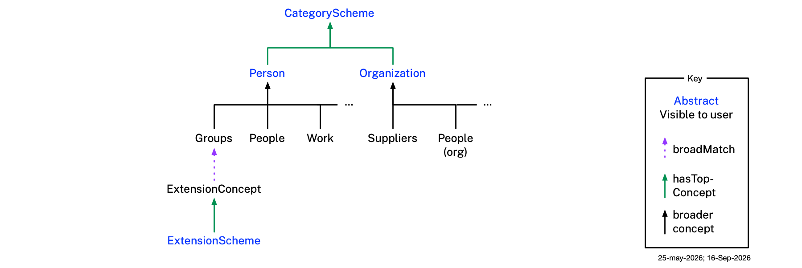
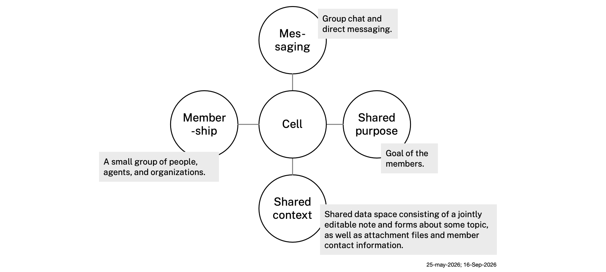
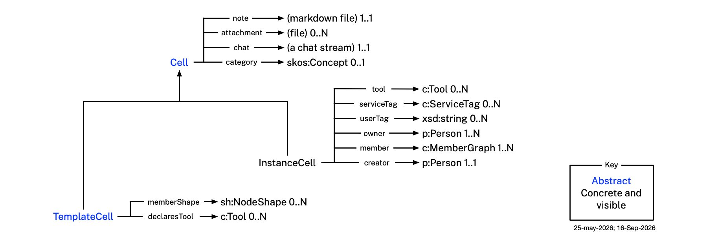
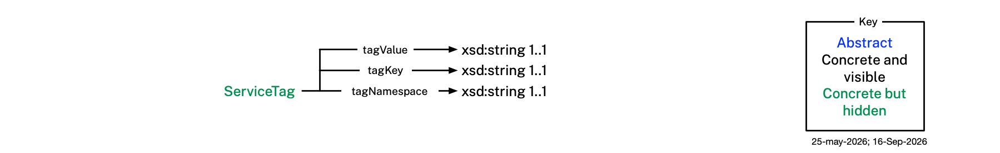
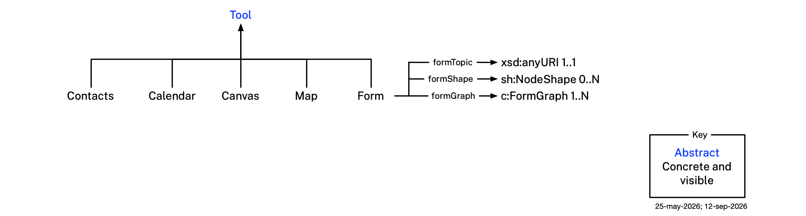
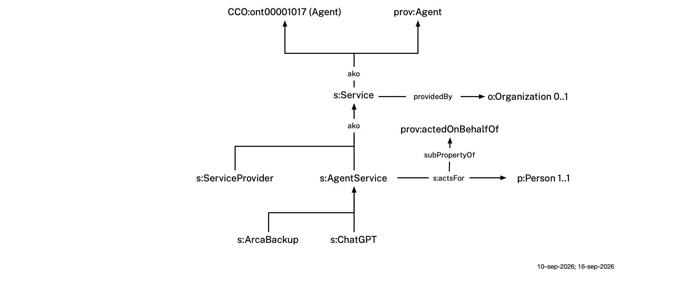

# V4 Ontologies

This document describes the ontologies used by V4, a free, open-source application under development at The Mee Foundation. The app lets the user create *cells* — private, secure collaboration spaces that can be joined both by other users and by V4-compatible **services**: an AI agent invited to help, a cell backup service, or the service an organization provides to the people it deals with. An organization never joins a cell itself — it takes part through the service it provides, hosted on its own node on The Mee Foundation's Personal Data Network (PDN). See [Service Ontology](#service-ontology).

The following **domain ontologies** model claims about people, organizations, and other subjects — these claims live in `c:MemberGraph` and `c:FormGraph` instances. They import and profile existing ontologies — documenting which of their classes and properties the app requires or uses — and extend them with app-specific classes and properties.

- **Persona ontology** — models a person: names, addresses, phone numbers, relationships, payment cards, and more. It is built on BFO (Basic Formal Ontology) and CCO (Common Core Ontologies) as the upper ontological foundation, and on domain ontologies that extend CCO:
  - **PersonOntology** — person, name types, parent-child relationships
  - **AddressOntology** — postal address structure
  - **StagingOntology** — staging area for terms pending promotion (phone numbers, email addresses, user accounts, etc.)
  - **AgentOntology** — CCO's own agents-and-properties vocabulary, imported transitively via PersonOntology. Not to be confused with this project's [Service ontology](#service-ontology) below — though `service.ttl` does import this same CCO file directly, for the `cco:ont00001017` (Agent) class every `s:Service` specializes
- **Organization ontology** — models organizations (companies, government agencies, nonprofits, etc.)
- **Service ontology** (this project's own `service.ttl`, not the imported CCO `AgentOntology` bullet above) — models the non-human services a person invites to collaborate inside a shared cell: AI agents (e.g. an LLM-based assistant such as ChatGPT), cell backup services, and the services organizations provide — the second kind of first-class, member-capable participant, peer to the Persona ontology. An organization is not itself member-capable; it participates through the service it provides. See [Service Ontology](#service-ontology).
- **Other domain ontologies** (`other/`) — a growing family of small, independent peer ontologies for domains a person merely *has* (a pet, a vehicle, an identity document, an online account) rather than *is*. The Persona ontology stays about a person's own identity: `persona.ttl` holds only a thin `hasX` link property into each of these domains where one is needed at all (e.g. `p:hasPet`, domain `p:Person`, range that domain's own class, referenced by name with no `owl:imports` in either direction), never the domain's own modeling. Each `other/*.ttl` file instead holds the actual "what is a pet / vehicle / identity document / etc." vocabulary — mostly vendored from real external ontologies rather than invented locally, the same way `persona.ttl` itself imports and profiles existing domain ontologies. This content can only ever reach a cell through a tool's own `c:formTopic` (never its `c:member`, which are always real relationship participants — see [Tools](#tools)):
  - **Pets ontology** (`other/pets.ttl`) — models what a pet *is*: name, species, breed, birth date, body weight, sex, spay/neuter status, and medications. See [Pets Ontology](#pets-ontology).
  - **Vehicles ontology** (`other/vehicles.ttl`) — models what a vehicle *is*: vehicle type, make, model, model year, VIN, color, body type, fuel type, drive wheel configuration, odometer reading, and engine specification. See [Vehicles Ontology](#vehicles-ontology).
  - **Identity Documents ontology** (`other/identity-documents.ttl`) — models government-issued identity documents: a birth certificate, driver's license, or passport, each a subclass of a common `idoc:IdentityDocument` superclass. See [Identity Documents Ontology](#identity-documents-ontology).
  - **Medical Appointments ontology** (`other/medical-appointments.ttl`) — models the claims two people need to share in order to arrange a medical appointment on someone else's behalf: patient, physician, medications, allergies, insurance, pharmacy. See [Medical Appointments Ontology](#medical-appointments-ontology).
  - **Service Accounts ontology** (`other/service-accounts.ttl`) — models an online service account a person holds (e.g. with Google or AT&T): service name, username, service URI, password. See [Service Accounts Ontology](#service-accounts-ontology).
  - **Banking ontology** (`other/banking.ttl`) — models a debit card and the checking account it draws on. See [Banking Ontology](#banking-ontology).
  - **Education ontology** (`other/education.ttl`) — models one stage of a person's schooling: school name, city, state, year graduated, degrees. See [Education Ontology](#education-ontology).
  - **Residences ontology** (`other/residences.ttl`) — models a place a person has lived, current or past. See [Residences Ontology](#residences-ontology).
  - **Itineraries ontology** (`other/itineraries.ttl`) — models a specific trip a person is planning or taking. See [Itineraries Ontology](#itineraries-ontology).

Also included are the Category **taxonomy** and the Cell **ontology**, the app's metadata layer. A *cell* is the atomic unit of information. A cell and everything in it live inside the app, in a protected store, encrypted at rest: V4 persists no data in the user's filesystem at all — see [storage.md](storage.md). In this repo a cell is carried on disk instead, as a folder holding a cell DataBook file, which is development scaffolding (see [Development Scaffolding](cell-databook.md#development-scaffolding) in cell-databook.md). Cells nest inside cells, forming a tree. A cell usually carries a **category** — a classification, described in the Category taxonomy, recording what kind of information it holds. A cell contains various kinds of content including markdown notes, chat streams, and other file attachments. It also contains structured information blocks (called *graphs*, defined as part of the Cell ontology — see [Graphs](#graphs)) whose schemas differ based on the cell's category.

Throughout this document we use these short-hands:

- `cat:` for the `category:` namespace (`http://mee.foundation/ontologies/category#`)
- `c:` for the `cell:` namespace (`http://mee.foundation/ontologies/cell#`) — also used for the graph-DataBook terms (`c:Graph`, `c:CGraph`, `c:MemberGraph`, `c:FormGraph`, `c:shape`, `c:claimant`, `c:subject`) that live in `cell.ttl`
- `p:` for the `persona:` namespace (`http://mee.foundation/ontologies/persona#`)
- `o:` for the `organization:` namespace (`http://mee.foundation/ontologies/organization#`)
- `s:` for the `service:` namespace (`http://mee.foundation/ontologies/service#`) — see [Service Ontology](#service-ontology)
- `pets:` for the `other/pets.ttl` namespace (`http://mee.foundation/ontologies/pets#`) — see [Pets Ontology](#pets-ontology)
- `v:` for the `other/vehicles.ttl` namespace (`http://mee.foundation/ontologies/vehicles#`) — see [Vehicles Ontology](#vehicles-ontology)
- `idoc:` for the `other/identity-documents.ttl` namespace (`http://mee.foundation/ontologies/identity-documents#`) — see [Identity Documents Ontology](#identity-documents-ontology)
- `ma:` for the `other/medical-appointments.ttl` namespace (`http://mee.foundation/ontologies/medical-appointments#`) — see [Medical Appointments Ontology](#medical-appointments-ontology)
- `sa:` for the `other/service-accounts.ttl` namespace (`http://mee.foundation/ontologies/service-accounts#`) — see [Service Accounts Ontology](#service-accounts-ontology)
- `banking:` for the `other/banking.ttl` namespace (`http://mee.foundation/ontologies/banking#`) — see [Banking Ontology](#banking-ontology)
- `residences:` for the `other/residences.ttl` namespace (`http://mee.foundation/ontologies/residences#`) — see [Residences Ontology](#residences-ontology)
- `itineraries:` for the `other/itineraries.ttl` namespace (`http://mee.foundation/ontologies/itineraries#`) — see [Itineraries Ontology](#itineraries-ontology)

See [**example.md**](example.md) for an illustration of the use of these ontologies by a hypothetical user, Alice, along with diagram-generation and validation instructions for the example dataset, [**storage.md**](storage.md) for where v4 actually keeps this data and what in this repo is development scaffolding, and [**app-behavior.md**](app-behavior.md) for how the app behaves on top of this data — cell naming/renaming/sharing, storage, permissions, and filing heuristics.

## Category Taxonomy

To help the user organize their information, the app comes with a pre-defined tree structure of categories. Although the user is free to organize their cells however they like, we think many users will choose to create their own tree of cells based on the pattern of the tree of category concepts. Cells that are created based on a pre-defined category have a `c:category` property whose value is that category.

The tree below is the taxonomy the app ships with. An organization can add a category of its own without it being added here, by publishing a **category extension** — its own SKOS concept scheme, linked into this tree by `skos:broadMatch`. See [Category Extensions](#category-extensions).

These categories vary in scope from broad groupings of information to narrower ones. In the social domain, for example, a category might be about "People", or more narrowly about "Immediate Family", and ultimately about just one family member. All pre-defined categories are *symmetric*. For example, "Extended Family" is symmetric because if Alice is a member of Bob's extended family, the reverse is also always true.

The category tree is modeled as a `skos:ConceptScheme` (`cat:CategoryScheme`), not an OWL class hierarchy — each category is a plain `skos:Concept` individual, connected to its parent via `skos:broader`, rooted at two top concepts, `cat:Person` and `cat:Organization` (`skos:hasTopConcept`). This is a deliberate choice: an OWL class hierarchy would carry real subsumption semantics — `cat:Pets rdfs:subClassOf cat:Person` would mean "every Pet is a Person," which is never what's intended. `skos:broader` carries no such entailment: `cat:Pets skos:broader cat:Person` means only that Pets is a narrower *topic* within the Person-rooted branch of information a user tracks about themselves — a taxonomy of information *about* a person or organization, not a taxonomy of *kinds of* person. Some concepts in this scheme have "starter" content, found via `cat-templates.ttl`: each of its `c:TemplateCell` individuals carries its own `c:category` value naming the concept it's a template for — the *cell template* for that concept.

When a new cell is created, the app looks for a `c:TemplateCell` whose `c:category` matches the concept being instantiated and clones it, if one exists, into that cell's DataBook — this is how a **cell template** becomes the starter content for a newly-created cell (see [Lazy Instantiation](app-behavior.md#lazy-instantiation) in app-behavior.md).

As we've mentioned, the user is free to create cells not included in the pre-defined categories. These, by the way, need not be symmetric, and simply carry no `c:category` value. The user is also free to rearrange their cells as they wish, adding new cells and moving others around. They can do this freely at any time; a cell carries no record of its own position, so nothing has to be updated when one moves.

### Personal Categories

`cat:Person` categories organize a person's mostly non-employment-related information:

1. **People** (`cat:People`) — people in your social or professional life. Use this category for people not otherwise tied to a specific domain — a bookkeeper you know belongs under Finances (Advisory Firms), and your primary care physician belongs under Health & Wellness (Medical > Provider > Primary Care Physician), rather than here.
    - **Immediate Family** (`cat:ImmediateFamily`) — your closest living relatives, which generally include parents, siblings, spouses/partners, and children.
    - **Extended Family** (`cat:ExtendedFamily`) — relatives outside the immediate nuclear group, such as grandparents, aunts, uncles, cousins, nieces and nephews.
    - **In-Laws / Step-Family** (`cat:InLawsStepFamily`) — relatives gained through marriage or legal guardianship, including a spouse's parents and siblings, or children from a previous relationship.
    - **Others** (`cat:Others`) — people you know socially or professionally who are not part of your family — acquaintances, friends, neighbors, or other connections.
1. **Groups** (`cat:Groups`) — a catch-all for clubs, charities, faith groups, and other groups that are not covered by a more specific category (e.g. `cat:SportsEntertainment`, `cat:Food`, etc.)
1. **Health & Wellness** (`cat:HealthWellness`) — personal health and wellness information. Medical history, allergies, medications, vaccinations, prescriptions, eyeglasses, ethnicity, gender, age.
    - **Medical** (`cat:Medical`) — medical (as opposed to dental or vision) care — diagnoses, treatments, providers, and insurance.
        - **History** (`cat:MedicalHistory`) — past diagnoses, conditions, surgeries, and treatments.
        - **Insurance** (`cat:MedicalInsurance`) — medical health insurance policies, providers, and coverage.
        - **Provider** (`cat:MedicalProvider`) — medical providers and practices you see for care.
            - **Primary Care Physician** (`cat:PrimaryCarePhysician`) — your primary care doctor, the physician you generally see first for checkups, referrals, and everyday health concerns, including name, contact information, and the name of the provider they are associated with.
            - **Medical Appointment** (`cat:MedicalAppointment`) — a medical appointment and associated information required by the provider to arrange this appointment.
    - **Dental** (`cat:Dental`) — dental care — diagnoses, treatments, providers, and insurance.
        - **History** (`cat:DentalHistory`) — past dental treatments, procedures, and conditions.
        - **Insurance** (`cat:DentalInsurance`) — dental insurance policies, providers, and coverage.
        - **Provider** (`cat:DentalProvider`) — dental providers and practices you see for care.
            - **Dentist** (`cat:Dentist`) — a dentist you see for care, including name, contact information, and the name of the provider they are associated with.
            - **Dental Appointment** (`cat:DentalAppointment`) — a dental appointment and associated information required by the provider to arrange this appointment.
    - **Vision** (`cat:Vision`) — vision and eye care — diagnoses, treatments, providers, and insurance.
        - **History** (`cat:VisionHistory`) — past eye-care prescriptions, treatments, and conditions.
        - **Insurance** (`cat:VisionInsurance`) — vision insurance policies, providers, and coverage.
        - **Provider** (`cat:VisionProvider`) — vision care providers and practices you see for care.
            - **Eye Doctor** (`cat:EyeDoctor`) — an eye doctor you see for care, including name, contact information, and the name of the provider they are associated with.
            - **Vision Appointment** (`cat:VisionAppointment`) — a vision appointment and associated information required by the provider to arrange this appointment.
    - **Fitness** (`cat:Fitness`) — general fitness and preventive physical health — exercise, gyms, trainers, and other non-clinical wellbeing information.
        - **Provider** (`cat:FitnessProvider`) — fitness providers and practices you see for care, e.g. gyms, trainers, and coaches.
            - **Personal Trainer** (`cat:PersonalTrainer`) — a personal trainer you see for care, including name, contact information, and the name of the provider they are associated with.
    - **Nutrition** (`cat:Nutrition`) — nutritionists and dietitians.
        - **History** (`cat:NutritionHistory`) — past nutritional consultations, diet plans, and dietary conditions.
        - **Provider** (`cat:NutritionProvider`) — nutritionists and dietitians you see for care.
    - **Mental Health** (`cat:MentalHealth`) — mental and behavioral health care.
        - **History** (`cat:MentalHealthHistory`) — past diagnoses, treatments, and mental health conditions.
        - **Insurance** (`cat:MentalHealthInsurance`) — mental health insurance policies, providers, and coverage.
        - **Provider** (`cat:MentalHealthProvider`) — mental health providers and practices you see for care, e.g. therapists, counselors, and psychiatrists.
            - **Therapist** (`cat:Therapist`) — a therapist you see for care, including name, contact information, and the name of the provider they are associated with.
    - **Physical Therapy** (`cat:PhysicalTherapy`) — physical therapy and rehabilitative care.
        - **History** (`cat:PhysicalTherapyHistory`) — past physical therapy treatments, injuries, and rehabilitation plans.
        - **Provider** (`cat:PhysicalTherapyProvider`) — physical therapy providers and practices you see for care.
1. **Personality** (`cat:Personality`) — self-assessments of personality, temperament, or social style — e.g. Myers-Briggs (MBTI) type, Big Five, DISC, Enneagram, or similar self-assessment instruments.
1. **Finances** (`cat:Finances`) — information about personal finances, bookkeeping, budgets, payment cards, bank accounts, brokerage accounts, insurance policies, financial advisors, etc.
    - **Bookkeeping** (`cat:Bookkeeping`) — budgeting, expense tracking, income, debts, IOUs, and savings goals.
    - **Banking & Payments Firms** (`cat:BankingPayments`) — firms that help you store, access, and move your cash for daily living. These include Retail Banks & Credit Unions, which provide checking accounts, savings accounts, and debit cards. These also include Payment Processors like Visa, Mastercard, or PayPal that let you buy things online and in stores, and Remittance Firms like Western Union or Wise used to send money to family or friends, especially overseas.
    - **Investment Firms** (`cat:Investing`) — firms that help you buy assets, so your money can grow over time for goals like buying a house or retiring. These include Brokerage Firms like Charles Schwab or Robinhood where you buy and sell stocks, bonds, and ETFs; Robo-Advisors, computer-run investing platforms like Betterment or Wealthfront that manage your portfolio for a low fee; and Mutual Fund companies like Vanguard or Fidelity that pool your money with other investors to buy a large bundle of stocks.
    - **Lending & Credit Firms** (`cat:LendingCredit`) — firms that lend you money when you need to buy something expensive that you cannot pay for all at once. These include Mortgage Lenders, banks or specialized companies that give you loans specifically to buy a home; Consumer Finance Companies, that give out personal loans, auto loans, or student loans; and Credit Card Issuers, banks that give you a plastic card to borrow money on the spot for daily purchases.
    - **Insurance Firms** (`cat:Insurance`) — firms that protect you and your family from financial ruin if something bad happens. These include Life & Health Insurance firms that cover medical bills or provide money to your family if you pass away, and Property & Casualty Insurance firms that insure your car, home, or apartment against accidents and theft.
    - **Advisory Firms** (`cat:Advisory`) — firms and individuals who do not just hold your money, but tell you the best ways to use it. These include Financial Planners (Wealth Advisors), human experts who help you build a custom roadmap for taxes, retirement, and budgeting, and Estate Planners, specialized professionals who help you write wills and plan how to pass your money to your children. Also includes Accountants and Bookkeepers, who track your income and expenses and prepare your taxes.
1. **Pets** (`cat:Pets`) — care instructions, veterinarians, medicines, food providers.
    - **Medical** (`cat:PetsMedical`) — a pet's medical care — veterinarians, prescriptions, medications and dosing instructions, devices, diagnoses, and treatments.
        - **Veterinarians** (`cat:PetsVeterinarians`) — veterinary practices and providers a pet sees for care.
        - **Devices** (`cat:PetsDevices`) — medical devices and supplies used in a pet's care, e.g. syringes, nebulizers, and injection solutions.
    - **Care & Feeding** (`cat:PetsCareAndFeeding`) — day-to-day instructions for someone else to take care of a pet — a pet's diet, food providers, feeding instructions and schedule, dietary restrictions, where they sleep, and other routine care.
1. **Home** (`cat:Home`) — owning or renting a home, apartment, or other dwelling. Leases, deeds, utility accounts, real estate brokers.
    - **Previous** (`cat:Previous`) — a previous home or residence, no longer current.
1. **Work** (`cat:Work`) — professional roles. Employment history, resume/CV, job level, job function, industry.
1. **Things** (`cat:Things`) — owned assets, property, vehicles, and other possessions.
    - **Vehicles** (`cat:Vehicles`) — related to owning and maintaining a vehicle. Registration, title, maintenance and repair history. See `cat:VehiclesProvider` for the firms and shops that service a vehicle, and `cat:Insurance` for vehicle insurance.
        - **Provider** (`cat:VehiclesProvider`) — firms and shops that keep a vehicle on the road — roadside assistance, dealerships, accessory vendors, and repair shops. See `cat:Insurance` for vehicle insurance.
1. **Travel** (`cat:Travel`) — travel plans, trips, and related information. Loyalty programs, airlines, bus lines, trains.
    - **Trips** (`cat:Trips`) — an individual trip being planned or taken — its own itinerary, dates, and destination-specific details, as distinct from `cat:Travel`'s broader loyalty-program/airline/general travel information.
    - **Provider** (`cat:TravelProvider`) — travel providers you book with — airlines, hotels, rail and bus lines, car rental companies, cruise lines, and travel agencies, including the loyalty program accounts and preferences held with each.
1. **Food** (`cat:Food`) — food preferences, dietary restrictions, favorite restaurants, recipes, shopping lists, and other food-related interests
1. **Sports & Entertainment** (`cat:SportsEntertainment`) — sports events (watching or participating) and entertainment (movies, plays, jazz clubs). Favorite teams/groups, venues, streaming services, ticketing. See `cat:Information` for other interests.
1. **Education** (`cat:Education`) — educational history and ongoing learning — schools, degrees, certifications, transcripts, and enrolled courses.
1. **Legal** (`cat:Legal`) — legal matters, contracts, agreements, trusts, wills, and professional legal relationships. Includes durable power of attorney and healthcare proxy agreements.
1. **Projects** (`cat:Projects`) — involvement in a specific project or initiative.
1. **Events** (`cat:Events`) — participation in or relationship to a specific event or gathering. This is the catch-all category. Sporting events, concerts, etc. would be in `cat:SportsEntertainment`. Events put on by clubs, faith groups, and other groups would be in `cat:Groups`.
1. **Information** (`cat:Information`) — information about anything; articles, web links, documents, images. Includes topics that interest and inspire you (e.g. drawing, painting, dancing, religion, gaming, music). See `cat:SportsEntertainment` for sports and entertainment, and `cat:Groups` for formal memberships tied to a hobby or interest.
1. **Government** (`cat:Government`) — government-issued credentials, tax records, and civic relationships.
    - **Federal** (`cat:Federal`) — federal government topic (e.g. passport, federal tax records).
        - **SSN** (`cat:SSN`) — social security number issued by the federal Social Security Administration.
        - **Passport** (`cat:Passport`) — passport issued by the Department of State.
    - **State** (`cat:State`) — state government topic (e.g. driver's license, state tax records).
        - **Birth Certificate** (`cat:BirthCertificate`) — a birth certificate issued by a state agency that issues and holds these records.
        - **Drivers License** (`cat:DriversLicense`) — a driver's license issued by a state agency that issues and holds these records.
1. **Companies** (`cat:Companies`) — a catch-all for your relationships with companies and organizations that provide services and/or products to you that are not included in more specific categories such as `cat:Finances`, `cat:HealthWellness`, `cat:Home`, `cat:Food`, etc.

### Organizational Categories

`cat:Organization` categories organize a person's professional and organizational-role information:

1. **Customers** (`cat:Customers`) — customer organizations. Rename to "Clients", etc.
1. **Marketing** (`cat:Marketing`) — marketing activities, campaigns, and related organizations.
    - **Prospects** (`cat:Prospects`) — customer prospects. Rename to "Client prospects", etc.
1. **Partners** (`cat:Partners`) — firms that provide goods and services.
1. **People (org)** (`cat:People(org)`) — people the organization interacts with in a working capacity.
    - **Employees** (`cat:Employees`) — related to employees.
    - **Consultants** (`cat:Consultants`) — engaged consultants.
    - **Others (org)** (`cat:Others(org)`) — people associated with the organization who don't fit Employees, Consultants, or Colleagues.
    - **Colleagues** (`cat:Colleagues`) — coworkers and peers within the organization not tracked as formal Employee records.
    - **Advisors** (`cat:Advisors`) — individuals who advise the organization in a non-employee capacity.
    - **Board of Directors** (`cat:BoardOfDirectors`) — the organization's board members.
    - **Direct Reports** (`cat:DirectReports`) — employees who report directly to a specific manager or role within the organization.
    - **Manager(s)** (`cat:Managers`) — the manager or managers a specific employee or role reports to within the organization.
1. **KB** (`cat:KB`) — corporate knowledge bases.
1. **Projects (org)** (`cat:Projects(org)`) — projects related to R&D, manufacturing, sales, marketing, operations, HR, etc.
1. **Meetings** (`cat:Meetings`) — face-to-face or online meetings, whether internal or with clients/customers. See also Events (org) for external, travel-to or larger-scale gatherings.
1. **Events (org)** (`cat:Events(org)`) — external events that people travel to, or larger-scale gatherings — conferences, webinars, town halls, and similar events. See also Meetings for ordinary internal or client/customer meetings.
    - **Conferences** (`cat:Conferences`) — a conference or professional gathering.
1. **Suppliers** (`cat:Suppliers`) — companies that supply goods or services to this organization.
1. **Legal (org)** (`cat:Legal(org)`) — contracts and agreements.
1. **Government (org)** (`cat:Government(org)`) — interactions with government organizations.
1. **Finances (org)** (`cat:Finances(org)`) — corporate finance-related matters.
    - **Banking & Payments (org)** (`cat:BankingPayments(org)`) — firms that help organizations store, access, and move their cash. These include Retail Banks & Credit Unions, which provide checking accounts, savings accounts, and debit cards. These also include Payment Processors like Visa, Mastercard, or PayPal.
    - **Investing (org)** (`cat:Investing(org)`) — These include Investment firms, Private Equity firms, Venture Capitalists, Brokerage Firms like Charles Schwab and Mutual Fund companies like Vanguard or Fidelity.
    - **Lending & Credit (org)** (`cat:LendingCredit(org)`) — banks or specialized companies that give loans for specific purposes and Credit Card Issuers that give employees a card for travel and related expenses.
    - **Insurance (org)** (`cat:Insurance(org)`) — firms that protect organizations from risks.
    - **Advisory (org)** (`cat:Advisory(org)`) — Financial Planners, outsourced CFO consultants, Accountants and Bookkeepers and Tax preparers.

### Category Taxonomy File

**`category.ttl`** — The Category taxonomy, defining a `skos:ConceptScheme` rather than an OWL class hierarchy:
  - *Individuals*: `cat:CategoryScheme` (a `skos:ConceptScheme`), `cat:Person`/`cat:Organization` (its two `skos:hasTopConcept` top concepts), and every other category concept — each a plain `skos:Concept`, with a `skos:prefLabel` for its display name, a `skos:broader` value naming its parent concept, and `skos:inScheme cat:CategoryScheme`. There is no `cat:Category` class at all — a category concept's type is just `skos:Concept`, scoped to the app's own scheme via `skos:inScheme` rather than a dedicated class.
  - No `cat:` property of its own — each `cat-templates.ttl` template cell instead carries its own `c:category` value naming the concept it's a template for (see [Cell Ontology File](#cell-ontology-files) below).

### Category Extensions

A **category extension** (`category-ext/`) is a bundle an organization publishes so that other instances of the app can file and validate cells of a category the app's own taxonomy does not define. One self-contained file per publisher carries three things: the publisher's own `skos:ConceptScheme`, the `skos:Concept` individuals in it, and a `c:TemplateCell` for each. The member shape those templates name sits beside it in `category-ext/shacl/`.

#### Why an extension rather than a new category concept

`cat:CategoryScheme` is this app's curated taxonomy of the *kinds* of thing a person tracks — Groups, Medical, Vehicles. A single named organization is not one of those kinds; it is an instance of one. Adding it there would grow the shipped taxonomy by one concept per organization anyone ever joins, and would oblige `cat-templates.ttl` to grow with it (integrity.md's TTL-6 requires a template per concept).

Neither file changes to accommodate an extension. Two useful consequences follow: `images/category-ontology/category.png` (PNG-5) stays correct as extensions are added, and TTL-7's invariant — every template in `cat-templates.ttl` carries `c:memberShape pshapes:ContactInfoShape`, with no exception — stays **true**, because an extension's template is not in that file. Variation arrives only with an extension.

#### How an extension links to the taxonomy

With `skos:broadMatch`, never `skos:broader`. SKOS reserves `skos:broader` for hierarchy *within* one concept scheme and provides the `skos:mappingRelation` family — of which `skos:broadMatch` is one — for links *between* schemes. An extension concept is by definition in another scheme, so `skos:broadMatch` is the correct predicate and `skos:broader` would be a misuse.

That link is load-bearing, not decorative: a recipient whose app does not have the extension installed still needs somewhere to file an incoming cell, and the `broadMatch` target is that somewhere. `shacl/cell-shacl.ttl`'s `:CellShape` accordingly requires a `c:category` value to be a `skos:Concept` in *some* `skos:ConceptScheme` rather than in `cat:CategoryScheme` specifically; integrity.md's **TTL-8** carries what SHACL cannot, requiring every extension concept to sit in its own file's scheme, carry exactly one `skos:broadMatch` to a `cat:` concept, never use `skos:broader` across schemes, and have a matching `c:TemplateCell` in the same file.

#### What a bundle contains

One file per publisher, holding three things:

- a `skos:ConceptScheme` of the publisher's own;
- one or more `skos:Concept` individuals in it, each carrying exactly one `skos:broadMatch` into `cat:CategoryScheme`;
- a `c:TemplateCell` per concept, naming whichever `c:memberShape` that publisher requires.

Its shapes file sits beside it in `category-ext/shacl/`.

That third item is the point of the mechanism. Every template in `cat-templates.ttl` names the same `c:memberShape`, `pshapes:ContactInfoShape`, so a member graph is validated as a generic contact-info profile whatever its category. An extension's template may name a different shape — which is what makes `c:memberShape` a genuine per-category hook rather than a constant.

An extension is expected to mint **no vocabulary of its own**. The terms its shape constrains should already exist in `persona.ttl`, `other/`, or `persona-ext/`; what belongs to the publisher is the shape — which fields it requires, how many values it permits, and which values it recognizes. See [Where a New Term Goes](CLAUDE.md#where-a-new-term-goes), whose rule 5 is what usually leaves an extension with nothing to declare beyond its scheme, template, and shape.

For a worked extension — a society's member directory form, its concept, template and shape, and the cell whose member graphs it validates — see [example.md](example.md#boston-hub-society).

## Cell Ontology

### Introduction to Cells

A cell is a secure container of information that can remain private to the user or be shared with other users and services (e.g. AI agent, cell backup service, organizational service provider). It enables these members to share context, communicate and collaborate towards a common purpose.

A cell holds various kinds of information:

- **Note** — a jointly writable document that may contain links to other cells.
- **Chat** — a chat stream shared with all members (and supports 1:1 messaging).
- **Members** — information about the members. Usually just contact information, although some cells will add richness.
- **Attachments** (📎) — an optional set of one or more files shared with every member. A file the user adds to the cell without attaching it is private to them and never propagates, though both sets are shown in this same area. Some common filetypes (images, video, PDFs, Markdown) will show previews whereas others (Excel spreadsheets, Word documents, etc.) might not.
- **Tags** — an optional set of short text labels for finding the cell again later. Tags cut across the tree rather than placing the cell in it, so they are independent of the cell's category; see [Tags](#tags) below, and [Finding Cells by Tag](app-behavior.md#finding-cells-by-tag) in app-behavior.md.

Cells may include **Form** elements. These contain editable data structured according to one of a set of pre-defined **form shapes** (schemas of fields and values) — see [Form Shapes](#form-shapes) below for the full list. For example, if the topic is taking care of a pet, the structured information might include species:dog, breed:Labradoodle, weight:26 pounds, and so on. If the topic is a credit card, it would have fields like name, card number, expiration date, and CVV code. Other planned tools include calendar and drawing canvas tools. 

The app contains two pre-defined, non-user-editable taxonomies of **categories**. One is focused on helping organize the information in a person's personal life (Family, Home, Pets, etc.), and the other on their work life (Employer, Employees, etc.). For some of these categories, the app includes a *template cell* that may contain some starter content (or may be empty) and/or may have a schema for the structured fields and values that a cell of this category might contain.

A cell has a **name**. Often this name is just a copy of the name of the category. For example, if the category is "People", the cell might be called "People". However, the user can give the cell a name of their own choosing.

A cell may have been assigned a **category** — a `skos:Concept` individual in one of the app's pre-defined schemes that categorizes the cell's main topic (e.g. "People", "Pets", "Things"). Some categories come with a pre-defined template cell that supplies starter content for the note, and may include one or more predefined form types.

A cell has a **creator**, which is the identity of the user who created it. This creator is automatically considered to be a cell **owner**. Any owner can invite a new member as an owner, or promote an existing member to owner. A cell owner has an elevated set of permissions for managing cell contents.

A cell can be **shared**. The creator of a cell can invite people, or services — one's own AI agent, a cell backup service, or the service of an organization compatible with The Mee Foundation's PDN protocols — to join the cell. If they accept the invitation, they gain access to the cell. Cells are dynamic, not static: any change made to a cell's contents by any member is visible to all members. Cells are self-contained and may be nested inside other cells by any app user. The organization of these multi-cellular structures is personal to the app user and not shared. The structures will be similar between users to the extent that they leverage the app's built-in tree of categories.

Cells can be **linked**. Cells have globally unique identifiers (see [Cell Id](cell-databook.md#cell-id)). This allows the note of a "source" cell to include a link to a "target" cell. The user can follow a link in a source cell if they also have access to the target cell.

### Diving Deeper

The Cell class splits into two disjoint kinds: `c:TemplateCell`, a reusable, class-level *template* cell, and `c:InstanceCell`, an *actual* cell instantiated in a user's own tree. There is no further subclass: a cell that carries a tool holds one or more `c:tool` values rather than a type of its own.

A cell is an atomic unit of information that the app manages for the user. It is held entirely inside the app, and cells nest inside cells, forming the tree.

`c:Cell` (below) models only the content *facet*, and stores no property recording the cell's own tree position: a cell's parent is per-member state in that member's own store rather than shared content (see [Cell Contents](app-behavior.md#cell-contents) in app-behavior.md), so refiling or renaming a cell never requires updating anything asserted on the cell itself — and two members of a shared cell can each file it wherever they like without touching what the other sees.

A cell's own Markdown note is displayed in the **Note area** (not the Attachments area); clicking a link in it to a note that doesn't exist yet creates a new, category-less cell for it — see [Wikilink-Triggered Cell Creation](app-behavior.md#wikilink-triggered-cell-creation) in app-behavior.md. See [Documentation-only Properties](#documentation-only-properties) below for what counts as a cell's attachments, shown in the app's **Attachments area**.

#### Cell Properties

- **`c:category`** — The category concept this cell was originally instantiated as, else nil — a genuine `skos:Concept` individual in `cat:CategoryScheme` (category.ttl), not a class. For one of the templated concepts (e.g. `cat:Passport`, `cat:BirthCertificate`, `cat:DriversLicense`, `cat:MedicalAppointment`, `cat:Vehicles`, `cat:Pets`, `cat:PetsMedical`, `cat:People`, `cat:ImmediateFamily`, `cat:ExtendedFamily`, `cat:InLawsStepFamily`, `cat:Others`), this is literally the concept whose `c:TemplateCell` template was cloned into this cell via [Lazy Instantiation](app-behavior.md#lazy-instantiation) (app-behavior.md); for any other cell, it's simply the category the cell was created to represent, asserted directly with no template involved. Either way the value is fixed at that point — it is not re-derived from the cell's current name, so it needs no update if the cell is later renamed or moved elsewhere in the tree. When a cell is shared with another member, the recipient's app can look at this value (if not nil) and use it as a hint as to where in the recipient's own tree it should be filed. Domain `c:Cell`, range `skos:Concept` (referenced by name, no `owl:imports`), at most one value (0..1) — see [Cell Ontology File](#cell-ontology-files) below.

#### Documentation-only Properties

Three more concepts appear off `Cell` in `images/cell-ontology/cell.png`'s diagram, described here for their intended semantics, but documentation only — none is an actual property declared in `cell.ttl`, and none is ever reified as a triple in any real graph (see integrity.md's PNG-3 for this open, accepted discrepancy):

- **`c:note`** — a cell's single Markdown note, shown in the app's **Note area**, 1..1. See [Introduction to Cells](#introduction-to-cells) above for its linking and sharing behavior, and [Wikilink-Triggered Cell Creation](app-behavior.md#wikilink-triggered-cell-creation) in app-behavior.md.

- **`c:attachment`** — a cell's flat set of file attachments, shown in the app's **Attachments area** (📎), 0..N. Attachments are the files every member of the cell receives: they are what travels with the cell when it is shared, and they are flat, like email attachments. A file a member adds to the cell without attaching it is instead their own **private** file: shown in the same Attachments area, marked as private, but never reaching another member. The distinction is one of propagation and nothing else, which is why it is still real for a single-member cell that shares nothing — it records what would travel if the cell were ever shared later, and that is exactly the moment a wrong default would bite. The cell's own Markdown note is neither, keeping its special role and its own **Note area**, and a descendant cell is never part of its ancestor's own content, even though it sits beneath it in the tree. For a worked pair — one file attached, one kept back, in the same shared cell — see [example.md](example.md#boston-hub-society).

- **`c:chat`** — a cell's single chat stream, 1..1. Every cell always has one, even if empty.

#### Tags

A cell can carry any number of **tags** — short text labels, shown in the app's **Tags area**. A tag is not a second category: a cell sits in at most one category, which is a *filing* decision about where the cell belongs in the tree, while tags are *retrieval* labels that cut across the tree freely. A cell filed under Pets can carry a tag naming the animal it concerns while sitting exactly where it sits, and the same tag can appear on cells filed in completely different branches.

There are two kinds, and a tag's kind is carried entirely by which property holds it — there is no kind marker on the tag itself. Both properties have domain `c:InstanceCell` rather than `c:Cell`, so a `c:TemplateCell` seeds no tags and none is ever cloned into a new cell by [Lazy Instantiation](app-behavior.md#lazy-instantiation):

- **`c:userTag`** (see [InstanceCell](#instancecell) above) is typed freely by the user — no list to choose from, no approval step, no restriction beyond being non-empty text. Alice tags her cat's three cells — `Ginger`, its `Medical` cell, and its `Care & Feeding` cell — **Ginger**, so one search collects everything about the cat regardless of where in the tree each cell sits; that those cells happen to be nested under one another is incidental, and the same tag would gather them just as well if they were scattered.
- **`c:serviceTag`** (see [ServiceTag](#servicetag) below for its three parts) is written by a member's own module — a tool such as `c:Contacts`, or an invited `s:AgentService` — for that module's own bookkeeping, never by a person. The app never shows these in the Tags area, and the user neither adds, edits, nor searches them: they are invisible to the user end to end, and only the module that wrote one ever reaches it, within its own `c:tagNamespace`. See [Service Tag Access](app-behavior.md#service-tag-access) in app-behavior.md.

There is deliberately no third, app-supplied kind — the app ships no built-in tag vocabulary at all. Where a set of cells shares a fact the data already models, that fact is found by searching for it directly rather than by labeling it; see [Finding Cells by Property](app-behavior.md#finding-cells-by-property) in app-behavior.md. A tag is for what the data does not already model.

The hidden kind is what lets a service keep external state it must round-trip without inventing a parallel store for it. An Apple Contacts service importing a contact into a cell records on that cell that the contact sat in an Apple Contacts *Group* called "Christmas List" — a fact the cell model has nowhere else to put, since a group is not a category, not a topic, and not a member. Holding it on the cell is what makes the import **lossless** and the sync **bidirectional**: a later edit on either side can be carried back to the other, because the service can still tell which group the contact came from.

A `c:userTag` is ordinary shared cell content: adding or removing one propagates to every member's copy over the PDN, exactly like the cell's note, attachments, chat, and (for the cells where the name is shared at all) its name. Every member may add and remove them regardless of ownership, the same latitude they already have over the note.

A `c:serviceTag` is the one exception — **it is never shared**. It stays in the copy belonging to the member whose module wrote it, and no other member ever receives it. The reason is meaning rather than secrecy: each principal runs their own services independently, so a bookkeeping label written by one member's module says nothing in a member's instance running a different service, or none at all — syncing it would deliver a value no one on the other side could interpret or clear. The consequence is that the same shared cell can legitimately carry different `c:serviceTag` values on each member's side, with nothing merging the two.

The deliberate limits: nothing merges or reconciles two members' tag sets beyond the ordinary content sync above, and there is no rename-a-tag-everywhere or merge-two-tags operation — renaming means removing one label and adding another, cell by cell. Tags apply to a cell as a whole; there is no way to tag an individual note, attachment, or tool within one. How a user searches their tree for one is described in [Finding Cells by Tag](app-behavior.md#finding-cells-by-tag) in app-behavior.md.

### TemplateCell

A `c:TemplateCell` individual, identified by its own `c:category` value naming a category concept, serves as a **cell template** — a reusable, typically empty shape that the application clones into a new cell whenever that concept is first instantiated into a user's tree (see [Lazy Instantiation](app-behavior.md#lazy-instantiation) in app-behavior.md); finding the template for a given concept is a reverse lookup (which `c:TemplateCell` carries this `c:category` value?), since `category.ttl` carries no forward pointer of its own. Such a cell is typed `c:TemplateCell` only. An ordinary, already-instantiated cell is typed `c:InstanceCell` instead, carrying real member composition, creator, and content. `c:TemplateCell` and `c:InstanceCell` are disjoint: a template cell is never also typed `c:InstanceCell` — see [Cell Ontology File](#cell-ontology-files) below.

#### Properties

Every real `c:TemplateCell` carries a `c:category` value naming the concept it's a template for (see [Cell Properties](#cell-properties) above — the same property is asserted on both kinds of cell). If it also has a `c:memberShape` value, or declares a tool carrying a `c:formShape`, then when a `c:InstanceCell` is later created for that same category (see [Lazy Instantiation](app-behavior.md#lazy-instantiation) in app-behavior.md), the app derives each new graph's own `c:shape` value from whichever of the two applies, by this same reverse lookup rather than copying anything — a cell stores no shape of its own (see [InstanceCell](#instancecell) below). The new cell receives one live `c:tool` per tool the template declares.

- **`c:memberShape`** — links a `c:TemplateCell` individual to the `sh:NodeShape`(s) describing the content expected of a `c:member` graph filed under its category, and sets that graph's own `c:shape` value — e.g. `ctpl:PassportTemplateCell` (which also carries `c:category cat:Passport`) carries `pshapes:ContactInfoShape` — its real document shape, `idocshapes:PassportShape`, is instead the `c:formShape` of the tool it declares, since a Passport is a form tool's content (see `c:declaresTool` below). An `owl:ObjectProperty`, domain `c:TemplateCell`, range `sh:NodeShape`, zero or more values, no fixed upper bound.

- **`c:declaresTool`** — names the tools a cell of this category is created with, each value a `c:Tool` node carrying its own `c:formShape` and nothing else — e.g. `ctpl:MedicalAppointmentTemplateCell` (which also carries `c:category cat:MedicalAppointment`) declares one `c:Form` carrying `mashapes:MedicalAppointmentRecordShape`. An `owl:ObjectProperty`, domain `c:TemplateCell`, range `c:Tool`, zero or more values, no fixed upper bound.

  Presence or absence is the whole of what a template says about tools: there is no boolean flag declaring whether a cell of this category carries a tool, because declaring the tool already says it, and a second statement could only ever disagree with the first. 18 of the 106 templates declare a tool today, each a `c:Form` — 14 of them naming a real document, account, or organization shape (`ctpl:PassportTemplateCell`/`SSNTemplateCell`/`BirthCertificateTemplateCell`/`DriversLicenseTemplateCell` — Alice's own government documents; `ctpl:MedicalAppointmentTemplateCell` — Sophia; `ctpl:PetMedicationsTemplateCell`/`ctpl:PetProfileTemplateCell` — Ginger; `ctpl:VehicleProfileTemplateCell` — the RAV4; `ctpl:CompaniesTemplateCell`/`ctpl:BankingPaymentsTemplateCell` — a company's own service account, plus a bank's debit card/checking account; `ctpl:HomeTemplateCell` — a residence, current or previous; `ctpl:TripsTemplateCell` — a trip itinerary; `ctpl:TravelProviderTemplateCell` — the loyalty/service account held with a travel provider, `sashapes:ServiceAccountShape`; `ctpl:GroupsTemplateCell` — a society or association a person belongs to, whose own `o:Organization` profile is the tool's topic; and `ctpl:OrganizationTemplateCell` — the bare `cat:Organization` top concept, standing for an organization such as an employer, whose own profile is likewise the topic), plus 3 more naming a shape for a more modest pattern, every property optional — `ctpl:HealthWellnessTemplateCell` (Sophia's physical characteristics — height, eye color, hair color), `ctpl:PrimaryCarePhysicianTemplateCell` (a physician's medical specialty — Dr. Jane Starostina's own `persona:specialty "Endocrinology"`), and `ctpl:PetsCareAndFeedingTemplateCell` (a pet's own identifying properties, reused from `pets:Pet`, every one optional here). The other 88 declare none: `ctpl:PeopleTemplateCell` and its four direct `skos:broader` children, every other templated category (each purely organizational, with no document, account or record content of its own — see TTL-6 in integrity.md, which requires every `category.ttl` concept except `cat:Person`/`cat:Organization` to have a template), plus `ctpl:UserDefinedTemplateCell` (the no-category fallback, likewise with nothing beyond a contact-info member).

  What a template declares constrains only what Lazy Instantiation produces, never what the resulting cell may later hold: **any** cell may gain further tools at any time, as many as the user likes, whatever its category's template says. The user picks such a tool's own shape themselves, from the app's full list rather than from anything the category declares — see app-behavior.md's [Adding a Tool](app-behavior.md#adding-a-tool) — so neither the category's `c:TemplateCell` nor integrity.md's TTL-4 constrains which shape it uses. A category that declares no tool offers no shape hint either.

### InstanceCell

A `c:InstanceCell` is a cell instantiated in a user's own tree — one of the two disjoint kinds of an abstract `c:Cell`, the other being `c:TemplateCell`. It carries `c:creator`, `c:owner`, `c:member`, and zero or more `c:tool` values. Every cell in a user's own tree is typed `c:InstanceCell`, never `c:TemplateCell` — there is no bare tree-position-only cell with no member content; a purely organizational cell with nothing substantive to say still carries a minimal stub `c:member` entry (claimed by and about `:Self`, who is then also that cell's sole `c:owner`) rather than omitting member content altogether.

There is no further subclass. Every cell is *about* something — a two-member cell with no tool and an empty note is about the relationship between its two members, and a cell whose note is about taking care of a pet is about taking care of that pet — so "has a topic" could never distinguish one kind of cell from another. What varies is whether a cell holds *structured* content alongside its unstructured note and its attachments, and of what kind: that is what `c:tool` records, as a count from zero upwards rather than as a type. See [Tools](#tools) below.

Reusable class-level templates (`cat-templates.ttl`) are the exception: each is typed solely `c:TemplateCell`, never `c:InstanceCell` — the two are disjoint, so a template cell carries no member composition of its own.

#### Properties

- **`c:member`** — one or more values, required, no fixed upper bound. It is a list of `c:MemberGraph`s (see [Graphs](#graphs) below for details). For an N-member `c:InstanceCell`, there are N subjects (one per member) and between N and N² `c:MemberGraph`s. The floor of N `c:MemberGraph`s obtains if each member self-asserts information about themselves but makes no claims about any other member. The ceiling of N² obtains when every member makes claims about every other member. In practice, we expect the number to be on average only slightly above N.

- **`c:creator`** — required, exactly one value. Identifies who created this cell's content: a single `p:Person`. A cell is always created by a human, never by an `s:Service` and never by an `o:Organization`, whose participation in a cell is always through the `s:ServiceProvider` it provides.

- **`c:owner`** — one or more values, required, no fixed upper bound. Identifies which of the cell's members hold the owner role, as opposed to the regular (non-owner) member role every other member defaults to. Always includes `c:creator`'s own value — the creator is always the cell's initial (and, until any promotion, sole) owner — and any current owner may promote any other current regular member (a `p:Person`, never an `s:Service` — the same person-only range `c:creator` uses) to owner, or demote another owner back to regular-member status — the `sh:minCount 1` floor keeps a cell's last remaining owner from being demoted. Every member has full read/write access to the cell's note regardless of ownership; what an owner alone may do is delete any member's claim or attachment, not only their own. A claim is immutable at the PDN layer, so a member creates, reads, and deletes their own claims but never updates one — a correction is a retraction plus a fresh claim, which the app surfaces to the user as an ordinary edit; see [Permissions](app-behavior.md#permissions) in app-behavior.md for the full app-level rule.

- **`c:userTag`** — a free-text tag the user minted themselves. Unconstrained beyond being a non-empty string: there is no vocabulary, scheme, or registry a value must belong to, and neither the ontology nor the app supplies a list to pick from — the user simply types what they want. Repeating one string across several cells is the entire point, since that is what lets a single search gather them all; what integrity.md's YAML-9 flags is only the same value repeated within this one property on a single cell. Shared cell content: it propagates to every member's copy when the cell is shared, as the cell's own name and `c:category` value do, and any member may add or remove one regardless of ownership. An `owl:DatatypeProperty`, domain `c:InstanceCell`, range `xsd:string`, zero or more values, no fixed upper bound.

- **`c:serviceTag`** — a tag written by one member's own module — a tool such as `c:Contacts`, or an invited `s:AgentService` — for that module's own bookkeeping, rather than by a person. Each value is a `c:ServiceTag` node rather than a literal, carrying exactly one `c:tagNamespace`, one `c:tagKey` and one `c:tagValue` (see [ServiceTag](#servicetag) below). That structure is what keeps two service modules' labels from colliding: the namespace is a DNS domain the writing module's own developer controls, so no registry has to arbitrate between them and no module has to remember to prefix itself by hand. *Hidden* from the user end to end: the app never shows these in the cell's tag display alongside its `c:userTag` values, and the user's own tag search never matches them either. Only services reach them, through the app's Cell Interface, and each module reaches only its own — every operation there is scoped to the `c:tagNamespace` the calling module's developer controls. Alone among a cell's content, a `c:serviceTag` value is local to the instance that wrote it and is never propagated to another member when the cell is shared — the deliberate exception to the rule that a cell's content is kept in sync across every member's copy. That exception is a meaning one, not a privacy carve-out: each principal's device hosts and runs its own agent independently, so bookkeeping written by one member's module says nothing in a member's instance running a different service, or none. Its consequence is that the same cell can legitimately carry different `c:serviceTag` values on either side of a share, with nothing merging the two. One more follows from the value being a node: two identical tags no longer collapse the way two identical literals do under RDF's set semantics, so a module adding a tag checks for a matching triple itself rather than relying on the graph to deduplicate for it. See [Tags](#tags) in app-behavior.md. An `owl:ObjectProperty`, domain `c:InstanceCell`, range `c:ServiceTag`, zero or more values, no fixed upper bound.

Note: neither is ever carried by a `c:TemplateCell` — their domain is `c:InstanceCell` deliberately, so no tag is ever cloned into a new cell by [Lazy Instantiation](app-behavior.md#lazy-instantiation); every tag is applied to the real, already-instantiated cell afterwards. This is the opposite choice from `c:category`, whose domain really is `c:Cell` because a template does carry the concept it's a template for.

Note: A `c:InstanceCell`'s applicable validation shape is derived: reverse-lookup the `c:TemplateCell` sharing this cell's own `c:category` value and read either its `c:memberShape` (for one of this cell's own `c:member` graphs) or the `c:formShape` of the matching declared tool (for one of a tool's own graphs), depending on which list the graph in question belongs to.

### ServiceTag

A `c:ServiceTag` is one module-written tag on a `c:InstanceCell`: a namespaced label, recorded as a node rather than a literal so that the writing module's identity travels alongside the label instead of being encoded into it by a convention nothing enforces. It takes no part in the `c:Cell` hierarchy — it is a value node `c:serviceTag` points at, with no `rdfs:subClassOf` of its own — and is never shared between cells or reused: each `c:serviceTag` value is its own node, and removing the tag removes the node with it. In practice it is a blank node, since a tag node has no identity worth naming and a cell DataBook's frontmatter has nowhere to mint an IRI; a named individual is equally legal.

The division of labor between its three parts is what makes one module's bookkeeping both legible and collision-free: the namespace separates developers from one another, the key separates one kind of recorded fact from another within a single developer's own module, and only the value is free-form.

#### Properties

- **`c:tagNamespace`** — which module wrote this tag: a DNS domain the writing module's own developer controls, written in reverse-DNS order — two or more lowercase labels, e.g. `foundation.mee.applecontacts` — the same registry-free namespacing convention Java packages, Apple's uniform type identifiers, and D-Bus names already use. It is the *developer's* domain, not the external system's: an Apple Contacts sync connector written by Mee namespaces itself under `mee.foundation`, because a domain is only proof against collision for whoever actually controls it, and naming the synced system instead would be first-come squatting on a name nobody holds. Two competing connectors for one external system therefore write different namespaces for the same underlying fact, which costs nothing — a `c:serviceTag` never propagates on a share, and the module that wrote a tag is the only one that ever reads it back. Lowercase is required rather than merely conventional: DNS is case-insensitive, so accepting `Foundation.Mee` would admit a second spelling of one namespace and silently split a module's own tags into two sets. Nothing links this string to an `s:AgentService` subclass, and nothing should — a third-party developer's module has no class in `service.ttl` to point at, and a tag has to stay interpretable without loading `service.ttl` at all. An `owl:DatatypeProperty`, domain `c:ServiceTag`, range `xsd:string`, required, exactly one value.

- **`c:tagKey`** — what kind of external fact this tag records, within its own namespace: e.g. `group` for the Apple Contacts *Group* a synced contact sat in, or `recordID` for the external record's own identifier. A letter followed by letters, digits, underscores or hyphens, with no dot, so a key can never be mistaken for a further namespace segment. The key exists so that one module can record several kinds of fact about a cell without encoding the kind into the label — which would be the same collision problem one level further down, inside a string nothing would again be parsing. Only the namespace/key pair has to be unique to one module's own vocabulary; the pair is deliberately *not* unique on a single cell, since a contact sitting in three Apple Contacts Groups is three tags sharing one namespace and one key, differing only in `c:tagValue`. An `owl:DatatypeProperty`, domain `c:ServiceTag`, range `xsd:string`, required, exactly one value.

- **`c:tagValue`** — the label itself, the free-form payload the writing module needs to round-trip, e.g. the Apple Contacts Group name `"Christmas List"`. Free-form is the point: the namespace and key have already done all the qualifying, so nothing about the external system's own naming has to be escaped, abbreviated, or encoded to fit — a value may contain spaces, punctuation, and a slash, none of which can be confused for structure, since the structure lives in sibling properties rather than in this string. Constrained only to a non-empty, single-line string with no leading or trailing whitespace — surrounding whitespace is rejected for the same reason it is on `c:userTag`, since a padded label silently fails to match its own unpadded twin in a search. No user-facing search ever matches this string, though — only the writing module reads it back, within its own namespace. An `owl:DatatypeProperty`, domain `c:ServiceTag`, range `xsd:string`, required, exactly one value.

### Tools

A **tool** is an object a cell can carry that adds a new capability to it — a form, a calendar, a drawing canvas, a map. Each kind brings two things at once: its own data format inside the cell, and its own contribution to the app's UI. A cell carries zero or more, via `c:tool`; a cell with none is the ordinary case, not a lesser kind of cell. A tool is not a member of the cell, and it is not one of the cell's built-in areas either — every cell has a Note area, a Chat area, an Attachments area and Member Info whether or not it carries a tool. Five kinds are defined — `c:Form`, `c:Calendar`, `c:Canvas`, `c:Contacts` and `c:Map` — and only `c:Form` has a settled data format today; the other four are deliberate extension points, awaiting one. A cell is created carrying whatever tool its category's template declares, and the person may add more at any time. The ontology models only the data format; what a tool contributes to the interface is app-level, and [app-behavior.md](app-behavior.md) describes it.

Five tool classes are defined. `c:Form` is the one whose format is settled: its data is graph DataBooks — one or more `c:FormGraph` values, whose fields the app renders as a form from the SHACL shape governing the tool (see [Form Shapes](#form-shapes) below for the shapes themselves, and [Form Fields from SHACL Shapes](app-behavior.md#form-fields-from-shacl-shapes) in app-behavior.md for how a shape becomes a form). `c:Calendar`, `c:Canvas`, `c:Contacts` and `c:Map` carry no properties of their own yet — they are defined so the extension point is visibly plural, and so that adding a tool later is a new subclass rather than a new property on `c:InstanceCell`. `c:Contacts` is the address-book tool: it syncs the cell's member info with Apple Contacts, its Android equivalent or Windows People. It is a tool rather than a service because it never joins the cell as a member — no claim in a cell is the address book's, so there is no party for a `c:member` entry to name.

All three tool properties — `c:formTopic`, `c:formGraph` and `c:formShape` — have domain `c:Form`, and `c:Tool` itself carries none. That follows from what a tool is rather than being an oversight: each kind brings its *own* data format, so there is nothing common to hoist onto the abstract class. A form's format is graphs conforming to a shape; a calendar's would be dated entries, a canvas's a drawing surface, a contacts tool's a correspondence with an address-book entry, and a map's placed features, none of them a graph and none worked out. A property that proves common once those four have formats of their own can be hoisted up then — cheap, where retracting one asserted too early is not.

#### Properties

- **`c:tool`** — links a cell to its tool node(s). An `owl:ObjectProperty`, domain `c:InstanceCell`, range `c:Tool`, zero or more values, no fixed upper bound. A cell receives one per tool its category's `c:TemplateCell` declares via `c:declaresTool`, and may gain more at any time, chosen by the user.

- **`c:formTopic`** — what the tool's content is about. Any resource IRI: often a third party who is not a member of the cell, such as a non-member `p:Person`/`o:Organization` representable by the Persona or Organization Ontologies, but just as legitimately an entity described by one of the `other/` domain ontologies (e.g. a pet, via [Pets Ontology](#pets-ontology)'s `pets:Pet`), which has no PDN identity at all. An `owl:AnnotationProperty`, domain `c:Form`, range `xsd:anyURI`, required on a live form tool, exactly one value.

  It is named *topic* rather than *subject* deliberately: "subject" is reserved for parties that hold a PDN node subject identity (`c:claimant`, `c:subject`), and a tool's topic carries no such guarantee. It is carried by the **tool**, not by each graph beneath it, because a form tool's several graphs are one claim apiece by different members about one and the same thing — stating it once is what makes their disagreeing about it unrepresentable rather than merely forbidden.

- **`c:formGraph`** — links a `c:Form` to the `c:FormGraph`(s) holding its content. An `owl:ObjectProperty`, domain `c:Form`, range `c:FormGraph`, required on a live form tool, at least one value. The minimum is one; the maximum for an N-member cell is N, reached when every cell member creates its own `c:FormGraph` about the tool's topic, claimed by themselves. Note the different range from `c:member`: a tool's graph is a `c:FormGraph`, never a `c:MemberGraph`, and the two are disjoint. That cap is per tool, not per cell.

- **`c:formShape`** — carried only by a *declared* tool, one reached by `c:declaresTool` from a `c:TemplateCell`: the `sh:NodeShape`(s) a live tool's graphs are expected to conform to. An `owl:ObjectProperty`, domain `c:Form`, range `sh:NodeShape`, zero or more values — the same domain as the `c:formGraph` values it governs, a shape declared one level above the thing it shapes being the wrong level. A live `c:tool` node never carries one; a declared tool never carries `c:formTopic` or `c:formGraph`, a template being in no position to know what a future cell's tool will be about.

A cell that carries no tool can be given one at any time, the user picking both the tool and the shape its content should follow, from the full list in [Form Shapes](#form-shapes) below — see app-behavior.md's [Adding a Tool](app-behavior.md#adding-a-tool).

### Graphs

Cells link to *graphs* (`c:Graph`) — named graphs containing sets of claims about some resource; that resource need not be a person (see `c:formTopic` under [Tools](#tools)).

A graph is a container of structured information about another person, organization, or any other topic. This information is expressed as a named graph of triples — typically using the Persona and Organization ontologies when the graph is about a person or organization, though the ontology does not require this — and stored in a **[DataBook](https://github.com/w3c-cg/holon/tree/main/architectures/databook)** (`.databook.md`) file that describes one facet of what it is about — specifically, inside the cell DataBook that links it, since a graph has no file of its own (see [cell-databook.md](cell-databook.md#body)). These claims may have originated from other graphs about the same subject.

`c:Graph` has one subclass, `c:CGraph`, which in turn has two of its own — `c:MemberGraph` and `c:FormGraph`. Which of the two a graph is typed as follows from which of a cell's two lists links it: `c:member`'s range is `c:MemberGraph` and `c:formGraph`'s is `c:FormGraph`. The two are `owl:disjointWith` — a graph is always exactly one of them — and `c:Graph` and `c:CGraph` are both abstract, so every real graph is one leaf or the other.

**Why two leaves.** The split records which of a graph's values map to PDN node "subject" identities. A `c:claimant` always does, since only a party holding one can make a claim; so does a `c:subject`, since a cell's members are always parties in the relationship. The `c:formTopic` standing above a `c:FormGraph` need not, and routinely does not: a tool's topic may be another user's `p:Person` or an `o:Organization`, both of which do have PDN identities, but it is just as legitimately a `pets:Pet`, a `v:Vehicle`, an `idoc:Passport`, an `itineraries:Itinerary`, a recipe or a poem — none of which has a PDN subject identity or could be given one. Folding both into one property would erase exactly the distinction a consumer needs when it tries to resolve a graph's IRIs over the PDN. With the split, the graph's own type says which of its values are resolvable identities, with nothing to look up.

One property applies to every `c:Graph`, both leaves included:

**`c:shape`** — present only on graphs that contain instances of a template; its value is a SHACL shape (`sh:NodeShape` individual) CURIE (e.g. `"idocshapes:BirthCertificateShape"`, `"pshapes:ContactInfoShape"`, `"idocshapes:DriversLicenseShape"`, `"idocshapes:PassportShape"`, `"pshapes:MedicalAppointmentRecordShape"`) — the same value a category's `c:TemplateCell` carries via `c:memberShape`, or the tool it declares via `c:formShape`, so a graph's declared value can be checked directly against its cell's own requirement.

A graph carries no field pointing back at the cell that references it — that link is asserted only on the cell side, via `c:member` or a tool's own `c:formGraph` (see above).

One property applies to every graph a cell actually links to, which is what `c:CGraph` exists to carry:

**`c:claimant`** — Who is making the claim. Values are local IRIs of `p:Person`, `o:Organization`, or `s:Service` individuals. Which of the three a graph names turns on who is really making the claim, not on who mechanically entered it:
- `:Self` — the user that is entering the data, even if the underlying information originates from some other party such as a company, government agency, or another person.
- a named individual of class `p:Person` — another user is claiming the data directly.
- a named individual of class `o:Organization` — an organization is claiming the data.
- a named individual of class `s:Service` — a service with no organization standing behind it in the relationship is claiming the data, e.g. an invited AI agent's own `c:member` self-claim or a tool graph it drafted (see [Service Ontology](#service-ontology)). Where an organization *does* stand behind the service, that `o:Organization` is named instead — the bank, not its `s:ServiceProvider`, since the organization is the party responsible for the claim and the one an eventual cryptographic signature would name. A claimant need not itself be one of the cell's members: a provider service's organization is reachable from a member subject via `s:providedBy` rather than being a member subject itself.

Each leaf then carries exactly one further property of its own, and never the other's:

**`c:subject`** (`c:MemberGraph` only) — The party whose `c:member` entry this graph is. Always a real participant in the cell's relationship, and so always a PDN-mappable identity:
- `:Self` — the graph is the user's own member entry.
- a named individual of `p:Person` — another user's member entry.
- a named individual of `s:Service` — an invited service's own self-claimed member entry, or the `s:ServiceProvider` through which an organization takes part.

An `o:Organization` is never a `c:subject`: an organization reaches a cell only as a `c:claimant` or a `c:formTopic`.

A `c:FormGraph` carries no about-ness property of its own: what its content is about is the holding tool's single `c:formTopic` (see [Tools](#tools) above). Value is any resource IRI; unlike `c:subject`, it carries no guarantee of being a PDN identity at all:
- a named individual of `p:Person` — a non-member third party the cell concerns (e.g. a family member's physician).
- a named individual of `o:Organization` — an organization the cell is about (e.g. an employer's own company profile).
- an individual of one of the `other/` domain ontologies — something the user merely *has* rather than *is* (`pets:Pet`, `v:Vehicle`, `idoc:Passport`, `residences:Residence`, `itineraries:Itinerary`, `sa:ServiceAccount`). These reach a cell only this way, never via `c:member`.

Not to be confused with a *cell's* own subject — see [The `v4` Block](cell-databook.md#the-v4-block) below for how the two relate; a cell has no `c:subject` value of its own.

The diagram below shows four kinds of graphs related to a hypothetical user, Alice, and her interactions with a Department of Motor Vehicles (DMV) agency. Across the top are two graphs where the DMV itself is the subject, and at the bottom where Alice is the subject. At the left are graphs where Alice has made the claims (e.g. Alice's own app instance has written the claims into the graph) and at the right are graphs where the DMV as the "other" has written the claims.

The lower left shows a graph that Alice might share with other people or companies. In it, she claims that her driver's license number is S43228943, having copied that number from her physical driver's license. The graph in the lower right carries the same information as the lower left, but because it is being claimed by the DMV it is more likely to be trusted by a recipient (especially if this information is conveyed via a secure channel and the claims are cryptographically bound to the identity of the DMV).

### Representative Cells

The diagram below shows seven representative cells.

Each cell's fill color and cell name text color follow a display convention rooted in the cell's own DataBook — see [Cell Contents](app-behavior.md#cell-contents) in app-behavior.md for the full rules. In short: tan fill for `People`/`Bob Johnson`/`BHS`/`Medical Appointment` (Person-rooted category), light blue for `Employee` (Organization-rooted category), purple for `Friends` (no category at all, Custom); `Bob Johnson`'s category is `cat:Others`, so its name doesn't match the label and is shown in black text, while `People`'s name matches its own category's label and is shown in green. This is purely a display choice about the cell's own DataBook box and name, not a separate RDF property.

Regular cells contain one or more circles that represent structured information about the cell members. A cell carrying a form tool also contains a square, holding structured information about whatever that tool is about — a non-member person, an organization, or anything else.

Two independent facts are drawn on each graph shape. **Shape** says what the graph is and, for a member, who that member is: a square for a tool's own graph, a circle for a `c:member` whose subject is a human (`p:Person`), and an octagon for a `c:member` whose subject is an `s:Service` — an invited agent service of any kind (an AI assistant, a contact sync, a backup service) or an organization's own service (see [Service Ontology](#service-ontology)). **Fill color** says only who claimed that graph: green for a graph claimed by anyone other than the self, and an outlined (unfilled) shape for one claimed by the self (the user). The two are deliberately orthogonal, so a shape's fill can be read without knowing anything about its claimant's type — an AI agent's claims are green like any other non-self party's, and the fact that it *is* an agent is carried by its octagon, not by its fill. For example, the `Bob Johnson` cell has four circles — two claimed by Bob, two claimed by Self. The `BHS` cell, which carries a form tool, has three circles (Self, Bob, and BHS's own member graphs) plus one square (BHS's organization profile, held by a form tool). The `Medical Appointment` cell shows that a single topic can be claimed more than once: it has two squares alongside its two member circles — both about the same subject, one claimed by each side. A tool only ever has one topic; what `c:formGraph` holds is one graph per member asserting it. The `Kyoto Trip 2027` cell (see example.md's [Planning a Trip with an Agent](example.md#planning-a-trip-with-an-agent)) is the one box here drawn from real example data rather than generically: one of its three members is Alice's own invited travel agent, drawn as an octagon rather than a circle since its subject is an `s:ChatGPT` rather than a `p:Person` — and claim-filled green like any other non-self party, since claim fill is a two-state self/not-self fact with no third "delegate" state, and one of its three tool-graph squares — all about the same trip — is claimed by that agent rather than by Alice or Dave. With one tool-graph square per member, this cell also demonstrates `c:formGraph`'s real upper bound in practice (see [Tools](#tools) above).

Cell box border style does not vary by member count — every cell box uses one uniform style. A cell's member count is never stored at all; it is simply derived by counting distinct `c:subject` values among its member graphs when needed, and is not visualized in any diagram.

A category's template cell (`cat-templates.ttl`) may also carry validation metadata declared in the paired per-template `*-shacl.ttl` file. This metadata lives on the class-level template only.

### Cell Ontology Files

**`cell.ttl`** — The Cell ontology, defining:
  - *Classes*: `c:Cell`, splitting into two disjoint kinds, `c:TemplateCell` (abstract, reusable class-level template) and `c:InstanceCell` (concrete, actual cell instantiated in a user's own tree) — a cell is always exactly one, never both (`owl:disjointWith`); `c:Tool` (abstract) and its four concrete subclasses `c:Form`/`c:Calendar`/`c:Canvas`/`c:Map` — the objects a cell can carry, each with its own data format, pointed at by `c:tool` and `c:declaresTool` rather than sitting in the `c:Cell` hierarchy. Also `c:ServiceTag` — the value node `c:serviceTag` points at, carrying a namespace, a key and a label; it takes no part in the `c:Cell` hierarchy, having no `rdfs:subClassOf` of its own. Also the graph-DataBook hierarchy: `c:Graph` (abstract, any graph DataBook, carrying `c:shape`); `c:CGraph` (abstract, its subclass, carrying the `c:claimant` every graph a cell links to must have); and that class's two `owl:disjointWith` leaves, `c:MemberGraph` (Subject-Claimant graph, `c:member`'s range, carrying `c:subject`) and `c:FormGraph` (Tool-Claimant graph, `c:formGraph`'s range, carrying no about-ness of its own — that is the holding tool's `c:formTopic`) — neither has subclasses of its own, and a graph is always exactly one of the two. The two leaves are split apart because a `c:subject` always maps to a PDN node subject identity while a `c:formTopic` need not. A graph DataBook only ever exists to be linked from a cell, so its classes live here too rather than in a separate file.
  - *Annotation properties*: `c:abstract` (marks a class as not directly instantiated in DataBooks); `c:shape` (domain `c:Graph`, range `sh:NodeShape` — present only on graphs that contain instances of a template, naming the same shape CURIE its cell's `c:TemplateCell` carries via `c:memberShape`/`c:formShape`); `c:claimant` (domain `c:CGraph`, range a union of `p:Person`, `o:Organization`, `s:Service` — who is making the graph's claims, common to both leaves); `c:subject` (domain `c:MemberGraph`, range `xsd:anyURI` — the party whose `c:member` entry a graph is, always a PDN-mappable identity); `c:formTopic` (domain `c:Form`, range `xsd:anyURI` — what a form tool's content is about, stated once by the tool rather than repeated on each graph beneath it; any resource IRI, not necessarily a `p:Person`/`o:Organization`, and explicitly not required to hold a PDN identity at all). There is no *cell-level* subject property — who or what a cell's own relationship is about is derived from its tools' own `c:formTopic` values, or failing those from its linked graphs' own `c:subject` values, rather than independently asserted on the cell itself (see [The `v4` Block](cell-databook.md#the-v4-block)); those two are real, asserted properties, just scoped to `c:MemberGraph`/`c:FormGraph` rather than to `c:Cell`/`c:InstanceCell`.
  - *Object properties*: `c:category` (domain `c:Cell`, range `skos:Concept` — the category concept this cell was originally instantiated as, else nil; fixed at creation, not re-derived from the cell's current name; at most one value; asserted on both kinds of cell — a real `c:InstanceCell` and, for a templated concept, the `c:TemplateCell` it was cloned from); `c:memberShape`/`c:formShape` (domain `c:TemplateCell`, zero or more values each — see [TemplateCell](#templatecell) above); `c:creator`/`c:owner`/`c:member` (domain `c:InstanceCell` — every cell in a user's own tree is typed `c:InstanceCell`, never `c:TemplateCell`, so every such cell carries all three; the reusable class-level templates in `cat-templates.ttl` are typed `c:TemplateCell` instead and carry none of them); `c:tool` (domain `c:InstanceCell`, range `c:Tool`, zero or more values) and `c:formGraph` (domain `c:Form`, range `c:FormGraph`, at least one on a live form tool); `c:declaresTool` (domain `c:TemplateCell`, range `c:Tool`, zero or more values) and `c:formShape` (domain `c:Form`, range `sh:NodeShape`, zero or more values, carried only in the declared-tool role); `c:serviceTag` (domain `c:InstanceCell`, range `c:ServiceTag`, zero or more values, no fixed upper bound). A cell stores no shape of its own — a `c:InstanceCell`'s validation shape is derived via a reverse lookup on its own `c:category` value (see [InstanceCell](#instancecell) above), never stored.
  - *Datatype properties*: `c:userTag` (domain `c:InstanceCell`, range `xsd:string`, zero or more values, no fixed upper bound — a cell's user-minted tags, a retrieval dimension orthogonal to `c:category`'s single filing hint; see [InstanceCell](#instancecell) above); and `c:tagNamespace`, `c:tagKey` and `c:tagValue` (domain `c:ServiceTag`, range `xsd:string`, each required exactly once — the three parts of one module-written tag; see [ServiceTag](#servicetag) below). A tag's *kind* is carried entirely by which of the two tag properties holds it — there is no kind marker — and neither tag property is ever asserted on a `c:TemplateCell`.
  `c:creator`'s range is `p:Person` — referenced by name without `owl:imports`, the same by-name pattern `c:claimant`, above, uses for its own wider three-way union; `c:owner`'s range is the same `p:Person` as `c:creator`'s, never an `s:Service`. `c:category`'s range is `skos:Concept` — `category.ttl`'s tree is a SKOS concept scheme, not an OWL class hierarchy, so its value is a genuine individual, not a class-value-punned class. `c:memberShape`'s and `c:formShape`'s range is `sh:NodeShape` — see [Cell Ontology](#cell-ontology) above — describing what a `c:member` graph, or a graph beneath a declared tool, filed under a *template* category should look like. `c:member`'s range is `c:MemberGraph` and `c:formGraph`'s is `c:FormGraph` — the former is the required per-member baseline, the latter the graphs a tool holds beyond it. `c:serviceTag`'s range is `c:ServiceTag`, a value node rather than a literal, which is what carries the writing module's namespace alongside the label; `c:userTag`'s stays `xsd:string`, a user's own tags having no second author to collide with. `c:Cell` carries no property recording where the cell sits at all — a cell's parent is per-member state in that member's own store, never shared content, so there is nothing here to point at; `c:category`'s range is the classificatory `skos:Concept`, not a tree position — it records what kind of thing a cell is, not where it lives, letting a recipient's app use it as a filing hint when a cell is shared with another member.
  These terms are referenced by name in the YAML frontmatter of each cell DataBook file. `cell.ttl` carries no `owl:imports` of its own for any of this — `p:`/`o:`/`service:` (for `c:creator`/`c:owner`/`c:claimant`'s ranges) are referenced by name only; `sh:NodeShape` (for `c:shape`'s and `c:memberShape`/`c:formShape`'s shared range) comes from the standard SHACL vocabulary. `category.ttl` carries no `owl:imports` of its own at all — `c:category`'s range `skos:Concept` is referenced by name only, the same by-name pattern.

**`shacl/cell-shacl.ttl`** — SHACL shapes for cell DataBook instances, split across shapes matching `cell.ttl`'s two-kind split: `:CellShape` (target `c:Cell`) constrains `c:category` to at most one value (0..1 — constrained via `sh:class skos:Concept` plus a nested `skos:inScheme cat:CategoryScheme` check) and requires `rdf:type` to be exactly one of `c:TemplateCell`/`c:InstanceCell` (`sh:xone`, mirroring `cell.ttl`'s `owl:disjointWith` — never both, never neither); `:TemplateCellShape` (target `c:TemplateCell`) constrains `c:memberShape` and `c:declaresTool`, each to zero or more values, no fixed upper bound; `:InstanceCellShape` (target `c:InstanceCell`) constrains `c:creator` to exactly one value, which must be a `p:Person`, `c:owner` to one or more values (each a `p:Person`, no fixed upper bound), `c:member` to one or more values (each a `c:MemberGraph`, no fixed upper bound), and `c:tool` to zero or more (each a `c:Tool`) — a `c:InstanceCell`'s validation shape is derived, never stored, so there's nothing to constrain. It also constrains `c:userTag` and `c:serviceTag`, each to zero or more values with no `sh:minCount` and no `sh:maxCount`: a cell need carry no tags at all, and nothing caps how many it may carry. Neither gets an `sh:in` list, since a tag belongs to no vocabulary at all. They are held to different depths, though. `c:userTag` is a non-empty `xsd:string` and nothing more (`sh:minLength 1`), which catches only the empty string, so the rules SHACL can't see for it — leading/trailing whitespace, a YAML value that isn't a string at all, and duplicates (RDF is a set, so a repeated literal collapses before validation runs) — are integrity.md's YAML-9 instead. `c:serviceTag` is held here only to its value's *kind* (`sh:class c:ServiceTag`, `sh:nodeKind sh:BlankNodeOrIRI`), which is also what rejects a leftover flat string outright; the node's own three parts are `:ServiceTagShape`'s business. `:ServiceTagShape` (target `c:ServiceTag`) requires `c:tagNamespace`, `c:tagKey` and `c:tagValue` exactly once each and pattern-checks all three — reverse-DNS well-formedness on the namespace, an identifier token on the key, and a non-empty single-line label with no surrounding whitespace on the value. What that leaves to YAML-9 is only what no SHACL constraint can reach: a YAML sub-value that isn't a string, an entry that isn't a mapping at all, an unrecognized extra sub-key, and the same `(namespace, key, value)` triple twice on one cell. The two tool shapes target `sh:targetObjectsOf` rather than a class, since the same tool classes serve both roles: `:LiveToolShape` (objects of `c:tool`) requires `c:formTopic` exactly once — this is what makes a cell's derived subject well-defined whenever a tool is present (see [The `v4` Block](cell-databook.md#the-v4-block)) — requires each `c:formGraph` value to be a `c:FormGraph`, and forbids `c:formShape`; `:DeclaredToolShape` (objects of `c:declaresTool`) constrains `c:formShape` and forbids both `c:formTopic` and `c:formGraph`, a template being in no position to know what a future cell's tool will be about. SHACL enforces only those minima; `c:formGraph`'s real upper bound — one value per cell member, each with a distinct claimant — is a cross-property invariant SHACL can't express, so it's checked by integrity.md's YAML-8 instead. `c:memberShape` and `c:formShape` are deliberately not constrained to `sh:class sh:NodeShape`: the individuals they point at are only typed `sh:NodeShape` in the per-template `*-shacl.ttl` files, which the cell pass deliberately excludes from its shapes (see [Validation](example.md#validation)), so that constraint would spuriously fail there. There is no cell-level subject shape, since a cell's own subject is derived, not stored — the three graph shapes below constrain the graph-level properties instead, mirroring `cell.ttl`'s three levels. `:CGraphShape` constrains `c:claimant` to exactly one value, which must be a `p:Person`, `o:Organization`, or `s:Service`; it targets `c:MemberGraph` and `c:FormGraph` explicitly rather than their shared `c:CGraph` superclass, since `helpers/validate.py` runs no reasoner and the synthesized data carries only the leaf type. `:MemberGraphShape` (target `c:MemberGraph`) constrains `c:subject` to exactly one value, which must be an IRI. `:FormGraphShape` (target `c:FormGraph`) constrains `c:subject` to zero — a tool's graph records who is claiming, never who a member is, its about-ness having moved up onto the tool — and that `sh:maxCount 0` guard is how the `owl:disjointWith` between the leaves becomes something a validator can fail on. `c:formTopic` gets no `sh:class` or `sh:or`: its value may be an individual of any `other/` domain ontology, so nothing could enumerate what is allowed.

How these terms are written into an actual `.databook.md` file — its filename, its frontmatter fields, its `v4.` block, and its body — is documented in [cell-databook.md](cell-databook.md). What a cell actually holds, and how cell naming, renaming, and sharing work, are app/display-level behavior, not ontology rules; see [Cell Contents](app-behavior.md#cell-contents) and [Naming, Renaming, and Sharing](app-behavior.md#naming-renaming-and-sharing) in app-behavior.md.

### Cell Ontology Validation

Cell DataBook instances are validated by `shacl/cell-shacl.ttl`: `category`/`owner`/`member`/`topic`/`creator` exist solely as `v4.` YAML frontmatter fields on cell DataBooks, so `helpers/validate.py`'s cell pass synthesizes the corresponding `c:` triples (`rdf:type c:Cell`, `c:category` if present, plus `rdf:type c:InstanceCell`/`c:creator`/`c:owner`/`c:member` unconditionally, and one `c:tool` blank node per `v4.tool` entry, carrying its own type, `c:formTopic` and `c:formGraph` links) directly from frontmatter, letting `:CellShape`/`:InstanceCellShape`/`:LiveToolShape` actually fire against real instance data — see [Validation](example.md#validation). `c:category` is asserted on every `c:Cell` regardless of kind, since its domain is `c:Cell` itself, not `c:InstanceCell`. Every cell DataBook is always typed `rdf:type c:InstanceCell` unconditionally by that synthesis — satisfying `:CellShape`'s `c:TemplateCell`/`c:InstanceCell` `sh:xone` requirement via the `c:InstanceCell` branch — so `:InstanceCellShape`'s required `c:owner`/`c:member` always applies; a category node with nothing substantive to say uses a minimal stub `c:member` entry (and matching `c:owner` value) rather than omitting member content (and, having nothing structured to hold, carries no `c:tool`). (`c:TemplateCell` individuals live only in `cat-templates.ttl`, a plain `.ttl` file rather than a DataBook, and deliberately excluded from the cell pass's base merge — see [Validation](example.md#validation) — so they need no such synthesis either.) There is no cell-level `v4.subject` or subject property to synthesize — a cell's own subject is derived, not stored; `c:subject` is scoped to `c:MemberGraph`, synthesized from each member entry's own `subject:` key.

The three graph shapes (see above) target `c:MemberGraph`/`c:FormGraph`, but that typing is itself only ever asserted from a graph's own `v4.member[]`/`v4.tool[].graph[]` entry, never as a literal `rdf:type` triple in the graph's own extracted Turtle body — and nothing in the entry marks its kind, since the list it sits in already does. The cell pass synthesizes it directly from the cell DataBook's frontmatter: a `v4.member` entry becomes `rdf:type c:MemberGraph` plus `c:claimant`/`c:subject`, a graph under a `v4.tool` entry becomes `rdf:type c:FormGraph` plus `c:claimant` alone, each asserted on the graph's plain `id` (that same entry's own `id` value), not the `#graph`-suffixed `graph.named_graph` IRI — so all three shapes actually fire against real instance data; see [Validation](example.md#validation).

**The template pass** — the per-template SHACL shapes referenced throughout this document — is driven entirely by each graph's own `c:shape` value, processed one cell at a time: for every graph in a cell that carries a `c:shape` value, `helpers/validate.py` validates that graph against the shape the template already names directly (since `c:shape`'s range is `sh:NodeShape`), targeting whichever individual(s) the shape's own logic selects — by `rdf:type`, for a narrow document/account class (e.g. `idoc:Passport`, asserted on a reified document individual, not necessarily the tool's own `c:formTopic`), or by carrying real content rather than just the bare `rdf:type` triple the self-containment convention re-asserts, for the one broad `p:Person`-targeting shape (`ContactInfoShape`) — never simply the graph's declared `c:subject` or its tool's `c:formTopic` itself, since either can legitimately name a party the shape isn't about (e.g. an `s:Service` member whose own ContactInfo-conformant content sits on a different individual in the same graph). A graph with no `c:shape` value is skipped by that pass. See [Validation](example.md#validation) for the full mechanism and commands.

## Persona Ontology

The Persona ontology defines a formal, machine-readable model of a person. It is used by triples stored in `c:Graph` instances.

We represent a person with the `p:Person` class — an app-specific subclass of CCO `Person` (`cco:ont00001262`). The user's own `p:Person` individual always uses the IRI `:Self` across all of their graphs; other people and organizations are assigned locally-minted named IRIs (e.g. `:Bob_Johnson`).

The persona ontology is used to describe the contents of **graphs** of **cells** (see [Cell Ontology](#cell-ontology), including its [Graphs](#graphs) subsection). These graphs, when describing people, function as *named-graph slices* — each is an independent facet of an identity in a specific cell context, carrying the claims relevant to that graph: names, addresses, phone numbers, SSNs, physical characteristics, parent-child relationships, social connections, payment cards, and more. The Persona ontology reuses existing well-known ontologies wherever possible and defines new terms only where no suitable existing term exists.

### Key Properties and Classes

This section describes the most fundamental properties and classes in the Persona ontology. A person's identity data is spread across multiple named-graph slices — each a graph embedded in some cell DataBook — each containing one `p:Person` individual. The user's slices share the IRI `:Self`; each other person's slices share their locally-assigned named IRI.

**Classes:**

- `p:Person` — an app-specific subclass of CCO `Person` (`cco:ont00001262`). Each graph (named-graph slice) contains exactly one `p:Person` individual. The user's own `p:Person` always uses the IRI `:Self`, shared across all of their graphs. Other people, groups, and organizations are assigned locally-minted named IRIs (e.g. `:Bob_Johnson`, `:Paula_Walker`). `:Self` is a local IRI and is never exposed externally over the PDN, so there are no collisions between instances of the app. All identity data — names, identifiers, addresses, social networks, payment cards, and more — attaches to this individual.

### Social Classes and Properties

This section describes classes and properties related to a person's social network.

**Classes:**

- `cco:ont00001183` — Social Network

**Properties:**

- `p:hasSocialNetwork` — a social network — other people known by the `p:Person` carrying the social network. The holder is not included as a member part of the social network object, but *is* considered to be a part of it by virtue of holding the network entity.
- `BFO_0000115` — has member part. Links to `p:Person` members of this network.

#### Named Graph Scoping and Graph-Specific Membership

A `BFO_0000115` (has member part) triple on a Social Network individual — for example, `:Alice_Family_Network BFO_0000115 :Sophia_Walker` in a graph about Alice's immediate family — targets `:Sophia_Walker` as a person entity, not as a graph-specific slice of her data. The named graph architecture provides the isolation: that triple lives inside its own named graph, and when an application needs "Sophia Walker's family graph data" it queries that graph together with the other graphs about her, rather than the full merged dataset. (See graphs #21 and #5 in the [Illustrative Example](example.md#illustrative-example-alice) for the concrete instance of this pattern.)

This is the correct design for three reasons:

- **BFO semantics**: changing the range of `BFO_0000115` to a DataBook document IRI (e.g. `<http://www.example.org/v4/graphs/graph-07>`) would be a semantic error — the range of `has member part` must be a continuant (a person or group), not a document.
- **Model simplicity**: introducing graph-specific "view" individuals (e.g. `:Sophia_Walker_Family`) would reintroduce the layered complexity that the removal of `p:Persona` was designed to eliminate.
- **Tooling maturity**: annotating the triple with RDF-star (`<< :Alice_Family_Network BFO_0000115 :Sophia_Walker >> v4:inContext <...>`) is a valid future option, but is not yet supported by Protégé and remains non-standard.

The practical implication is that the **merged whole-tree dump** (see [Validation](example.md#validation)) correctly finds all reachability links across the full dataset, while **application queries** that display a social network's members should join against specific graph named graphs rather than the full triplestore merge.

### Possession-Related Classes and Properties

This section describes properties and classes related to things a person has, holds, possesses, purchased, or rents.

- Physical plastic/paper cards are `MaterialArtifact` subclasses that include driver's license, health insurance card, payment card, etc.
- Physical wallets — `p:hasPhysicalCard` records that a `p:Person` possesses a card, wallet-contained or not; BFO `continuant part of` separately records that a specific card is currently inside a specific `p:Wallet`. These are independent, complementary facts, not alternatives — a wallet-contained card carries both.

**Classes:**

- `p:PhysicalCard` — a physical plastic or paper card (held in a wallet or carried directly).
- `p:PhysicalHealthInsuranceCard` (subclass of `p:PhysicalCard`) — a physical health insurance membership card.
- `p:PhysicalDriversLicense` (subclass of `p:PhysicalCard`) — a state-issued driver's license card.
- `p:PhysicalPaymentCard` (subclass of `p:PhysicalCard`) — a physical credit or debit card.
- `p:PhysicalSocialSecurityCard` (subclass of `p:PhysicalCard`) — a paper or plastic card issued by the Social Security Administration.
- `p:Wallet` — a physical wallet that can hold cash as well as various kinds of paper or plastic identity or payment cards.

**Properties:**

- `is carrier of` (from BFO) — used to link a physical card to its corresponding `p:Person` in another graph.
- `p:hasWallet` — links a `p:Person` to a physical wallet.
- `p:hasImageScan` — a link to a scanned image of this card.
- `p:hasPhysicalCard` — links a `p:Person` to a `p:PhysicalCard` they possess, whether carried directly or held inside a wallet.
- `p:hasPet` — links a `p:Person` to a `pets:Pet` individual (range referenced by name only, no `owl:imports`). What a pet *is* — species, breed, medications — is modeled entirely in the [Pets Ontology](#pets-ontology) below, a separate `other/pets.ttl` peer ontology; `persona.ttl` holds only this thin link, keeping it scoped to a person's own identity rather than accumulating unrelated domains.
- `p:hasVehicle` — links a `p:Person` to a `v:Vehicle` individual (range referenced by name only, no `owl:imports`). What a vehicle *is* — type, make, model, specifications — is modeled entirely in the [Vehicles Ontology](#vehicles-ontology) below, a separate `other/vehicles.ttl` peer ontology, following the exact same thin-link pattern as `p:hasPet`.
- `p:hasIdentityDocument` — links a `p:Person` to an `idoc:IdentityDocument` individual (range referenced by name only, no `owl:imports`). What an identity document *is* — its subclasses `idoc:BirthCertificate`/`idoc:DriversLicense`/`idoc:Passport` and their identity claims — is modeled entirely in the [Identity Documents Ontology](#identity-documents-ontology) below, a separate `other/identity-documents.ttl` peer ontology, following the exact same thin-link pattern as `p:hasPet`/`p:hasVehicle` — and the one place where that pattern's abstract-superclass fan-out really earns its keep, since a single link property here serves three concrete document subtypes there.
- `p:hasBankAccount` — links a `p:Person` to a `banking:CheckingAccount` individual (range referenced by name only, no `owl:imports`). What a checking account, and the `banking:DebitCard` that draws on it, *are* is modeled entirely in the [Banking Ontology](#banking-ontology) below, a separate `other/banking.ttl` peer ontology, following the same thin-link pattern. See [Finance-Related Classes and Properties](#finance-related-classes-and-properties).
- `p:hasEducation` — links a `p:Person` to an `education:EducationRecord` individual (range referenced by name only, no `owl:imports`). What a stage of schooling *is* — institution, location, year, degrees — is modeled entirely in the [Education Ontology](#education-ontology). Repeat the property for each stage; which stage a record represents is carried there by `education:educationLevel`, so one link property serves them all.

### Accounts

This section describes properties and classes related to a person's relationship with an online service provider. An online service account (`OnlineServiceAccount`, CCO `ent00000033`) records a person's credentials and identity with an online service provider such as Google or AT&T. `sa:ServiceAccount` (`other/service-accounts.ttl` — see [Service Accounts Ontology](#service-accounts-ontology) below) is the template label for a graph whose purpose is to carry one of these accounts' login credentials; the individual it labels is always multi-typed `ent00000033` as well, so the properties below apply to it directly, with no change to any of their domains. There is no `p:hasServiceAccount` link property: CCO's own `holds user account` already plays that role, so `persona.ttl` adds nothing of its own here.

**Properties:**

- `holds user account` (CCO) — links a `p:Person` to an `OnlineServiceAccount`.
- `has service name` (CCO) — the name of the online service (e.g. "Google").
- `has service URI` (CCO) — the URI of the online service.
- `has user handle` (CCO) — the user's handle or username on the service.
- `sa:hasPassword` — the password credential for an `OnlineServiceAccount` (defined in `other/service-accounts.ttl`, alongside the class it constrains rather than in `persona.ttl`, since neither its domain nor its range is a `p:Person`).

### Finance-Related Classes and Properties

This section describes properties and classes related to a person's interactions with financial institutions. The classes themselves live in the separate `other/banking.ttl` peer ontology — see [Banking Ontology](#banking-ontology) — leaving `persona.ttl` with just the thin link into them.

**Classes** (in `other/banking.ttl`):

- `banking:CheckingAccount` — a bank checking account held by a person, linked to a debit card.
- `banking:DebitCard` — a debit card, multi-typed alongside CCO `ent00000051`.

**Properties:**

- `p:hasBankAccount` (`persona.ttl`) — links a `p:Person` to a `banking:CheckingAccount` they hold.
- `banking:accessesBankAccount` (`other/banking.ttl`) — links a `banking:DebitCard` to the `banking:CheckingAccount` it draws funds from; it lives there rather than in `persona.ttl` because neither of its endpoints is a `p:Person`.

### Contact-Related Classes and Properties

The table below maps every JSContact (RFC 9553) property to its representation in the Persona ontology. Properties `persona.ttl` defines for JSContact alignment are marked **JSC**.

| JSContact Property | Card. | Ontology Representation | Via | SHACL constraint |
|---|:---:|---|---|:---:|
| `name.full` | 0..1 | `cco:ent00000001` FullName | `designated by` | max 1 |
| `name.given` | 0..1 | `cco:ent00000002` GivenName | `designated by` | max 1 |
| `name.surname` | 0..1 | `cco:ent00000004` FamilyName | `designated by` | max 1 |
| `name.given2` | 0..1 | `cco:ent00000003` AdditionalName | `designated by` | max 1 |
| `name.surname2` | 0..1 | `cco:ent00000058` Surname2 | `designated by` | max 1 |
| `name.prefix` | 0..1 | `cco:ent00000057` Title/HonorificPrefix | `designated by` | max 1 |
| `name.suffix` | 0..1 | `cco:ent00000005` Suffix (Jr., Sr., III) | `designated by` | max 1 |
| `name.credential` | 0..1 | **JSC** `p:Credential` (MD, PhD, Esq.) | `designated by` | max 1 |
| `nicknames` | 0..1 | `cco:ont00000990` Nickname | `designated by` | max 1 |
| `name.altName` | 0..1 | `cco:ent00000006` AlternateName | `designated by` | max 1 |
| `emails` | 0..N | `cco:ent00000024` EmailAddress | `designated by` | — |
| ↳ `contexts` | 0..N | **JSC** `p:contactContext` annotation | annotation property | — |
| `phones` | 0..N | `cco:ent00000023` TelephoneNumber | `designated by` | — |
| ↳ `contexts` | 0..N | **JSC** `p:contactContext` annotation | annotation property | — |
| ↳ `features` | 0..N | **JSC** `p:phoneFeature` annotation | annotation property | — |
| `addresses` | 0..N | `cco:ent00000010` USPostalAddress | (address pattern) | — |
| ↳ `contexts` | 0..N | **JSC** `p:contactContext` annotation | annotation property | — |
| `anniversaries` (birth) | 0..1 | `cco:ent00000046` Birthdate | `designated by` | max 1 |
| `anniversaries` (other) | 0..N | **JSC** `p:Anniversary` | `p:hasAnniversary` | — |
| ↳ `kind` | — | **JSC** `p:anniversaryKind` | datatype property | — |
| ↳ `date` | — | **JSC** `p:anniversaryDate` | datatype property | — |
| ↳ `label` | — | **JSC** `p:anniversaryLabel` | datatype property | — |
| `organizations[].name` | 0..1 | `cco:ent00000047` OrganizationName | `designated by` | max 1 |
| `organizations[].units` | 0..1 | **JSC** `p:OrganizationUnit` | `designated by` | max 1 |
| `titles[].name` | 0..1 | **JSC** `p:JobTitle` | `designated by` | max 1 |
| `onlineServices` (account) | 0..N | `cco:ent00000033` OnlineServiceAccount | `holds user account` | — |
| `onlineServices` (URL) | 0..N | **JSC** `p:WebURL` | `designated by` | — |
| ↳ `service` | 0..N | **JSC** `p:serviceLabel` annotation | annotation property | — |
| `personalInfo` | 0..N | **JSC** `p:PersonalInfo` | `p:hasPersonalInfo` | — |
| ↳ `kind` | — | **JSC** `p:personalInfoKind` | datatype property | — |
| ↳ `value` | — | **JSC** `p:personalInfoValue` | datatype property | — |
| ↳ `level` | — | **JSC** `p:personalInfoLevel` | datatype property | — |
| `photos[].uri` | 0..N | **JSC** `p:hasPhoto` (xsd:anyURI) | datatype property | — |
| `legalName` | 0..1 | `cco:ont00001331` Legal Name | `designated by` | — |
| `uid` | 1 | IRI of the `p:Person` individual | — | — |
| `notes` | 0..N | `Person` Note via `has text value` | `designated by` | — |
| `relatedTo` | 0..N | `BFO_0000115` (member) | object property | — |
| `updated` | 0..1 | [`version:`](cell-databook.md#version) in the DataBook YAML frontmatter | YAML field | — |
| `language` | 0..1 | *(not yet mapped)* | — | — |
| `preferredLanguages` | 0..N | *(not yet mapped)* | — | — |

### Personality-Related Classes and Properties

This section describes the class and properties, defined in `persona.ttl`, that model a self-assessed personality result from a named framework (MBTI, Big Five, DISC, Enneagram, etc.).

**Classes:**

- `p:PersonalityAssessment` — a self-assessment of personality, temperament, or social style from a named framework.

**Properties:**

- `p:hasPersonalityAssessment` — links a `p:Person` to one of their `p:PersonalityAssessment` individuals; repeatable (a person may record results from more than one framework).
- `p:personalityFramework` — the named framework or instrument (e.g. `"MBTI"`, `"Big Five"`, `"DISC"`, `"Enneagram"`) (domain `p:PersonalityAssessment`).
- `p:personalityResult` — the self-assessed result or type code within that framework, e.g. `"INFJ"` (domain `p:PersonalityAssessment`).
- `p:personalityAssessmentDate` — the date the self-assessment was taken or last confirmed (domain `p:PersonalityAssessment`).

### Modeling Details

This section describes a few details related to modeling names and addresses.

**Peer name pattern**: All name types (FullName, GivenName, FamilyName, AlternateName) connect directly to a `p:Person` via `designated by` (`ont00001879`). They are siblings, not nested under a PersonName parent. Legal names belong to the birth certificate graph (annotated `c:shape idocshapes:BirthCertificateShape`); a preferred/goes-by name (AlternateName) belongs to each social or professional graph where it applies.

**Address history**: Each address graph carries a `p:Person` with a USPostalAddress and an `AddressDesignation` with a `TemporalInterval` (start date required; no end date = current address).

### Persona Templates

Every graph is classified by a **template type label class** — a documentation-only grouping, not an `rdfs:subClassOf` hierarchy — asserted via `rdf:type` directly on the graph's own real content individual (except `p:ContactInfo`, never asserted anywhere — see its own bullet below). A graph declares its template as the `shape` field of its own `v4.member[]`/`v4.tool[].graph[]` entry (inside its owning cell DataBook's frontmatter — see [cell-databook.md](cell-databook.md#the-v4-block)) rather than by typing its `p:Person` individual — as the shape CURIE that validates it (`c:shape`'s range is `sh:NodeShape`, not the template label class itself), e.g. `sashapes:ServiceAccountShape` for a graph carrying `sa:ServiceAccount` content; `c:shape` is 0..N, so a single graph may declare more than one value when it holds more than one template's worth of content at once (e.g. Citibank's own claimed graph carries `sashapes:ServiceAccountShape`, `bankingshapes:DebitCardShape`, and `bankingshapes:CheckingAccountShape` together).

`persona.ttl` itself declares exactly one such label — `p:ContactInfo`, the generic contact-info profile every cell's `c:member` graph is validated against, reused across so many unrelated tree positions that it has no single category concept of its own to attach a template cell to. Every other template label class this project defines lives in an `other/*.ttl` peer ontology alongside the rest of its own domain's modeling, each linked from its class-level `c:TemplateCell` template (in `cat-templates.ttl`) via `c:formShape` (`cell.ttl`) — so the shape is reachable by looking up the `c:TemplateCell` whose own `c:category` value names the corresponding concept, see [Lazy Instantiation](app-behavior.md#lazy-instantiation) in app-behavior.md:

| Template label class | Ontology |
|---|---|
| `pets:Pet`, `pets:PetMedicationRecord` | [`other/pets.ttl`](#pets-ontology) |
| `v:Vehicle` | [`other/vehicles.ttl`](#vehicles-ontology) |
| `idoc:BirthCertificate`, `idoc:DriversLicense`, `idoc:Passport` | [`other/identity-documents.ttl`](#identity-documents-ontology) |
| `ma:MedicalAppointmentRecord` | [`other/medical-appointments.ttl`](#medical-appointments-ontology) |
| `sa:ServiceAccount` | [`other/service-accounts.ttl`](#service-accounts-ontology) |
| `banking:DebitCard`, `banking:CheckingAccount` | [`other/banking.ttl`](#banking-ontology) |
| `residences:Residence` | [`other/residences.ttl`](#residences-ontology) |
| `itineraries:Itinerary` | [`other/itineraries.ttl`](#itineraries-ontology) |

Which SHACL shape validates each of these, which `*-shacl.ttl` file defines it, and which categories declare it up front are all in [Form Shapes](#form-shapes) below, generated from the `.ttl` files rather than maintained here.

The SSN designator class `cco:ent00000008` has no template label class of its own — it's just a designator on `:Self` directly — so `cat:SSN` reuses `pshapes:SSNShape` from `shacl/persona-shacl.ttl` rather than adding one.

**Government-issued identity documents** — `idoc:BirthCertificate`, `idoc:DriversLicense`, and `idoc:Passport` are also subclasses of `idoc:IdentityDocument` (artifact instance use), on top of their template-label use. `idoc:IdentityDocument` is the class for government-issued documents that formally identify a person, defined in the separate `other/identity-documents.ttl` peer ontology — see [Identity Documents Ontology](#identity-documents-ontology). The property `p:hasIdentityDocument` (`persona.ttl`; domain: `p:Person`, range: `idoc:IdentityDocument`) links a person to the government document they hold. Each government-ID graph declares one named individual of the document type and links it from `:Self`, held by that cell's form tool. `p:ContactInfo` is a format label only — not a government-issued document, and not a subclass of `idoc:IdentityDocument`.

- `p:ContactInfo` — label for graphs that carry professional contact details in the JSContact (RFC 9553) format. A digital contact format (RFC 9553) — not a government-issued identity document, and therefore not a subclass of `idoc:IdentityDocument`. Declared as `template: "pshapes:ContactInfoShape"` in the graph's own `v4.member[]`/`v4.tool[].graph[]` entry. SHACL shape `:ContactInfoShape` (in `shacl/contactinfo-shacl.ttl`) enforces:
  - **Required**: exactly one `GivenName` designator.
  - **Optional**: `OrganizationName`, all other name components, `OrganizationUnit`, `JobTitle`, contact channels (`Email`/`TelephoneNumber`), addresses, online services, anniversaries, personal info, photo.
  - **Max 1** on all single-valued name and organization components.
  See the [JSContact field coverage table](#contact-related-classes-and-properties) above for the complete mapping.

### Persona Ontology Files

- **`persona.ttl`** — The Persona ontology. Imports the domain ontologies above and documents which classes and properties the app uses (required vs. optional). Defines `p:Person` (V4-specific subclass of CCO `Person`), the thin `hasX` link properties into the `other/` peer ontologies (`p:hasPet`, `p:hasVehicle`, `p:hasIdentityDocument`, `p:hasBankAccount` — each referenced by name with no `owl:imports` in either direction), app-specific extension properties (`p:hasSocialNetwork` and others), the physical card and wallet classes, and the whole JSContact (RFC 9553) alignment layer: `p:ContactInfo` (the one template type label class this file declares — never asserted via `rdf:type` anywhere), the designator classes `p:Credential`/`p:WebURL`/`p:OrganizationUnit`/`p:JobTitle`, the annotation properties `p:contactContext`/`p:phoneFeature`/`p:serviceLabel`, `p:hasPhoto`, and the `p:Anniversary`, `p:PersonalInfo`, and `p:PersonalityAssessment` classes with their own properties (see [Contact-Related Classes and Properties](#contact-related-classes-and-properties) and [Personality-Related Classes and Properties](#personality-related-classes-and-properties)). Everything here is either a property of a `p:Person` directly or a thin link out to a domain modeled elsewhere; each record/document class a person merely *has* lives in its own `other/*.ttl` peer ontology instead. Also defines `p:specialty` — a physician's medical specialty (e.g. "Endocrinology"), domain `p:Person` directly rather than `ma:MedicalAppointmentRecord`, since it describes the physician themselves, not the appointment; backs the tool `cat:PrimaryCarePhysician` declares.

- **`cat-templates.ttl`** — Class-level `c:Cell` templates for category concepts, 106 in total. Holds one template cell individual per `category.ttl` concept, the two SKOS top concepts `cat:Person`/`cat:Organization` included (see integrity.md's TTL-6 — a cell may legitimately be instantiated as either: `Cells(person)` is the root of the user's own tree, `Acme(organization)` stands for an employer) — plus one, `ctpl:UserDefinedTemplateCell`, with **no** `c:category` value at all, the fallback for a cell created with no category selected (the Custom/UserDefined case — see [Lazy Instantiation](app-behavior.md#lazy-instantiation) in app-behavior.md). Each of the other 105 carries its own `c:category` value naming the concept it's a template for — the sole route to a template individual (Lazy Instantiation clones it into a new cell when a cell matching that concept is first created in a user's tree). Each is typed solely `c:TemplateCell` — `c:TemplateCell` and `c:InstanceCell` are disjoint, so a template cell carries no member composition of its own, just its shape property/properties pointing to SHACL shape(s) — in `shacl/persona-shacl.ttl` or `shacl/contactinfo-shacl.ttl` for a template targeting a `persona:`-defined class, otherwise in the `other/shacl/*-shacl.ttl` file paired with whichever `other/*.ttl` peer ontology declares that template label class (see the table in [Persona Templates](#persona-templates)) — following two patterns: (1) `c:memberShape pshapes:ContactInfoShape` plus a `c:declaresTool` node whose `c:formShape` carries the category's own real shape — the 18 whose real content is held by a form tool (Passport, SSN, BirthCertificate, DriversLicense, MedicalAppointment, PetMedications, PetProfile, VehicleProfile, Companies, BankingPayments, Home, Trips, TravelProvider, Groups, Organization — each a reified document/account/organization type, TravelProvider's being the loyalty/service account held with that provider — plus HealthWellness, PrimaryCarePhysician, and PetsCareAndFeeding, each a more modest shape with every property optional) — `cat:BankingPayments` carries three `c:formShape` values at once (`ServiceAccountShape`, `DebitCardShape`, `CheckingAccountShape`), since a single Citibank-claimed tool graph there holds all three templates' content together — `cat:PrimaryCarePhysician` similarly carries two (`PrimaryCarePhysicianShape`, `ContactInfoShape`), since Dr. Jane Starostina's own tool graph (graph-25) doubles as both her optional specialty record and a contact-info profile; (2) `c:memberShape pshapes:ContactInfoShape` alone, declaring no tool, for every other templated category (88 of them, including `ctpl:PersonTemplateCell`, `ctpl:PeopleTemplateCell` and its four direct `skos:broader` children), plus `ctpl:UserDefinedTemplateCell` — each either a purely organizational category or the no-category fallback, with no document type or tool content of its own. `c:memberShape pshapes:ContactInfoShape` itself is asserted directly and identically on all 106 individuals in this file, with no exception (integrity.md's TTL-7) — a uniformity scoped to `cat-templates.ttl` on purpose, since a template published by a [category extension](#category-extensions) may name any member shape it likes — not hoisted onto the `c:TemplateCell` class via an OWL restriction, since nothing in this project's validation pipeline runs a reasoner to materialize such an entailment. A template's declaring a tool, or not, is the whole of what it says on the matter: there is no separate boolean, since declaring the tool already says it. Imports `cell.ttl` directly — `category.ttl` is referenced by name only in each `c:category` value, no `owl:imports` either direction.

- **`other/shacl/*-shacl.ttl`** — the per-template shapes, each paired with the `other/*.ttl` peer ontology whose template label class it targets, and each linked from the tool its `cat-templates.ttl` template cell declares, via that tool's `c:formShape` (not merely co-located by naming convention). Every one of these templates holds its real content in a form tool, alongside a separate bare-given-name `c:member` stub. See the table in [Persona Templates](#persona-templates) for which file holds which shape, and each ontology's own section for its field-level requirements: [Pets](#pets-ontology), [Vehicles](#vehicles-ontology), [Identity Documents](#identity-documents-ontology), [Medical Appointments](#medical-appointments-ontology), [Service Accounts](#service-accounts-ontology), [Banking](#banking-ontology), [Residences](#residences-ontology), [Itineraries](#itineraries-ontology).

- **`shacl/contactinfo-shacl.ttl`** — SHACL shapes for ContactInfo graphs (`c:shape pshapes:ContactInfoShape`) — remains a standalone file, since ContactInfo is reused across many unrelated tree positions with no single category concept of its own to attach a template cell to. Validates `p:Person` instances:
  - GivenName required (exactly 1); every other name component, OrganizationName, OrganizationUnit, JobTitle, and each contact channel optional, at most one each.

- **`shacl/persona-shacl.ttl`** — SHACL constraint rules for all `p:Person` individuals across all graphs. Validates properties including:
  - *All `p:Person` instances*: SSN format (`NNN-NN-NNNN`), email format, phone (E.164), address cardinality, payment cards, wallet, social network, bank account (the `:DebitCardShape`/`:CheckingAccountShape` themselves live in `other/shacl/banking-shacl.ttl` — see [Banking Ontology](#banking-ontology))
  - *US Postal Address*: required street, city, state (USPS 2-letter), ZIP; optional country
  - *`p:Person`*: scalp hair (0..1); `has mother` / `is mother of` range must be a `p:Person`
  - `:HealthWellnessShape` — the `c:formShape` of the tool `cat:HealthWellness` declares — targets `p:Person` directly. Formalizes Sophia Walker's own physical-characteristics graph: height (a CCO Height quality plus its Ratio Measurement ICE), eye color, and scalp hair/hair color (self-contained, duplicating `:ScalpHairShape`/`:HairColorShape`'s own constraints inline rather than deferring to them) — every property optional
  - *Social Network*: sub-groups (via `has part`) must be Social Networks; members (via `has member part`) must be `p:Person` instances
  - `:PrimaryCarePhysicianShape` — one of the two `c:formShape` values on the tool `cat:PrimaryCarePhysician` declares, alongside `pshapes:ContactInfoShape` — targets `p:Person` directly, since a physician has no reified document individual of their own. One optional property: `p:specialty` (e.g. Dr. Jane Starostina's own "Endocrinology"). Since both shapes target `p:Person`, Dr. Starostina's own tool graph (graph-25) is validated as a contact-info profile in addition to her specialty
  - *`p:Wallet`*: items declaring themselves `continuant part of` this wallet must be `p:PhysicalCard` instances
  - *`p:PhysicalCard`*: image scan, if present, must be `xsd:anyURI` (max 1); `continuant part of` target, if present, must be a `p:Wallet` (max 1)

### Persona Ontology Validation

`shacl/persona-shacl.ttl` runs against one cell's data at a time, in the cell pass. Every per-template shape — all of `other/shacl/*-shacl.ttl`, plus ContactInfo's own standalone `shacl/contactinfo-shacl.ttl` — instead runs against individual graphs (the template pass), selected purely by each graph's own `c:shape` value — see [Cell Ontology Validation](#cell-ontology-validation) above and [Validation](example.md#validation) for the mechanism and commands.

## Pets Ontology

The Pets ontology (`other/pets.ttl`) is the first of this project's `other/` peer ontologies (see also the [Vehicles Ontology](#vehicles-ontology)) — small, mostly-vendored ontologies for domains a person merely *has* (a pet, a vehicle) rather than *is*. Keeping this content out of `persona.ttl` means that file stays scoped strictly to a person's own identity; `persona.ttl` holds only the thin `p:hasPet` link (domain `p:Person`, range `pets:Pet`, referenced by name — see [Possession-Related Classes and Properties](#possession-related-classes-and-properties)) connecting a person to this ontology's own classes.

`pets:Pet` and `pets:PetMedicationRecord` are each independent template type label classes, the same kind every other `other/*.ttl` peer ontology defines (see [Persona Templates](#persona-templates) above) — an individual in a graph body is typed with one of these classes directly via `rdf:type`, regardless of what shape validates it.

Throughout this section, `pets:` is short for the `pets:` namespace (`http://mee.foundation/ontologies/pets#`).

### Pet-Related Classes and Properties

This section describes the classes and properties, defined in `other/pets.ttl`, that identify a pet — its name, what kind of animal it is, and, optionally, its birth date, current body weight, sex, and spay/neuter status.

**Classes:**

- `pets:Pet` — template label for a graph that identifies a pet, and also the actual `rdf:type` of the pet individual itself (a pet has no `p:Person` individual of its own — see `p:hasPet` above).
- `pets:BodyWeight` — a pet's body weight as of a single current measurement (not a weigh-in history); multi-typed as CCO's Information Bearing Entity (`cco:ont00000253`) and Ratio Measurement Information Content Entity (`cco:ont00001283`), the same reification style `pets:DosageAmount` already uses.

**Properties:**

- `pets:name` — the pet's own name, e.g. `"Ginger"` (`xsd:string`); required, exactly one value. A plain string property, not the CCO designated-by/Designative-Name machinery used for a *person's* name — a pet has no FullName/GivenName/FamilyName structure to model.
- `pets:hasSpecies` — links a `pets:Pet` directly to an [NCBI Taxonomy](https://www.ncbi.nlm.nih.gov/taxonomy) (NCBITaxon) class IRI (e.g. `NCBITaxon:9685` for *Felis catus*, the domestic cat); required, exactly one value.
- `pets:hasBreed` — links a `pets:Pet` directly to a [VBO](https://github.com/monarch-initiative/vertebrate-breed-ontology) (Vertebrate Breed Ontology) class IRI (e.g. `VBO:0100221` "Siamese (Cat)"); optional, at most one value. Assert one of VBO's own per-species "Mixed Breed" classes (e.g. `VBO:0100262` "Mixed Breed (Cat)") when the pet is known or assumed to be a non-purebred mixture; omit the property entirely when breed is simply not recorded at all.
- `pets:birthDate` — the pet's date of birth; optional, at most one value, and — unlike a strict single datatype — accepts either a full `xsd:date` (e.g. `"2020-06-15"`) when known exactly, or a bare `xsd:gYear` (e.g. `"2020"`) when only the approximate year is known (common for adopted/rescue pets), mirroring `p:anniversaryDate`'s own dual-precision (`xsd:date`/`xsd:gMonthDay`) treatment.
- `pets:hasBodyWeight` — links a `pets:Pet` to its `pets:BodyWeight` individual; optional, at most one value. The linked `pets:BodyWeight` carries exactly one `cco:ont00001769` ("has decimal value") and exactly one `cco:ont00001863` ("uses measurement unit") pointing at a real CCO Measurement Unit individual (e.g. `cco:ont00001477` "Kilogram Measurement Unit" or `cco:ont00001728` "Pound Measurement Unit") — unlike `pets:DosageAmount`, the unit here is required, since a bare number alone is meaningless for a weight.
- `pets:sex` — the pet's biological sex (`xsd:string`); optional, at most one value, constrained by SHACL to exactly `"Male"` or `"Female"`.
- `pets:isSpayedOrNeutered` — whether the pet has been surgically sterilized (`xsd:boolean`); optional, at most one value. A single boolean rather than two sex-specific properties, since `pets:sex` already records which term (spayed vs. neutered) applies.

### Medication-Related Classes and Properties

This section describes the classes and properties, all defined in `other/pets.ttl`, that model a single medication entry — what drug, how much, and how often — reusing external vocabulary wherever one fits rather than inventing flat strings.

**Classes:**

- `pets:PetMedicationRecord` — template label for a graph that carries a pet's list of medications, and also the class of the record individual itself (a pet has no `p:Person` individual of its own, so `pets:hasMedication` links hang off this record rather than off a person).
- `pets:Medication` — a single medication entry: what drug, how much, and how often.
- `pets:DosageAmount` — how much of a `pets:Medication` is given per dose; multi-typed as CCO's Information Bearing Entity (`cco:ont00000253`) and Ratio Measurement Information Content Entity (`cco:ont00001283`).
- `pets:MedicationAdministration` — how often, and over what period, a `pets:Medication` is given; subclass of DrOn's "drug administration" process class (`DRON:00000031`).

**Properties:**

- `pets:hasMedication` — links a `pets:PetMedicationRecord` to one of its `pets:Medication` entries (domain `pets:PetMedicationRecord`, range `pets:Medication`); repeatable.
- `pets:hasActiveIngredient` — links a `pets:Medication` directly to a ChEBI chemical-substance class IRI (e.g. `CHEBI:2676` for amoxicillin); repeatable for combination drugs.
- `pets:hasDoseForm` — links a `pets:Medication` to a DrOn dose-form class IRI (e.g. `DRON:00000022` "drug tablet"); omitted for a true measured quantity (e.g. a teaspoon of liquid) rather than a count of discrete units.
- `pets:hasDosageAmount` — links a `pets:Medication` to its `pets:DosageAmount` (domain `pets:Medication`, range `pets:DosageAmount`).
- `pets:hasAdministration` — links a `pets:Medication` to its `pets:MedicationAdministration` (domain `pets:Medication`, range `pets:MedicationAdministration`).
- `pets:medicationFrequencyPerDay` — free-text frequency, e.g. `"2"` or `"as needed"` (domain `pets:MedicationAdministration`).
- `pets:medicationBrandName` — free-text marketed brand name, e.g. `"Clavamox"` (domain `pets:Medication`) — kept as a plain string since DrOn embeds brand names only inside auto-generated RxNorm product-class labels, not as a reusable property.
- `pets:medicationManufacturer` — free-text manufacturer name, e.g. `"Zoetis"` (domain `pets:Medication`) — kept as a plain string since DrOn has no manufacturer/labeler class.
- `pets:medicationDuration` — free-text alternative to a fixed end date, e.g. `"10 days"` (domain `pets:Medication`), for courses with no fixed calendar end date.

`pets:DosageAmount` also carries exactly one of CCO's `cco:ont00001769` ("has decimal value") or `cco:ont00001773` ("has integer value"), and optionally `cco:ont00001863` ("uses measurement unit") pointing at a CCO Measurement Unit individual (e.g. "Teaspoon Measurement Unit", `cco:ont00001573`) — omitted for a count of discrete dose-form units. `pets:MedicationAdministration` carries `pets:medicationFrequencyPerDay` plus exactly one `BFO_0000199` ("occupies temporal region") link to a `BFO_0000038` temporal-interval individual carrying `cco:ent00000017`/`cco:ent00000018` ("has start/end date") — the same `AddressDesignation` temporal-interval pattern used for address history above; an absent end date means the medication is ongoing.

### Reused External Vocabulary (Pets)

The external ontologies reused above, and one deliberately not used:

- **[NCBI Taxonomy](https://www.ncbi.nlm.nih.gov/taxonomy) (NCBITaxon)** — the standard taxonomic identifier for a species. A hand-curated subset covering 33 common pet species — mammals (cat, dog, rabbit, guinea pig, golden hamster, gerbil, chinchilla, ferret, hedgehog, fancy rat, fancy mouse), birds (budgerigar, cockatiel, canary, lovebird, African grey parrot, zebra finch), reptiles/amphibians (red-eared slider, leopard gecko, bearded dragon, ball python, corn snake, green iguana, White's tree frog, axolotl), and aquarium fish (goldfish, betta, zebrafish, Japanese rice fish, guppy, neon tetra, angelfish, koi) — is vendored at `project_files/ncbitaxon-subset.ttl` and `owl:import`ed from `other/pets.ttl`; NCBITaxon's full distribution (~2.7 million classes, all of life) is not vendored, and never realistically could be. CC0/public domain.
- **[VBO](https://github.com/monarch-initiative/vertebrate-breed-ontology) (the Vertebrate Breed Ontology)** — the only breed vocabulary found published as a real, resolvable OWL ontology (FCI/AKC/DAD-IS breed lists exist only as HTML/CSV, with no ontology IRIs). VBO's real full release turned out to be a genuine middle case — 19,961 classes across 49 species, ~78% of which (cattle, sheep, chicken, horse, pig, goat, and more) is livestock/poultry/game with no place in a *Pets* ontology — so rather than hand-picking a handful of illustrative breeds, `project_files/vbo-subset.ttl` extracts **every real breed** (2,822 classes) under the 9 companion-pet species this project names (dog, cat, rabbit, guinea pig, golden hamster, goldfish, zebrafish, zebra finch, Japanese rice fish), preserving VBO's own `subClassOf` breed tree (species-group → breed → sub-breed/variety, e.g. "Dog breed" → "Chihuahua" → "Chihuahua, Long-Haired") including its per-species "Mixed Breed" classes — comprehensive for every real pet species this app models, without dragging in irrelevant livestock breeds. `owl:import`ed from `other/pets.ttl`. Licensed CC-BY 4.0 — attributed in the vendor file's own header and per-class comments.
- **[DrOn](https://github.com/mcwdsi/dron) (the Drug Ontology)** — the only drug-domain ontology actually built on BFO, the same upper ontology CCO (and therefore this project) already uses. A small, hand-curated subset of its upper module — `pets:hasDoseForm`'s target classes ("drug tablet", "drug capsule") and `pets:MedicationAdministration`'s superclass ("drug administration") — is vendored at `project_files/dron-upper.ttl` and `owl:import`ed from `other/pets.ttl`; DrOn's real per-product classes (auto-generated from RxNorm, hundreds of thousands of them, ~300MB) are not vendored, since nothing here needs them.
- **[ChEBI](https://www.ebi.ac.uk/chebi/)** (Chemical Entities of Biological Interest) — `pets:hasActiveIngredient`'s values are real ChEBI class IRIs (e.g. `CHEBI:2676` for amoxicillin), cited directly, not imported (ChEBI is far larger than DrOn) — the same move DrOn itself makes for chemical-substance identity rather than modeling chemistry on its own.
- **CCO's already-vendored, already-transitively-imported `UnitsOfMeasureOntology.ttl`/`InformationEntityOntology.ttl`** (via `PersonOntology.ttl`'s own `owl:imports` chain) — supplies `pets:DosageAmount`'s value/unit-linking properties and real unit individuals (Teaspoon/Tablespoon/Milliliter/Milligram Measurement Unit).
- **FHIR RDF was deliberately not used** — despite HL7 FHIR's `Quantity`/`Dosage` datatypes being a natural-looking fit on paper, FHIR RDF is not BFO-aligned (HL7's own documentation concedes the mismatch and describes FHIR RDF as record/transaction-oriented, "should not be directly interpreted as stating facts"), is ~6MB/1000+ classes, and validates natively via ShEx rather than SHACL — a poor fit for this project's architecture. Only its general shape (value+unit, frequency+period) served as informal inspiration for `pets:DosageAmount`/`pets:MedicationAdministration`'s design, with no RDF-level dependency.
- `persona:usesDrOnClass`/`persona:usesChEBIClass` (annotation properties, `persona.ttl`, mirroring `persona:usesCCOClass`) document exactly which DrOn/ChEBI classes are actually referenced, asserted on `other/pets.ttl`'s own ontology header.

### Pets Ontology Files

- **`other/pets.ttl`** — Defines `pets:Pet` and `pets:PetMedicationRecord`/`pets:Medication` and their properties (see above), each an independent template type label class in its own right. `owl:imports` `project_files/dron-upper.ttl`, `project_files/ncbitaxon-subset.ttl`, and `project_files/vbo-subset.ttl`.
- **`project_files/ncbitaxon-subset.ttl`** — A hand-curated subset of NCBI Taxonomy covering 33 common pet species, cited by their real upstream IRIs with real upstream labels/definitions, not a full mirror. `owl:import`ed by `other/pets.ttl`.
- **`project_files/vbo-subset.ttl`** — A real, programmatically-filtered *extraction* of VBO — every breed (2,822 classes) under the 9 companion-pet species this project names, preserving VBO's own breed tree — not hand-picked, and not a full mirror of VBO's 19,961-class release either (which is ~78% livestock/poultry/game breeds out of scope for a *Pets* ontology). `owl:import`ed by `other/pets.ttl`.
- **`project_files/dron-upper.ttl`** — A hand-curated subset of [DrOn](https://github.com/mcwdsi/dron) (the Drug Ontology)'s upper module — five classes ("drug product", "active ingredient", "drug tablet", "drug capsule", "drug administration"), cited by their real upstream IRIs with real upstream labels/definitions, not a full mirror (DrOn's full distribution is ~300MB of RxNorm-derived per-product classes not relevant here). `owl:import`ed by `other/pets.ttl`. The first non-CCO/non-`mee.foundation` external ontology this project has ever vendored.
- **`other/shacl/pets-shacl.ttl`** — SHACL shapes for pet identity, pet medication, and care & feeding graphs, each directly linked from the tool its `cat-templates.ttl` template cell declares, via that tool's `c:formShape`:
  - `:PetShape` (`c:shape petshapes:PetShape`) targets `pets:Pet` individuals directly. Enforces: exactly one `name` (`xsd:string`) required; exactly one `hasSpecies` (IRI) required; at most one `hasBreed` (IRI) optional; at most one `birthDate` optional, and if present must be `xsd:date` or `xsd:gYear`; at most one `hasBodyWeight` (`pets:BodyWeight`) optional; at most one `sex` optional, constrained to `"Male"`/`"Female"`; at most one `isSpayedOrNeutered` optional (`xsd:boolean`). `:BodyWeightShape` targets `pets:BodyWeight`: exactly one "has decimal value" and exactly one "uses measurement unit" (IRI), both required — unlike `:DosageAmountShape`, the unit isn't optional here.
  - `:PetMedicationRecordShape` (`c:shape petshapes:PetMedicationRecordShape`) targets `pets:PetMedicationRecord` record individuals directly — the medication list is a property of the record, not of the pet (which has no `p:Person` individual). Enforces: at least one `hasMedication` link. `:MedicationShape` targets each linked `pets:Medication` individual: at least one `hasActiveIngredient` (IRI); exactly one `hasDosageAmount` (`pets:DosageAmount`) and `hasAdministration` (`pets:MedicationAdministration`); optionally `hasDoseForm` (IRI), `medicationBrandName`, `medicationManufacturer`, `medicationDuration`. `:DosageAmountShape` targets `pets:DosageAmount`: exactly one of "has decimal value"/"has integer value" (`sh:xone`), optionally "uses measurement unit". `:MedicationAdministrationShape` targets `pets:MedicationAdministration`: optional `medicationFrequencyPerDay`; exactly one "occupies temporal region" link to a `BFO_0000038` interval.
  - `:PetsCareAndFeedingShape` — the `c:formShape` of the tool `cat:PetsCareAndFeeding` declares — targets `pets:Pet` individuals directly, mirroring `:PetShape`'s own property list, but with every property optional, including `name`/`hasSpecies` (required by `:PetShape` itself).

### Pets Ontology Validation

`other/shacl/pets-shacl.ttl` runs against individual graphs (the template pass), selected the same `c:shape`-driven way as the Persona template shapes above — `pets:Pet` (identity) and `pets:PetMedicationRecord` (medications) each have their own shape and target class. See [Validation](example.md#validation) for the mechanism and commands.

## Vehicles Ontology

The Vehicles ontology (`other/vehicles.ttl`) is the second of this project's `other/` peer ontologies (after the [Pets Ontology](#pets-ontology)) — small, mostly-vendored ontologies for domains a person merely *has* rather than *is*. Keeping this content out of `persona.ttl` means that file stays scoped strictly to a person's own identity; `persona.ttl` holds only the thin `p:hasVehicle` link (domain `p:Person`, range `v:Vehicle`, referenced by name — see [Possession-Related Classes and Properties](#possession-related-classes-and-properties)) connecting a person to this ontology's own classes.

`v:Vehicle` is an independent template type label class, the same kind `pets:Pet`/`pets:PetMedicationRecord` already establish.

Unlike the Pets ontology (which never vendors an upstream class for "Pet" itself), `v:Vehicle` and its four vehicle-kind classes are also invented locally — named after [schema.org](https://schema.org/Vehicle)'s own `Vehicle`/`Car`/`BusOrCoach`/`Motorcycle`/`MotorizedBicycle` vocabulary for familiarity, but not formally grounded in it (no `owl:imports` or `subClassOf` of schema.org terms). Only the make/model controlled vocabulary is vendored, from Wikidata.

Throughout this section, `v:` is short for the `vehicles:` namespace (`http://mee.foundation/ontologies/vehicles#`) — `other/vehicles.ttl`'s own real Turtle prefix stays the verbose `vehicles:` internally (matching `service.ttl`'s `s:`/`service:` split), but every doc mention uses the short `v:` alias.

### Vehicle-Related Classes and Properties

This section describes the classes and properties, defined in `other/vehicles.ttl`, that identify a vehicle — its kind, make, model, and model year, and, optionally, its VIN, color, body type, fuel type, drive wheel configuration, odometer reading, and engine specification.

**Classes:**

- `v:Vehicle` — template label for a graph that identifies a vehicle, and also the actual `rdf:type` of the vehicle individual itself (a vehicle has no `p:Person` individual of its own — see `p:hasVehicle` above).
- `v:VehicleType` (abstract) — parent of the four concrete vehicle-kind classes below; never itself instantiated.
- `v:Car`, `v:BusOrCoach`, `v:Motorcycle`, `v:MotorizedBicycle` — the four vehicle kinds, each a concrete subclass of `v:VehicleType` with no properties of its own; used solely as `v:hasVehicleType` values (class-value-punning, the same style `c:category` and `pets:hasSpecies`/`pets:hasBreed` already use).
- `v:Make` — the type of every individual vendored in `project_files/wikidata-vehicle-makes-subset.ttl`, a real vehicle manufacturer.
- `v:Model` — the type of every individual vendored in `project_files/wikidata-vehicle-models-subset.ttl`, a real vehicle model.
- `v:OdometerReading` — a vehicle's current odometer reading; multi-typed as CCO's Information Bearing Entity (`cco:ont00000253`) and Ratio Measurement Information Content Entity (`cco:ont00001283`), the same reification style `pets:BodyWeight` already uses.
- `v:EngineSpecification` — a vehicle's engine details (type and displacement); a lighter-weight class than `v:OdometerReading`, with no CCO measurement-unit reification, since displacement is near-universally expressed in liters with no real unit ambiguity to guard against.

**Properties:**

- `v:hasVehicleType` — links a `v:Vehicle` to one of the four vehicle-kind classes (class-value-punned, not an instance); required, exactly one value.
- `v:hasMake` — links a `v:Vehicle` directly to a [Wikidata](https://www.wikidata.org) manufacturer individual (e.g. `wd:Q53268` for Toyota); required, exactly one value.
- `v:hasModel` — links a `v:Vehicle` directly to a Wikidata model individual (e.g. `wd:Q819982` for the Toyota RAV4); required, exactly one value.
- `v:modelMake` — links a `v:Model` individual back to its `v:Make` individual; asserted once per model in `project_files/wikidata-vehicle-models-subset.ttl` itself.
- `v:modelYear` — the vehicle's model year (`xsd:gYear`); required, exactly one value.
- `v:vehicleIdentificationNumber` — the vehicle's VIN (`xsd:string`); optional, at most one value — kept as a flat string since CCO has no reusable VIN designator class (only an informal mention as a `skos:example`).
- `v:color` — the vehicle's exterior color, free text; optional, at most one value.
- `v:bodyType` — the vehicle's body style (e.g. `"SUV"`, `"Sedan"`), free text — mirroring schema.org's own `bodyType`, which is likewise left as Text; optional, at most one value.
- `v:fuelType` — the vehicle's fuel type; optional, at most one value, constrained by SHACL to a small controlled vocabulary (`Gasoline`, `Diesel`, `Electric`, `Hybrid`, `PlugInHybrid`, `Hydrogen`) rather than a vendored external class list.
- `v:driveWheelConfiguration` — which wheels receive power; optional, at most one value, constrained by SHACL to `FWD`/`RWD`/`AWD`/`4WD`.
- `v:hasOdometerReading` — links a `v:Vehicle` to its `v:OdometerReading` individual; optional, at most one value. The linked `v:OdometerReading` carries exactly one `cco:ont00001769` ("has decimal value") and exactly one `cco:ont00001863` ("uses measurement unit") pointing at a real CCO Measurement Unit individual (e.g. `cco:ont00001433` "Mile Measurement Unit" or `cco:ont00001598` "Kilometer Measurement Unit") — the unit is required, since a bare number alone is ambiguous between miles and kilometers.
- `v:hasEngineSpecification` — links a `v:Vehicle` to its `v:EngineSpecification` individual; optional, at most one value. Carries `v:engineType` (free text, e.g. `"Internal Combustion"`) and `v:engineDisplacementLiters` (`xsd:decimal`), both optional.

### Reused External Vocabulary (Vehicles)

- **[Wikidata](https://www.wikidata.org)** — a hand-curated selection of 35 major consumer vehicle manufacturers (car, motorcycle, and bus) and 21 current/recent flagship models, each a real Wikidata individual cited by its real Q-ID (e.g. `wd:Q53268` for Toyota, `wd:Q819982` for the Toyota RAV4) — verified live against Wikidata's own SPARQL endpoint and search API. Not a full extraction (unlike `project_files/vbo-subset.ttl`'s real full extraction of VBO's pet-relevant breed tree) — Wikidata has no bounded "vehicle manufacturer"/"vehicle model" scope the way VBO's pet breeds did, so this stays a hand-picked illustrative set, like `project_files/dron-upper.ttl`/`ncbitaxon-subset.ttl`. Deliberately typed as individuals rather than classes (unlike `pets:hasSpecies`/`pets:hasBreed`'s class-value-punning): Wikidata itself models a manufacturer or model as an instance of a class, not as a class in its own right. CC0/public domain, so no attribution obligation applies.
- **[schema.org](https://schema.org/Vehicle)** — the inspiration for `v:Vehicle`'s vehicle-kind naming (`Car`, `BusOrCoach`, `Motorcycle`, `MotorizedBicycle`) and several property names (`bodyType`, `fuelType`, `driveWheelConfiguration`, `vehicleIdentificationNumber`) — not formally imported or subclassed; `other/vehicles.ttl` defines its own local classes/properties rather than reusing schema.org's real IRIs directly.

### Vehicles Ontology Files

- **`other/vehicles.ttl`** — Defines `v:Vehicle` and its properties (see above), an independent template type label class. `owl:imports` `project_files/wikidata-vehicle-makes-subset.ttl` and `project_files/wikidata-vehicle-models-subset.ttl`.
- **`project_files/wikidata-vehicle-makes-subset.ttl`** — A hand-curated subset of Wikidata covering 35 major consumer vehicle manufacturers, cited by their real upstream Q-IDs with real upstream labels, not a full extraction. `owl:import`ed by `other/vehicles.ttl`.
- **`project_files/wikidata-vehicle-models-subset.ttl`** — A hand-curated subset of Wikidata covering 21 current/recent flagship models across the manufacturers above, cited by their real upstream Q-IDs, each linked back to its manufacturer via `v:modelMake`. `owl:import`ed by `other/vehicles.ttl`.
- **`other/shacl/vehicles-shacl.ttl`** — SHACL shapes for vehicle identity graphs, directly linked from the tool its `cat-templates.ttl` template cell declares, via that tool's `c:formShape`:
  - `:VehicleShape` (`c:shape vehicleshapes:VehicleShape`) targets `v:Vehicle` individuals directly. Enforces: exactly one `hasVehicleType` (`v:VehicleType`), `hasMake` (IRI), `hasModel` (IRI), and `modelYear` (`xsd:gYear`), all required; at most one each of `vehicleIdentificationNumber`, `color`, `bodyType`, `fuelType` (constrained to a small `sh:in` list), `driveWheelConfiguration` (constrained to a small `sh:in` list), `hasOdometerReading` (`v:OdometerReading`), and `hasEngineSpecification` (`v:EngineSpecification`), all optional. `:OdometerReadingShape` targets `v:OdometerReading`: exactly one "has decimal value" and exactly one "uses measurement unit" (IRI), both required. `:EngineSpecificationShape` targets `v:EngineSpecification`: at most one `engineType` and at most one `engineDisplacementLiters`, both optional.

### Vehicles Ontology Validation

`other/shacl/vehicles-shacl.ttl` runs against individual graphs (the template pass), selected the same `c:shape`-driven way as `other/shacl/pets-shacl.ttl` — `v:Vehicle` has its own shape and target class. See [Validation](example.md#validation) for the mechanism and commands.

## Identity Documents Ontology

The Identity Documents ontology (`other/identity-documents.ttl`) is the third of this project's `other/` peer ontologies (after the [Pets Ontology](#pets-ontology) and [Vehicles Ontology](#vehicles-ontology)) — government-issued identity document classes for what a person merely *has* rather than *is*. Keeping this content out of `persona.ttl` means that file stays scoped strictly to a person's own identity; `persona.ttl` holds only the thin `p:hasIdentityDocument` link (domain `p:Person`, range `idoc:IdentityDocument`, referenced by name — see [Possession-Related Classes and Properties](#possession-related-classes-and-properties)) connecting a person to this ontology's own classes. Unlike Pets/Vehicles, this ontology vendors no external vocabulary of its own — every class it defines is local, and the identity claims each document shape enforces (names, dates, designator numbers) reuse CCO terms the same way `persona.ttl` already does elsewhere.

Throughout this section, `idoc:` is short for the `identitydocuments:` namespace (`http://mee.foundation/ontologies/identity-documents#`) — `other/identity-documents.ttl`'s own real Turtle prefix stays the verbose `identitydocuments:` internally (the same verbose-internal/short-alias split as `vehicles:`/`v:` and `service:`/`s:`), but every doc mention uses the short `idoc:` alias.

### Identity-Document-Related Classes and Properties

This section describes the classes defined in `other/identity-documents.ttl` that identify a government-issued identity document.

**Classes:**

- `idoc:IdentityDocument` — superclass for every government-issued document that formally identifies a person. Never itself instantiated — only its three concrete subclasses below are.
- `idoc:BirthCertificate` — template label for a graph carrying a person's legal birth certificate name record, and the actual `rdf:type` of the reified document individual (linked from `:Self` via `p:hasIdentityDocument`).
- `idoc:DriversLicense` — template label for a graph carrying the identity claims on a state-issued driver's license. Distinct from `p:PhysicalDriversLicense` (`persona.ttl`), which models the physical card object carried in a wallet, not the identity data itself.
- `idoc:Passport` — template label for a graph carrying the identity claims on a government-issued passport.

**Properties:** none of its own — `p:hasIdentityDocument` (domain `p:Person`, range `idoc:IdentityDocument`) is the sole link into this ontology, and it lives in `persona.ttl` instead, the same "thin `hasX` link stays with the person" pattern `p:hasPet`/`p:hasVehicle` already establish.

One designator class rounds the ontology out: `idoc:GenderMarker` (subclass of CCO Designative Name) — the gender marker as it appears on a document (`'M'`, `'F'`, `'X'`), attached to an `idoc:Passport` via `designated by`. It is the only document designator this project mints itself; a driver's license number, passport number, place of birth, issuing jurisdiction, and issue date all reuse CCO's own `ent00000065`–`ent00000069` directly.

### Identity Documents Ontology Files

- **`other/identity-documents.ttl`** — Defines `idoc:IdentityDocument` and its three subclasses (see above), each an independent template type label class in its own right. Carries no `owl:imports` — no external vocabulary is vendored for this domain.
- **`other/shacl/identity-documents-shacl.ttl`** — SHACL shapes for the three document classes, each directly linked from the tool its `cat-templates.ttl` template cell declares, via that tool's `c:formShape`:
  - `:BirthCertificateShape` (`c:shape idocshapes:BirthCertificateShape`) targets `idoc:BirthCertificate` document individuals directly — all identity claims (names) are properties of the document individual, not the `p:Person`. Enforces: FullName OR (GivenName + FamilyName) required; optional AdditionalName, AlternateName, Nickname, Legal Name.
  - `:DriversLicenseShape` (`c:shape idocshapes:DriversLicenseShape`) targets `idoc:DriversLicense` document individuals directly. Enforces: FullName OR (GivenName + FamilyName) required; Birthdate, DriversLicenseNumber, ExpirationDateIdentifier required (1..1 each); IssuingJurisdiction, PostalAddress, and hasPhoto optional.
  - `:PassportShape` (`c:shape idocshapes:PassportShape`) targets `idoc:Passport` document individuals directly. Enforces: FullName OR (GivenName + FamilyName) required; Birthdate, PassportNumber, ExpirationDateIdentifier required (1..1 each); IssueDate, IssuingCountry, PlaceOfBirth, GenderMarker, and hasPhoto optional.

### Identity Documents Ontology Validation

`other/shacl/identity-documents-shacl.ttl` runs against individual graphs (the template pass), selected the same `c:shape`-driven way as `other/shacl/pets-shacl.ttl`/`other/shacl/vehicles-shacl.ttl` — each of the three document classes has its own shape and target class. See [Validation](example.md#validation) for the mechanism and commands.

## Medical Appointments Ontology

The Medical Appointments ontology (`other/medical-appointments.ttl`) is a small `other/` peer ontology for a domain a person merely *has* — the claims two people need to share in order to arrange a medical appointment on someone else's behalf — rather than *is*. Unlike Pets/Vehicles/Identity Documents, `persona.ttl` carries no thin `hasX` link into it: a record here is shared between the two members coordinating that care rather than possessed by one `p:Person`, so there is no single holder for a link to name.

Throughout this section, `ma:` is short for the `medicalappointments:` namespace (`http://mee.foundation/ontologies/medical-appointments#`) — `other/medical-appointments.ttl`'s own real Turtle prefix stays the verbose `medicalappointments:` internally (matching `identitydocuments:`/`idoc:`'s identical split), but every doc mention uses the short `ma:` alias.

### Medical-Appointment-Related Classes and Properties

**Classes:**

- `ma:MedicalAppointmentRecord` — template label for a graph carrying the claims needed to arrange a medical appointment on behalf of someone else, and the actual `rdf:type` of the reified record individual. The claims below are properties of the record, not of the patient's `p:Person`. Any referenced third party (patient, physician) must have their own claims copied into the same graph, since every named graph must be self-contained for p2p sync between the coordinating members.

**Properties** (domain `ma:MedicalAppointmentRecord` throughout):

- `ma:forPatient` — the `p:Person` the appointment is for.
- `ma:hasPrimaryCarePhysician` — the patient's primary care physician, a `p:Person`. (The physician's own specialty is `p:specialty`, in `persona.ttl` — it describes the physician themselves, not the appointment.)
- `ma:currentMedication` — a medication the patient currently takes, as free text; repeatable.
- `ma:allergy` — an allergy the patient has, as free text; repeatable.
- `ma:medicalHistoryNote` — free-text summary of relevant history or ongoing conditions.
- `ma:insuranceProvider`, `ma:insurancePolicyNumber`, `ma:insuranceGroupNumber` — the patient's health insurance details.
- `ma:preferredPharmacy` — the patient's preferred pharmacy, as a free-text name and/or address.

### Medical Appointments Ontology Files

- **`other/medical-appointments.ttl`** — Defines the class and properties above. Carries no `owl:imports`.
- **`other/shacl/medical-appointments-shacl.ttl`** — `:MedicalAppointmentRecordShape` (`c:shape mashapes:MedicalAppointmentRecordShape`), linked from the tool `cat:MedicalAppointment`'s template cell declares, via its `c:formShape`. Enforces: exactly one `ma:forPatient`, `ma:insuranceProvider`, and `ma:insurancePolicyNumber`; `ma:hasPrimaryCarePhysician`, `ma:medicalHistoryNote`, `ma:insuranceGroupNumber`, `ma:preferredPharmacy` optional; `ma:currentMedication` and `ma:allergy` repeatable.

### Medical Appointments Ontology Validation

`other/shacl/medical-appointments-shacl.ttl` runs against individual graphs (the template pass), selected the same `c:shape`-driven way as every other per-template shape. See [Validation](example.md#validation).

## Service Accounts Ontology

The Service Accounts ontology (`other/service-accounts.ttl`) is a small `other/` peer ontology for a domain a person merely *has* — an online service account, e.g. with Google or AT&T — rather than *is*. `persona.ttl` carries no thin `hasX` link into it: CCO's own `holds user account` (`cco:ent00000045`) already plays that role — see [Accounts](#accounts).

Throughout this section, `sa:` is short for the `serviceaccounts:` namespace (`http://mee.foundation/ontologies/service-accounts#`) — the file's own real Turtle prefix stays the verbose `serviceaccounts:` internally, but every doc mention uses the short `sa:` alias.

### Service-Account-Related Classes and Properties

**Classes:**

- `sa:ServiceAccount` — template label for a graph carrying the login credentials for one of a person's online service accounts, and the actual `rdf:type` of the account individual. Always multi-typed `cco:ent00000033` (Online Service Account) as well, so its service name, username, and service URI reuse that class's own existing properties directly (`cco:ent00000034`, `cco:ent00000035`, `cco:ent00000036`) with no domain change.

**Properties:**

- `sa:hasPassword` — the password credential; domain `cco:ent00000033`, the class `sa:ServiceAccount` multi-types alongside. It lives here rather than in `persona.ttl` because neither its domain nor its range is a `p:Person`.

- `sa:loyaltyProgramID` — the membership number identifying the account holder within a provider's loyalty or rewards program (a Hilton Honors number, an airline frequent-flyer number). Optional, at most one value: most online service accounts have no loyalty program attached at all, so it appears only on accounts held with a provider that runs one. Distinct from `has user handle` (`cco:ent00000035`) — a loyalty number identifies the person as a *program member* and is quoted when booking or claiming points, while the user handle is what they log in with, and the two are routinely different values on the same account. Range `xsd:string`, never numeric, since real program IDs are opaque identifiers that may carry leading zeros or non-digit characters. Domain `cco:ent00000033`, the same as `sa:hasPassword`, and here rather than in `persona.ttl` for the same reason.

### Service Accounts Ontology Files

- **`other/service-accounts.ttl`** — Defines the class and two properties above. Carries no `owl:imports`.
- **`other/shacl/service-accounts-shacl.ttl`** — `:ServiceAccountShape` (`c:shape sashapes:ServiceAccountShape`), linked from the tools `cat:Companies`'s and `cat:BankingPayments`'s template cells declare, via their `c:formShape`. Enforces: exactly one `has user handle` (username) and one `sa:hasPassword`; `has service name`, `has service URI`, and `sa:loyaltyProgramID` each optional, at most one value.

### Service Accounts Ontology Validation

`other/shacl/service-accounts-shacl.ttl` runs against individual graphs (the template pass). See [Validation](example.md#validation).

## Banking Ontology

The Banking ontology (`other/banking.ttl`) is a small `other/` peer ontology for a domain a person merely *has* — a debit card and the checking account it draws on — rather than *is*. `persona.ttl` holds only the thin `p:hasBankAccount` link (domain `p:Person`, range `banking:CheckingAccount`, referenced by name — see [Finance-Related Classes and Properties](#finance-related-classes-and-properties)).

Throughout this section, `banking:` is both the file's real Turtle prefix and its doc alias (`http://mee.foundation/ontologies/banking#`) — short enough to need no separate alias, unlike `identitydocuments:`/`idoc:`.

### Banking-Related Classes and Properties

**Classes:**

- `banking:DebitCard` — template label for a graph carrying one of a person's debit cards, and the actual `rdf:type` of the card individual. Always multi-typed `cco:ent00000051` (Debit Card) as well, so its card number, CVV, and expiration date reuse that class's own designator pattern directly.
- `banking:CheckingAccount` — a bank checking account held by a person, linked to a debit card; also a template label for a graph carrying the account's own details (Checking Account Number `cco:ent00000071`, Routing Number `cco:ent00000072`, both via `designated by`).

**Properties:**

- `banking:accessesBankAccount` — links a `banking:DebitCard` (via `cco:ent00000051`) to the `banking:CheckingAccount` it draws funds from. It lives here rather than in `persona.ttl` because neither of its endpoints is a `p:Person`.

### Banking Ontology Files

- **`other/banking.ttl`** — Defines the classes and property above. Carries no `owl:imports`.
- **`other/shacl/banking-shacl.ttl`** — two shapes, both linked from the tool `cat:BankingPayments`'s template cell declares, via its `c:formShape`:
  - `:DebitCardShape` (`c:shape bankingshapes:DebitCardShape`) targets `cco:ent00000051` directly rather than `banking:DebitCard`, since every `banking:DebitCard` individual is always multi-typed alongside that CCO class. Enforces: exactly one card number (PAN) and one expiration date; CVV and a linked `banking:CheckingAccount` optional (max 1 each).
  - `:CheckingAccountShape` (`c:shape bankingshapes:CheckingAccountShape`) targets `banking:CheckingAccount` directly. Enforces: exactly one Checking Account Number and one Routing Number.

### Banking Ontology Validation

`other/shacl/banking-shacl.ttl` runs against individual graphs (the template pass). See [Validation](example.md#validation).

## Residences Ontology

The Residences ontology (`other/residences.ttl`) is a small `other/` peer ontology for a domain a person merely *has* — a place they have lived, current or past — rather than *is*. `persona.ttl` carries no thin `hasX` link into it: a residence is always the sole `c:formTopic` of its own `cat:Home` cell, and the resident is already recorded by the `has participant`/AddressDesignation machinery it multi-types alongside.

Throughout this section, `residences:` is both the file's real Turtle prefix and its doc alias (`http://mee.foundation/ontologies/residences#`).

### Residence-Related Classes and Properties

**Classes:**

- `residences:Residence` — template label for a graph carrying one of a person's residences, and the actual `rdf:type` of the residence individual. Always multi-typed `cco:ent00000016` (AddressDesignation) as well, so its address (`has address`), resident (`has participant`), and date range (`occupies temporal region` → `TemporalInterval`) reuse that class's own property pattern directly. An open-ended interval (no end date) means the current residence — see [Address history](#modeling-details).

**Properties:** none of its own.

### Residences Ontology Files

- **`other/residences.ttl`** — Defines the class above. Carries no `owl:imports`.
- **`other/shacl/residences-shacl.ttl`** — `:ResidenceShape` (`c:shape residenceshapes:ResidenceShape`), linked from the tool `cat:Home`'s template cell declares, via its `c:formShape`. Enforces: exactly one address and one temporal-region interval; a linked participant (the resident, usually `:Self`) optional.

### Residences Ontology Validation

`other/shacl/residences-shacl.ttl` runs against individual graphs (the template pass). See [Validation](example.md#validation).

## Itineraries Ontology

The Itineraries ontology (`other/itineraries.ttl`) is a small `other/` peer ontology for a domain a person merely *has* — a specific trip being planned or taken — rather than *is*, as distinct from `cat:Travel`'s broader loyalty-program/airline information. `persona.ttl` carries no thin `hasX` link into it: an itinerary is always the `c:formTopic` of a tool on its own `cat:Trips` cell.

Throughout this section, `itineraries:` is both the file's real Turtle prefix and its doc alias (`http://mee.foundation/ontologies/itineraries#`).

### Itinerary-Related Classes and Properties

**Classes:**

- `itineraries:Itinerary` — template label for a graph carrying one of a person's trip itineraries, and the actual `rdf:type` of the itinerary individual. Alone among this project's template label classes, it is not multi-typed alongside any existing CCO/domain class — no domain ontology models trip-planning data yet — and it carries no structured properties of its own beyond a human-readable `rdfs:label` and/or `rdfs:comment` describing the trip (destination, dates, notes, as free text).

**Properties:** none of its own.

### Itineraries Ontology Files

- **`other/itineraries.ttl`** — Defines the class above. Carries no `owl:imports`.
- **`other/shacl/itineraries-shacl.ttl`** — `:ItineraryShape` (`c:shape itineraryshapes:ItineraryShape`), linked from the tool `cat:Trips`'s template cell declares, via its `c:formShape`. Enforces: at least one of `rdfs:label` or `rdfs:comment`.

### Itineraries Ontology Validation

`other/shacl/itineraries-shacl.ttl` runs against individual graphs (the template pass). See [Validation](example.md#validation).

## Education Ontology

The Education ontology (`other/education.ttl`) is a small `other/` peer ontology for a domain a person merely *has* — a record of one stage of their schooling — rather than *is*. It is the exact parallel of `other/medical-appointments.ttl`'s `ma:MedicalAppointmentRecord`: a reified record individual, not a property of the person. `p:hasEducation` (`persona.ttl`) is the thin link into it.

It backs `cat:Education`, which until now had no vocabulary at all behind it, and supplies the High School and College rows of a membership directory profile.

Throughout this section, `education:` is both the file's real Turtle prefix and its doc alias (`http://mee.foundation/ontologies/education#`).

### Education-Related Classes and Properties

**Classes:**

- `education:EducationRecord` — one stage of a person's schooling: a secondary school, a college or university, or a further qualification. An independent template type label class, asserted via `rdf:type` directly on the record individual and targeted directly by its own SHACL shape. A person may hold any number.

**Properties** (every one with domain `education:EducationRecord`, never `p:Person` — that is what keeps this file in `other/` rather than `persona-ext/`):

- `education:schoolName` — the name of the school, college, or awarding institution. The one required property: a record naming no institution records nothing.
- `education:educationLevel` — which stage this record represents. A controlled vocabulary enumerated in the shapes file rather than the ontology (the same pattern `v:fuelType` and `pets:sex` use): `"high school"`, `"college"`, `"other"`. Carrying the stage as a value rather than as a property per stage is deliberate — it lets a form asking for exactly one high school and one college express that as a cardinality constraint in its own shape instead of as vocabulary.
- `education:schoolCity` — the city the institution is in. A bare string: this locates the institution for a reader, it is not part of anyone's postal address.
- `education:schoolState` — the state, province, or region — or the country, where no smaller subdivision applies.
- `education:yearGraduated` — the year of graduation, an `xsd:gYear`. A year rather than a date, since no form and few memories carry the day.
- `education:degree` — a degree or qualification awarded, e.g. `"BSEE"`. Repeat where one institution awarded more than one. A bare string, not a `p:Credential`: that class is a post-nominal designator attached to a person's name, whereas this is an attribute of the record.

### Education Ontology Files

- **`other/education.ttl`** — Defines the class and properties above. Carries no `owl:imports`.
- **`other/shacl/education-shacl.ttl`** — `:EducationRecordShape`. A structural baseline only: datatypes, single-value caps, `education:schoolName` required, and the `education:educationLevel` value list. It requires nothing else — which stages a person must supply, and how many of each, is the asking organization's business and belongs in that organization's own shape.

### Education Ontology Validation

`other/shacl/education-shacl.ttl` runs against individual graphs (the template pass). See [Validation](example.md#validation).

## Directory Profile Ontology

The Directory Profile ontology (`persona-ext/directory-profile.ttl`) is the first **persona extension** — the sibling family to `other/`, for terms whose subject is the `p:Person` themselves but which are too narrow to earn a place in `persona.ttl`.

The two families are told apart by one test, the **domain** of the properties in the file. An `other/` file's properties describe a record, document, or possession (`pets:hasSpecies` on a `pets:Pet`, `education:schoolName` on an `education:EducationRecord`). A `persona-ext/` file's properties have domain `p:Person` directly. `other/` never takes a `p:Person` property — that is what this folder exists to prevent.

What keeps these particular terms out of `persona.ttl` is breadth rather than subject: `persona.ttl` carries what any application recording a person needs, and — per `p:ContactInfo`'s own comment — what is "reused across every category's member graph". These fields are asked by membership directories and by nothing else.

No individual organization's requirements appear in this file. Which of these fields a given organization requires, caps, or restricts to a fixed value list is a SHACL matter, carried by that organization's own shape — see [Category Extensions](#category-extensions). Any club, alumni association, or professional directory can reuse the whole file.

Throughout this section, `dp:` is the doc alias; the file's own real Turtle prefix is the verbose `directoryprofile:` (`http://mee.foundation/ontologies/directory-profile#`), the same verbose-internal/short-alias split as `v:` and `idoc:`.

### Directory-Profile-Related Classes and Properties

**Classes:**

- `dp:DirectoryProfile` — label for a graph whose purpose is to carry a person's entry in a membership directory. Never asserted via `rdf:type` anywhere — a label only, exactly like `p:ContactInfo`, and for the same reason: the individual a directory profile describes is already a `p:Person`. An organization's member shape therefore targets `p:Person`, not this class.

**Properties** (every one with domain `p:Person`):

*Membership*

- `dp:memberSince` — the date the person joined, an `xsd:date`. Which organization is settled by the cell the graph sits in, not by the property.
- `dp:sponsoredBy` — the name of the member who sponsored or nominated them, where the organization admits members that way. A bare string: the sponsor is named on a form, and the directory makes no claim they are a user of this app.

*Professional*

- `dp:industry` — the industry the person works in; repeat for several. Deliberately left unenumerated in the ontology, since every directory has its own list — the permitted values are fixed by the asking organization's shape.
- `dp:industryOther` — the free-text industry given when none of an organization's listed industries fits. Separate from `dp:industry` precisely because that property's values are constrained to a list.
- `dp:assistantName`, `dp:assistantEmail` — the person's work assistant, where a directory routes contact through one. `dp:assistantEmail` is a bare string rather than a CCO `EmailAddress` designator: it designates the assistant, not the member.
- `dp:previousPositions` — previous work and life positions, including military service, with years.
- `dp:directorships` — board directorships, past and present.
- `dp:nonProfitPositions` — positions held with non-profit organizations.
- `dp:recognitions` — awards, honors, and recognitions.

*Family*

- `dp:spousePartnerName` — the spouse or partner's name. A bare string rather than a link to a `p:Person` or a `p:hasSocialNetwork` membership: a directory prints the name it was given. Where a real modeled relationship is wanted, that belongs in a cell of its own under `cat:ImmediateFamily`.
- `dp:spousePartnerBirthDate` — their birth date, an `xsd:date`. Both are single-valued, so no reification is needed to keep the name and the date together.
- `dp:family` — children and other family, with years of birth.

*Background and personal*

- `dp:hometown` — the city, state, and country where the person grew up. Free text, not a CCO `PostalAddress`: a place a person names, not an address anything is delivered to.
- `dp:dietaryRestrictions` — restrictions the organization needs when catering events.
- `dp:personalGoals` — what the person is working toward, in their own words.
- `dp:lifeExperiences` — the biographical answer a directory prints alongside the factual fields. Distinct from `p:PersonalInfo`, which carries hobbies, interests, and expertise as structured kind/value pairs — a directory's Interests/Hobbies question reuses that class rather than adding a property here.

The free-text properties above are free text on purpose: **one text box on a form is one string property**. A directory asks "Recognitions" as a single written answer, so it is stored as one rather than acquiring a structure the question never had.

### Directory Profile Ontology Files

- **`persona-ext/directory-profile.ttl`** — Defines the class and properties above. Carries no `owl:imports`; `p:Person` is referenced by name.
- **`persona-ext/shacl/directory-profile-shacl.ttl`** — `:DirectoryProfileShape`, targeting `p:Person`. Datatypes and a single-value cap on every field a directory asks as one question; nothing required, and `dp:industry` left uncapped and unenumerated on purpose.

### Directory Profile Ontology Validation

`persona-ext/shacl/directory-profile-shacl.ttl` runs against individual graphs (the template pass). Because it targets `p:Person`, it is subject to the same substantive-person retargeting as `pshapes:ContactInfoShape`. See [Validation](example.md#validation).

## Organization Ontology

The Organization ontology models organizations — companies, government agencies, nonprofits, and other institutions — that participate in the Personal Data Network. An `o:Organization` is not itself member-capable: it participates in a cell through the `s:ServiceProvider` it provides (see [Service Ontology](#service-ontology)), and otherwise reaches a cell only as a `c:claimant` or a `c:formTopic`.

**Classes:**

- `o:Organization` — an organization (company, government agency, corporation, nonprofit, etc.) on the Personal Data Network.

**Properties:**

- **`o:hasWebsite`** — optional. The organization's own public website URL. An `owl:DatatypeProperty`, domain `o:Organization`, range `xsd:anyURI`.
- **`o:numMembers`** — optional. The number of members the organization currently has — a plain count asserted by whoever claims the graph, not derived from any modeled membership relation. An `owl:DatatypeProperty`, domain `o:Organization`, range `xsd:integer`.

### Organization Ontology File

- **`organization.ttl`** — The Organization ontology.

### Organization Ontology Validation

`shacl/organization-shacl.ttl`'s `:OrganizationShape` targets `o:Organization` instances and constrains both of the class's properties, each optional and at most one value: `o:hasWebsite` must be an `xsd:anyURI`, and `o:numMembers` a non-negative `xsd:integer`. Both are optional because most organizations in the example data are named only as a `c:claimant` or a `c:formTopic`, with no profile of their own — an organization is never a `c:member` subject, since it participates in a cell through the `s:ServiceProvider` it provides (see [Service Ontology](#service-ontology)). `:OrganizationShape` doubles as a per-graph template shape (`c:shape oshapes:OrganizationShape`) for a graph that does carry such a profile — the same dual role `pshapes:SSNShape` and `pshapes:HealthWellnessShape` already play from within `shacl/persona-shacl.ttl`. See example.md's [Boston Hub Society](example.md#boston-hub-society) for the worked case, and [Chestnut Hill Village Association](example.md#chestnut-hill-village-association) for the same shape claimed by `:Self` instead, where the organization runs no PDN node of its own.

## Service Ontology

A **service** is a software module that integrates some local or remote system into a cell, and in doing so becomes a genuine non-human member of it — the second kind of first-class, member-capable participant, peer to a person. A cell's members are only ever `p:Person` or `s:Service` individuals. An `o:Organization` is **not** member-capable: an organization participates in a cell through the `s:ServiceProvider` it provides, and otherwise reaches a cell only as a `c:formTopic` or a `c:claimant`.

An `s:Service` is never a [`c:creator`](#cell-ontology), and can never be promoted to `c:owner` either — a cell is always created by, and only ever owned by, a `p:Person` — but it is a genuine `c:member` participant, and a [`c:claimant`](#graphs) of the graphs it contributes, including a tool's own graph about whatever the cell's relationship concerns. Whatever it does outside the cell, every `s:Service` reaches the cell itself through one surface — the **[Cell Interface](app-behavior.md#cell-interface)**, the same read/write surface a human member's own UI uses, which is why an invited service needs no special-case permission logic.

Services branch in two, on the question of whom the service acts for: an **agent service** (`s:AgentService`) acts on behalf of exactly one `p:Person` member of the cell, named by its required `s:actsFor` value — an LLM assistant (`s:ChatGPT`) and a backup service (`s:ArcaBackup`) are agent services in the same sense — while a **service provider** (`s:ServiceProvider`) acts on behalf of the `o:Organization` that provides it, named by `s:providedBy`. Each member of a shared cell can independently bring their own agent: when a member invites theirs in, it becomes a real member, distinct from any agent a different member separately invites. No class here is declared disjoint from any other, so one real service can be more than one kind at once.

**Classes:**

- `s:Service` — the member-capable class for every cell participant that is not a person. Every service the app offers is one of the classes below. No class here is declared disjoint from any other, so one real service can be more than one kind at once.
- `s:AgentService` — a service that acts on behalf of exactly one `p:Person` member of the cell, named by its required `s:actsFor` value. That mandate is what defines the class, not what the service does with it, so an LLM assistant, a contact sync and a backup service are all agent services in the same sense. Directly instantiable: an agent with no vendor class of its own is typed `s:AgentService` and nothing more.
- `s:ChatGPT` — OpenAI's assistant, invited by a member to collaborate inside a cell (Alice's travel agent). Carries no `s:providedBy`: the class already names the vendor, and OpenAI is not a party to the cell's relationship.
- `s:ArcaBackup` — the cell backup service Arca provides, joining a cell as a real member. The one leaf carrying both `s:actsFor` (the member who invited it, whose copy of the cell it preserves) and `s:providedBy` (Arca, genuinely a party to the arrangement).
- `s:ServiceProvider` — the service an `o:Organization` provides to a person, standing in for that organization inside a shared cell. It is the `c:member` subject, but not the `c:claimant`, of the content the organization contributes — those claims are attributed to the providing `o:Organization` itself.

The hierarchy branches on **whom the service acts for**: an `s:AgentService` acts for one member (`s:actsFor`), an `s:ServiceProvider` acts for the organization that provides it (`s:providedBy`). That is the whole of the difference between the two branches.

**Properties:**

- **`s:actsFor`** — required, exactly one value. Identifies the `p:Person` member this agent service is a delegate/collaborator for — e.g. Alice's own travel agent carries `s:actsFor :Self`. An `owl:ObjectProperty`, domain `s:AgentService`, range `p:Person`. The one-principal rule is also why a `c:serviceTag` written by an agent service never propagates on a share: the tag means something only in the instance of the member the service acts for. The range is `p:Person` alone, not the wider member union: an agent's principal is always a human, mirroring `c:creator`'s and `c:owner`'s own person-only ranges.
- **`s:providedBy`** — identifies the `o:Organization` that provides this service. An `owl:ObjectProperty`, domain `s:Service`, range `o:Organization`. At most one value on an `s:Service` generally (0..1 — a service with no organization behind it simply omits it), and required, exactly one value on `s:ServiceProvider` and `s:ArcaBackup`. `s:ChatGPT` deliberately requires none — naming the vendor is the class's own job, and OpenAI is not a party to the cell's relationship. This is the only route by which an organization reaches a cell's member list at all, and it is what identifies the party a provider service's claims are attributed to.

**CCO grounding.** `s:Service rdfs:subClassOf cco:ont00001017` — CCO's own Agent class, "A Material Entity that bears an Agent Capability", itself a BFO Material Entity (`BFO_0000040`). This is what grounds a service as a thing that genuinely acts, which is what a cell member has to be, and it parallels `o:Organization`'s own `cco:ont00001180` (Organization) parent — so every cell participant, human or service, is a CCO Agent.

**PROV-O alignment.** `s:Service`/`s:actsFor` are also aligned with the [W3C PROV Ontology](https://www.w3.org/TR/prov-o/) (PROV-O), the standard vocabulary for describing provenance and delegation, rather than inventing an equivalent from scratch: `s:Service rdfs:subClassOf prov:Agent`, `s:AgentService rdfs:subClassOf prov:SoftwareAgent` (inherited by all three of its leaves), and `s:actsFor rdfs:subPropertyOf prov:actedOnBehalfOf` — all narrower `rdfs:subClassOf`/`rdfs:subPropertyOf` relations, not `owl:equivalentClass`/`owl:equivalentProperty`, since `s:Service`'s membership ("invited to collaborate inside a shared cell") is narrower than any `prov:Agent`, and `s:actsFor`'s domain/range are narrower than PROV-O's own `prov:Agent`-to-`prov:Agent` relation. `s:ServiceProvider` stays at its parent's `prov:Agent` alignment rather than narrowing to `prov:SoftwareAgent`, since what an organization provides need not be running software at all. This is the same external-vocabulary-reuse pattern already used for DrOn/NCBITaxon/VBO ([Pets Ontology](#pets-ontology)) and Wikidata ([Vehicles Ontology](#vehicles-ontology)): a hand-curated subset — `project_files/prov-upper.ttl` — vendors just `prov:Agent`, `prov:SoftwareAgent`, `prov:Person`, `prov:Organization`, and `prov:actedOnBehalfOf`, each cited under its real upstream IRI.

See example.md's [Planning a Trip with an Agent](example.md#planning-a-trip-with-an-agent) for a worked example of an AI agent joining a cell as a real member, and [Backing Up Cells](example.md#backing-up-cells) for a backup service doing the same.

### Service Ontology Files

- **`service.ttl`** — The Service ontology, defining `s:Service`, its two branches (`s:AgentService` with its `s:ChatGPT`/`s:ArcaBackup` leaves, and `s:ServiceProvider`), and `s:actsFor`/`s:providedBy`. Referenced by name from `cell.ttl` (`c:member`'s and `c:owner`'s comments, and `c:claimant`'s range) with no `owl:imports` either direction — the same convention `cell.ttl` already uses for `p:Person`/`o:Organization` (`persona.ttl`/`organization.ttl`). It carries two imports of its own: CCO's `AgentOntology`, for the `cco:ont00001017` parent described above (the same by-import pattern `organization.ttl` uses for `cco:ont00001180`), and `project_files/prov-upper.ttl` (via `http://mee.foundation/ontologies/prov-upper-subset`) for the PROV-O alignment.
- **`project_files/prov-upper.ttl`** — A hand-curated subset of the [W3C PROV Ontology](https://www.w3.org/TR/prov-o/) (PROV-O) — `prov:Agent`, `prov:SoftwareAgent`, `prov:Person`, `prov:Organization`, and `prov:actedOnBehalfOf`, cited by their real upstream IRIs with definitions adapted from the PROV-O Recommendation, not a full mirror (PROV-O also defines `prov:Entity`/`prov:Activity` and the relations connecting them, e.g. `prov:wasGeneratedBy`/`prov:used`, none of which is referenced anywhere in this project yet). Published under the W3C Document License. `owl:import`ed by `service.ttl`.

### Service Ontology Validation

`shacl/service-shacl.ttl` targets each class in turn. `:ServiceShape` (target `s:Service`) constrains `s:providedBy` and `s:actsFor` to at most one value each, an `o:Organization` and a `p:Person` respectively. `:AgentServiceShape` (target `s:AgentService`) raises `s:actsFor` to exactly one value, inherited by both of its leaves; `:ServiceProviderShape` and `:ArcaBackupShape` each raise `s:providedBy` to exactly one value. `s:ChatGPT` gets no shape of its own, since it adds no constraint beyond the one it already inherits. No shape forbids `s:actsFor` on `s:ServiceProvider` — since no class is disjoint from any other, that would be unsatisfiable against `:AgentServiceShape`'s own minimum for any service typed both an agent service and a provider.

## Form Shapes

A **form shape** is an `sh:NodeShape` that the content of a `c:Form` tool's `c:FormGraph` conforms to — the value a graph carries as its `c:shape`, and the value a category's `c:TemplateCell` declares on its tool as `c:formShape` (see [Tools](#tools) above). The app presents this same set to the user as **form types**, one entry per shape in its **Add Tool** dialog; what the app does with the user's pick — stamping the shape onto the new graph and rendering its fields — is app behavior, described in app-behavior.md's [Adding a Tool](app-behavior.md#adding-a-tool) and [Form Fields from SHACL Shapes](app-behavior.md#form-fields-from-shacl-shapes). The two words name one thing from two sides: *form shape* is what it is, *form type* is what the user picks.

Each shape is defined in the `*-shacl.ttl` file paired with the ontology that declares the class it targets — described in that ontology's own *Validation* section above, and listed in [core-files.md](core-files.md). The repo declares many more `sh:NodeShape`s than appear here; three kinds are deliberately not form shapes:

- **Component shapes**, which validate a node nested inside a form rather than the form itself — `petshapes:BodyWeightShape`, `petshapes:MedicationShape`, `vehicleshapes:OdometerReadingShape`, and the name-, address- and physical-trait-component shapes in `shacl/persona-shacl.ttl`. A parent shape reaches them; the user never picks one.
- **Structural shapes**, which validate the cell, tool and graph skeleton or a service rather than any form's content — all of `shacl/cell-shacl.ttl` (see [Cell Ontology Validation](#cell-ontology-validation) above) and all of `shacl/service-shacl.ttl`.
- **A shape named only as a template's `c:memberShape`**, which governs that category's member graphs rather than a form — today `bhsshapes:MemberShape` alone. The converse is not an exclusion: `pshapes:ContactInfoShape` is both every template's `c:memberShape` *and* a form shape, so it is listed.

Membership is not an editorial judgment. It is exactly `helpers/validate.py`'s own shape registry — the registry that resolves a graph's `c:shape` value — minus the member-shape-only entries, which is what generates the table below.

The last column names the categories whose template declares that shape up front, so a cell of that category is created carrying the form already (see [Lazy Instantiation](app-behavior.md#lazy-instantiation) in app-behavior.md). A dash means no template declares it — the shape is reachable only by adding the tool by hand, which is exactly what the dialog is for. Either way the full list is offered regardless of the cell's own category.

<!-- BEGIN GENERATED: form-types (helpers/form-types.py) -->
| Form type | `c:shape` value | What the form records | Declared by |
|---|---|---|---|
| **Contact Info** | `pshapes:ContactInfoShape` | A person's names, organization name and unit, job title, emails and phones, postal addresses, online services, anniversaries, personal info and photo. Given name required, at most one of each component. The dialog's default, and the same shape every template names as its `c:memberShape` | `cat:PrimaryCarePhysician` |
| **Health & Wellness** | `pshapes:HealthWellnessShape` | A person's physical characteristics — height, eye color, hair color; all optional | `cat:HealthWellness` |
| **Primary Care Physician** | `pshapes:PrimaryCarePhysicianShape` | A physician's medical specialty; optional, and paired with Contact Info on the same form | `cat:PrimaryCarePhysician` |
| **Directory Profile** | `dpshapes:DirectoryProfileShape` | What a membership directory asks of a member — member since, sponsor, industry, previous positions, directorships, non-profit positions, recognitions, spouse or partner, family, hometown, dietary restrictions, personal goals, life experiences; nothing required | — |
| **Education Record** | `educationshapes:EducationRecordShape` | One stage of a person's schooling — school name (required), education level, school city and state, year graduated, degree | — |
| **Social Security Number** | `pshapes:SSNShape` | A US Social Security Number, in `NNN-NN-NNNN` form | `cat:SSN` |
| **Passport** | `idocshapes:PassportShape` | Name, date of birth, passport number and expiration date (all required); additional name, issue date, issuing country, place of birth, gender marker and photo | `cat:Passport` |
| **Driver's License** | `idocshapes:DriversLicenseShape` | Name, date of birth, license number and expiration date (all required); additional name, postal address, issuing jurisdiction and photo | `cat:DriversLicense` |
| **Birth Certificate** | `idocshapes:BirthCertificateShape` | A full name, or a given plus family name; additional name, alternate name, nickname and legal name are optional | `cat:BirthCertificate` |
| **Service Account** | `sashapes:ServiceAccountShape` | An online account — username and password (required); service name, service URI and loyalty program ID | `cat:BankingPayments`, `cat:Companies`, `cat:TravelProvider` |
| **Debit Card** | `bankingshapes:DebitCardShape` | Card number and expiration date (required); CVV, and a link to the checking account it draws on | `cat:BankingPayments` |
| **Checking Account** | `bankingshapes:CheckingAccountShape` | Exactly one account number and one routing number | `cat:BankingPayments` |
| **Residence** | `residenceshapes:ResidenceShape` | A place lived in — exactly one address and one temporal interval (an open-ended one meaning current), plus the resident | `cat:Home` |
| **Vehicle** | `vehicleshapes:VehicleShape` | Vehicle type, make, model and model year (all required); VIN, color, body type, fuel type, drive wheel configuration, odometer reading and engine specification | `cat:Vehicles` |
| **Pet** | `petshapes:PetShape` | A pet's name and species (required); breed, birth date, body weight, sex and spay/neuter status | `cat:Pets` |
| **Pet Care & Feeding** | `petshapes:PetsCareAndFeedingShape` | The same fields as Pet, every one optional, so day-to-day care instructions may identify the pet by any subset of them or none | `cat:PetsCareAndFeeding` |
| **Pet Medications** | `petshapes:PetMedicationRecordShape` | At least one medication, each with its active ingredients, dosage amount and administration schedule | `cat:PetsMedical` |
| **Medical Appointment** | `mashapes:MedicalAppointmentRecordShape` | Patient, insurance provider and policy number (required); primary care physician, insurance group number, preferred pharmacy and medical history notes | `cat:MedicalAppointment` |
| **Trip Itinerary** | `itineraryshapes:ItineraryShape` | A trip's plan as free text — at least a human-readable label or description, the itinerary being drafted and revised in prose rather than in fixed fields | `cat:Trips` |
| **Organization** | `oshapes:OrganizationShape` | An organization's own profile — website and member or employee count, alongside its name and self-description | `bhscat:BostonHubSociety`, `cat:Groups`, `cat:Organization` |
<!-- END GENERATED: form-types -->

An installed [category extension](#category-extensions) can reach this list from either side. Its template may declare a shape already here — `bhscat:BostonHubSociety` declares `oshapes:OrganizationShape`, which is why that row's last column names a concept outside `cat:CategoryScheme` — or it may publish a shape of its own, which then joins the dialog alongside these. What an extension publishes as its template's `c:memberShape` is a different matter: `bhsshapes:MemberShape` governs that category's member graphs rather than a form, so it is not a form type and is not offered here.

The table above is generated from the `.ttl` files by `helpers/form-types.py` — the shapes and the last column come from `helpers/validate.py`'s own shape registry and from every `c:formShape` in `cat-templates.ttl` and `category-ext/`, so a new shape or a newly-declaring template shows up as drift rather than being missed. The names and descriptions are written by hand. Run `python3 helpers/form-types.py --check`, or `/sync-form-types`, to reconcile the two.

---

See [**example.md**](example.md) for a worked illustrative example (Alice Walker) showing how these ontologies are used together in practice, plus diagram-generation instructions and the full validation pipeline for the example dataset, [**storage.md**](storage.md) for where v4 actually keeps this data and what in this repo is development scaffolding, and [**app-behavior.md**](app-behavior.md) for how the app behaves on top of this data.
