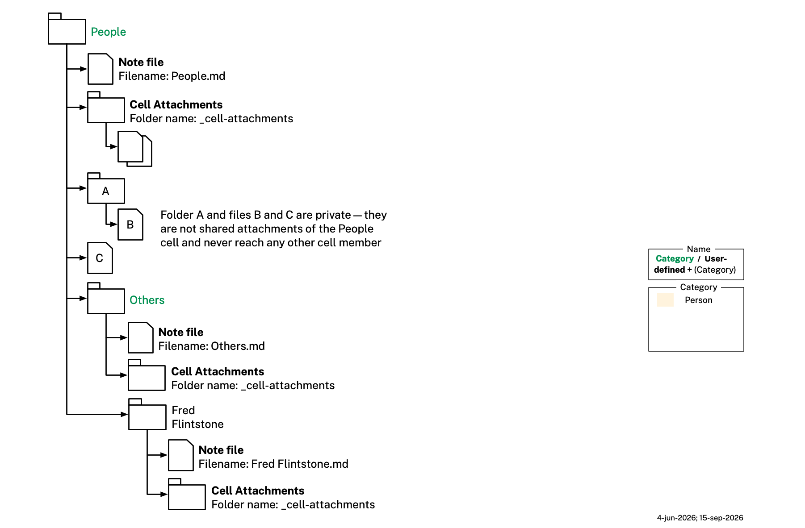

# App Behavior

This file continues [README.md](README.md) and [example.md](example.md), which describe the Category, Pod, Graph, Persona, Organization, and Service ontologies and illustrate them with a worked example. This file documents how the app behaves *on top of* that data — pod lifecycle, storage, sharing, permissions, naming/renaming, what actions a user can take on a pod, what happens when a shared pod arrives somewhere new, and so on.

Nothing in this file changes any `.ttl` file or DataBook triple — every rule here is app-level behavior, not an ontology rule. This file is also written at the **user level** throughout: it describes what a member can do and sees in the app, not how the PDN layer beneath implements it. The two can legitimately differ, and where they do this file follows the user's view — see [Tool & Member Info Permissions](#tool--member-info-permissions) for the case where they diverge most visibly.

## Pod Storage

Pods are stored on the user's device(s) or, for an organization's own `s:ServiceProvider`, on Personal Data Network (PDN) nodes hosted by that organization. **A pod is never persisted in the user's filesystem**: its entire content lives in a protected, app-managed store, encrypted at rest — see [storage.md](storage.md) for that decision and the reasoning behind it. No pod is ever stored by any cloud provider, or any third party of any kind, including The Mee Foundation. When a pod is shared, changes to its contents — including its own name, for a single-member pod or a pod with three or more members, or a two-member pod that also carries a tool — propagate to every member over the PDN; see [Naming, Renaming, and Sharing](#naming-renaming-and-sharing) below for what stays independent per member instead. Two pieces of a pod's content never propagate at all: a member's own **private files**, as against the **attachments** every member receives (see [Pod Contents](#pod-contents) below), and a `pod:serviceTag`, written by one member's own service module and meaningful only in the instance that wrote it (see [Tags](README.md#tags) in README.md). The two differ in who decides: the first is the member's own choice about a file of theirs, the second a bookkeeping label they never see.

### Pod Contents

A pod is a unit the app manages, identified by its own stable id (see [Deriving and Checking a Pod Id](#deriving-and-checking-a-pod-id) below). Nothing marks it in a filesystem, because it is not in one, and it carries no record of its own position in the tree: a pod's parent is per-member state in that member's own store, never shared content, which is what lets two members of a shared pod each file it wherever they like without touching what the other sees.

A pod may carry a `pod:category` value. When present, it records the category concept — a `skos:Concept`, always ultimately reachable from `podcat:Person` or `podcat:Organization` — the pod was originally instantiated from; that concept is normally one of `podcat:PodCategoryScheme`'s own, reached by following `skos:broader` upward, but it may instead belong to a [category extension](README.md#category-extensions)'s own scheme, in which case the path runs through that concept's single `skos:broadMatch` into the core taxonomy first and then upward by `skos:broader` as usual (`bhscat:BostonHubSociety` → `podcat:Groups` → `podcat:Person`) — so the three category types below are well-defined either way; this value is fixed at that point and never re-derived from the pod's current name or position, so neither needs to stay in step with it. There are accordingly **three category types**: **Person** (category reachable from `podcat:Person`), **Organization** (category reachable from `podcat:Organization`), and **Custom** (no `pod:category` at all — a pod the user created without picking any existing category concept). Custom is identified precisely, not by judgment call: the pod simply carries no `pod:category` value.

A pod's own **name** is a separate, purely display-level choice, independent of the above: when the pod does have a category, the name may be copied verbatim from that category's own `skos:prefLabel` (e.g. a pod named "Others" whose category is `podcat:Others`), or the user may give it a different name entirely (e.g. a pod named "Bob Johnson" whose category is still `podcat:Others`). The app's own record of the name is authoritative outright, and there is no independent display-name override anywhere. For a single-member pod or a pod with three or more members — or a two-member pod that also carries a tool — this name is part of the pod's own shared content: it is kept in sync and identical across every member's copy, exactly like its graphs, its attachments, its note (a note's own text, including any links it contains, but not necessarily the resolvability of a link pointing outside the pod — see the note description below), chat, `pod:category`, and everything else the pod carries (see [Introduction to Pods](README.md#introduction-to-pods) in README.md). What stays independent per member is only their own tree *position* for the pod — the parent it's nested under, and so that parent's own name. A bare two-member pod (carrying no tool) is the one exception: there, the name itself is also independent per member, alongside tree position, rather than shared — see [Naming, Renaming, and Sharing](#naming-renaming-and-sharing) below for both this exception and how the app keeps a shared name unique within each member's own tree.

- A pod's **attachments** are the files every member of the pod receives, shown in the app's **Attachments area**, and they are what travels with the pod when it's shared. Attachments are flat, like email attachments. A file the member adds to the pod without attaching it is instead their own **private** file — it stays in their copy of the pod, syncs across their own devices like the rest of it, and never reaches another member. Both sets are shown in this same area: the attachments plainly, and the private files badged (🔒) under their own divider, keeping whatever structure the member has given them rather than being flattened in alongside the attachments. A file is attached or made private by dragging it across, and a member may hold private files in a pod that has no attachments at all. The distinction is about propagation and nothing else, so it is real even in the ordinary case of a single-member pod that shares nothing: it records what *would* travel if the pod were ever shared later — which is exactly the moment a wrong default would bite. Private content may be organized however the member likes; the flatness above is about what travels, and nothing that stays put needs it.
- A pod's **note** is shown in the app's Note area. A pod has exactly one, never more, written in Markdown, and it supports the same freeform linking PKM (Personal Knowledge Management) tools do: a note may link to any other pod's note anywhere in the user's tree, not just within its own pod. Once a link's target has actually been instantiated as a pod (see [Wikilink-Triggered Pod Creation](#wikilink-triggered-pod-creation) below for the one case where it hasn't been yet), the link resolves by that target pod's own stable, globally unique id (see [Pod Id](pod-databook.md#id)) — not by matching its display text. Concretely, a resolved link is written using the alias syntax those same tools already support — `[[7f3a9c2e5d41b08f…|foo]]`, id before the pipe, display text after — rather than inventing new syntax; an unresolved link with no target yet (see below) is simply `[[foo]]`, no pipe at all. A link's own display text travels with the pod's note when the pod is shared, but resolution never falls back to text-matching. This matters because pod names are only unique among siblings, not globally (see [Naming, Renaming, and Sharing](#naming-renaming-and-sharing) below) — a recipient's own tree can easily contain an unrelated pod that happens to share a display name with the intended target, and id-based resolution is what keeps a link from ever silently jumping to that wrong pod instead. What id-based resolution can't fix is the linked-to pod itself not traveling with the note: if the target lies outside this pod's own boundary (i.e. it isn't part of this pod's own Attachments-area content or its own note) and the recipient doesn't independently have a pod carrying that id — because it was never shared with them, or they organize their tree completely differently — the link simply won't resolve on their side; it fails closed (inert, shown as unresolved) rather than open (silently pointing somewhere else). This is an accepted limitation of cross-pod linking, not a defect. That boundary has an inner edge as well: a link whose target is one of the member's own private files resolves in their own copy and fails closed on every other member's side, since a private file never travels — the same inert-rather-than-wrong behavior, for the same reason.

### Scaffolding: This Repo's Filesystem Tree

None of the above is a filesystem. The app does not exist yet, though, so this repository carries its worked example on disk, as a tree of folders under `example/Pods/`: one folder per pod, marked as a pod by a reserved `_pod-attachments` folder directly inside it, holding that pod's structured content as a `.databook.md` file, its note as a Markdown file named after the folder, its attachments inside the reserved folder, and the member's own private files loose beside them. **All of that is development scaffolding** — a way to carry, validate and diagram real pod content before there is an app to hold it — and none of it is a commitment about how Tellipod stores anything. It is specified in [Development Scaffolding](pod-databook.md#development-scaffolding) in pod-databook.md, which is the file to read wherever this repo's layout and the model above appear to disagree; [storage.md](storage.md) draws the boundary between the two.

The diagram shows a slice of that tree — the `People` pod, its `Others` child, and `Others`' own `Fred Flintstone` child — with the folder-icon fill and folder-name text colors this repo's own diagrams use throughout: fill by category type (tan for Person, light blue for Organization, purple for Custom), and folder-name text **green** when the name matches the category's label verbatim, plain **black** when the user has customized it. A Custom pod's name has no label to possibly match, so it is always black text too, never green. The two colors are independent — a pod can be tan-filled with black text ("Fred Flintstone"), light-blue-filled with black text, or purple-filled with black text. Only a folder that is a pod carries fill at all; `_pod-attachments` and the private `A` folder stay white. In this repo's scaffolding a Custom pod's DataBook filename also carries the literal `(custom)` disambiguator in place of a category-derived `<catType>` (e.g. `Friends(custom).databook.md` — see the [Filename Convention](pod-databook.md#filename-convention) in pod-databook.md), and the two must agree; that filename is a scaffolding convention, never the test itself, which is the absence of `pod:category` alone. The pod's name is likewise carried in the DataBook's `title:` field, which mirrors the folder verbatim (integrity.md's YAML-5).

### Deriving and Checking a Pod Id

The creating device derives a new pod's id (see [Pod Id](pod-databook.md#id)) at the moment of creation and writes the pod's founding event. Every member device checks the founding event when it arrives, a newly linked device's first sync included: it recomputes the id, verifies the signature, and drops the event on any mismatch.

## Pod Management

This section is about how the app manages a **pod** specifically — its lifecycle, membership, permissions, naming, and what happens when one is shared.

### Lazy Instantiation

Pods for most category concepts are not pre-created ahead of time. A pod is not created until the user wants one. When a pod matching a templated concept (one for which some `pod:TemplatePod` carries a matching `pod:category` value) is first created, the app clones that `pod:TemplatePod` into the new pod — real content later filed under it is validated against that template's own `pod:memberShape`, or against the `pod:formShape` of a tool it declares, found by the same `pod:category` match rather than copied onto the new pod (content filed as a `pod:member` graph is validated against `pod:memberShape`, content held by a tool against that tool's `pod:formShape` instead) — and the clone is given real member-classified content — typed `pod:InstancePod` — rather than staying purely a template. If the template declares any tool via `pod:declaresTool` (18 of the 106 templates do, e.g. `podcat:MedicalAppointment`'s, `podcat:PetsMedical`'s, `podcat:Companies`'s, and `podcat:Home`'s — plus 3 more, e.g. `podcat:HealthWellness`'s, whose tool holds a bare third-party-reference label rather than a specific document type), the clone is created carrying one live `pod:tool` per declared tool, since a real pod of that category always ends up holding that content beyond its own `pod:member` baseline.

If the user instead creates a pod with **no category** selected at all (the Custom/UserDefined case, identified by the pod carrying no `pod:category` value at all), there is no `pod:category` value to drive the usual reverse lookup, so this one case falls back to a different, fixed template instead: `ctpl:UserDefinedTemplatePod` (`pod-category-templates.ttl`) — the one `pod:TemplatePod` carrying no `pod:category` value at all, found as that unique category-less template rather than by matching a category. It carries only `pod:memberShape pshapes:ContactInfoShape` and declares no tool — a Custom pod has no document type and no tool of its own, only ever a contact-info view of its member(s).

When a member then actually fills in that pod's `pod:member` graph or a tool's own graph, the app also stamps the new graph's own `pod:shape` value from that same lookup, using whichever of the two shape properties matches the list the new graph belongs to — the pod's `pod:category` → its `pod:TemplatePod` → that template's `pod:memberShape` (for a `pod:member` graph) or its declared tool's `pod:formShape` (for a tool's own graph) → that shape's own CURIE, copied directly, since `pod:shape`'s range is `sh:NodeShape` (`pod.ttl`), the same range `pod:memberShape` and `pod:formShape` already carry — there is no separate label to resolve. **This mapping is unconditional**: whenever a `pod:TemplatePod` of category X carries a `pod:memberShape` value, every real pod of category X must have its `pod:member` graph(s) carry the matching `pod:shape` value too, with no exception for which shape it happens to be. For example, a `podcat:Passport` pod's sole tool graph → `ctpl:PassportTemplatePod` → its declared tool's `pod:formShape idocshapes:PassportShape` → the graph's own `pod:shape` is stamped `idocshapes:PassportShape` directly — integrity.md's TTL-3 separately verifies that shape's own `sh:targetClass` (`idoc:Passport`) is asserted via `rdf:type` on the graph's own new document individual; TTL-4 verifies the `template:` value itself against the pod's `TemplatePod`. Every one of the 106 templates in `pod-category-templates.ttl` uses `pshapes:ContactInfoShape` as its own `pod:memberShape` (a `pod:member` graph is always validated as a basic contact-info profile, regardless of category, while any category-specific content lives in a tool instead), so every real `pod:member` graph's `pod:shape` is likewise stamped `pshapes:ContactInfoShape` uniformly — even though that shape's own `sh:targetClass` is the broad `persona:Person` rather than a narrow reified document class, since it validates the graph's own subject individual in place rather than a separate reified document (integrity.md's TTL-3 carves this one shape out as its sole exemption from the rdf:type-matching rule, since a `pod:member` stub graph legitimately need carry no `persona:Person` individual at all — e.g. an organization's own self-claimed member stub). Every `pod-categories.ttl` concept, the two SKOS top concepts `podcat:Person`/`podcat:Organization` included, now has a matching `pod:TemplatePod` (integrity.md's TTL-6 — no real pod is ever categorized as bare Person/Organization), so the reverse `pod:category` → `pod:TemplatePod` → `pod:memberShape` lookup above covers every real `pod:member` graph without exception, including Alice's own contact info (`podcat:Employees` → `ctpl:EmployeesTemplatePod`) — there is no longer a live case of a ContactInfo graph created with no pod-level template lookup at all.

### Number of Members

A pod can have just one member (the user) or several. We don't yet know how many members a pod can support, but the number is almost surely well under 100. An invited agent service (`s:AgentService`, see [Inviting AI Agents](#inviting-ai-agents) below) is a real member too, and counts toward this same tally — inviting one raises a single-member pod to a two-member pod, exactly as inviting a human would.

### Permissions

Pod-level capabilities are governed by two independent axes: **ownership** (`pod:owner`, pod.ttl — owner vs. regular member) and **identity type** (human or service). A pod's creator (`pod:creator`) is always its initial, and until any promotion its sole, owner; any current owner may promote any other current regular member of `p:Person` identity — never an `s:Service`, which can never hold the owner role, mirroring `pod:creator`'s own person-only range — to owner, at which point that member's capabilities change as shown below. Any current owner may likewise demote another owner back to regular-member status, so ownership is not permanent once granted — the one limit being that a pod always retains at least one owner (`pod:owner` carries `sh:minCount 1`), so the last remaining owner cannot be demoted. A single-member pod has only its creator, who is trivially its sole owner — the owner/regular-member distinction only becomes observable once a pod gains a second member. There is no separate guest tier — every member, of any identity type, has exactly the same access as any other member of the same ownership status.

Capabilities are grouped by the surface they govern, one table each: the **pod container** itself, its **attachments**, its **note**, and its **tool & member info** (graph claims). A capability appears in exactly one table.

We define three kinds of members:

- **Owner** — a user who is currently holding the owner role. The pod creator immediately becomes the pod's first, and initially sole, owner.
- **Member** — a user who is not currently an owner.
- **Service** — a service, (always a non-owner).

Every pod in every table now carries a decided value. A pod reading `n/a` marks a capability that genuinely cannot apply to that role, rather than one left open — an `s:Service` can invite no one, so it can never have a self-invited member to remove.

#### Pod Container Permissions

| Capability | Owner | Member | Service | Open Issue |
|---|---|---|---|---|
| Create pod | yes | yes | no |  |
| Invite member to a pod | yes | yes | no |  |
| Uninvite self-invited member | yes | yes | n/a |  |
| Remove member from pod | yes | no | no |  |
| Remove owner-member from pod | yes | no | no |  |
| Leave pod | yes | yes | yes |  |
| Rename pod for all members | yes | yes / no  | no |  #1 |
| Delete pod locally | yes | yes | yes |  |
| Delete pod for all members | yes | no | no |  #2 |
| Promote member to owner | yes | no | no |  |
| Demote owner to member | yes | no | no |  |
| Out-of-pod communications | yes | yes | no |  |

**Open Issues**

1. **Rename** — may any member rename a pod for everyone, or only an owner? This document's [Naming, Renaming, and Sharing](#naming-renaming-and-sharing) section argues at length for any member, against the Microsoft Teams/Discord/GitHub precedent; Vladimir and Sergey restrict it to owners.
2. **Leave vs. delete locally** — does *Leave pod* subsume *Delete pod locally*, or are they distinct? Leaving withdraws one's membership, which propagates; deleting locally removes the pod from one's own tree only. They are kept as separate rows pending an answer.

**Capabilities**

- **Create pod** — create a new pod in one's own tree. Only a human can: `pod:creator`'s range is `p:Person` alone, so no service — provider, agent, or backup — can originate a pod, and none can invite anyone into one either. An organization's relationship with a person therefore only ever exists because the person created the pod and invited that organization's `s:ServiceProvider` into it; the organization cannot open the conversation.
- **Invite member to a pod** — invite a person, or a service (one's own AI agent, a backup service, or an organization's own service), to a pod of which one is already a member.
- **Uninvite self-invited member** — remove a pod member whom this member originally invited.
- **Remove member from pod** — remove any regular (non-owner) member.
- **Remove owner-member from pod** — remove a member who currently holds the owner role, as distinct from removing a regular member.
- **Leave pod** — withdraw one's own membership, dropping oneself from `pod:member` (and from `pod:owner`, if held). Its relationship to *Delete pod locally* is unsettled.
- **Rename pod for all members** — change the pod's shared name so the change propagates to every member's copy. See [Naming, Renaming, and Sharing](#naming-renaming-and-sharing) below for the full rule, including the bare two-member-pod exception where the name is independent per member rather than shared.
- **Delete pod locally** — remove the pod from this member's own tree only, not from any other member's copy.
- **Delete pod for all members** — only the owner can do this. 
- **Promote member to owner** — add a current regular member (a `p:Person`, never an `s:Service`) to `pod:owner`.
- **Demote owner to member** — remove a current owner from `pod:owner`, returning them to regular-member status. Restricted to owners, and never applicable to the pod's last remaining owner, since `pod:owner` requires at least one value.
- **Out-of-pod communications** — communicate with another pod member outside the pod, by email or SMS, using contact information about that member that they have put in the pod.

#### Attachment Permissions

An attachment is a file every member of the pod receives, shown in the app's Attachments area (see [Pod Contents](#pod-contents) above). An attachment is **immutable**: once added, its content is never updated in place by any role, so a correction means deleting it and adding the corrected file. Vladimir and Sergey call this an *immutable document*, a PDF being their example.

A file the member adds to the pod without attaching it is instead their own **private** file, which no other member ever receives. Every row below reads the same for one, with a single difference: both *another member's* rows become `n/a`, since no other member ever has one of this member's private files to read or delete. A service reaches exactly what its principal reaches — its access is its principal's access (see [Pod Interface](#pod-interface) below) — so a member's own agent or backup service sees their private files, and a service acting for another member never does.

| Capability | Owner | Member | Service | 
|---|---|---|---|
| Read own attachment | yes | yes | yes | 
| Read another member's attachment | yes | yes | yes | 
| Add own attachment | yes | yes | yes | 
| Add an attachment as if authored by another member | no | no | no | 
| Update own attachment | no | no | no | 
| Update another member's attachment | no | no | no | 
| Delete own attachment | yes | yes | yes | 
| Delete another member's attachment | yes | no | no | 

- **Read own attachment** / **Read another member's attachment** — retrieve an attachment's content, one's own or one added by a different member.
- **Add own attachment** — put a new file into the pod's flat attachment set, authored as oneself.
- **Add an attachment as if authored by another member** — attribute a newly-added attachment to a member other than oneself. No role may do this.
- **Update own attachment** / **Update another member's attachment** — modify an existing attachment's content in place. No role may do either: an attachment is immutable, so replacing one means deleting it and adding the corrected file, which re-dates it and re-attributes it to whoever added the replacement.
- **Delete own attachment** — remove an attachment one added oneself.
- **Delete another member's attachment** — remove an attachment a different member added.

Two further capabilities move a file across the boundary between the two sets. Attaching one's own private file is just *Add own attachment* above; the reverse direction is its own capability:

| Capability | Owner | Member | Service | 
|---|---|---|---|
| Make own attachment private | yes | yes | yes | 
| Make another member's attachment private | no | no | no | 

- **Make own attachment private** — move an attachment one added oneself back among one's own private files. Every other member sees this as a deletion, which every role may already do to an attachment of their own.
- **Make another member's attachment private** — do the same to an attachment a different member added. No role may, owner included. The objection isn't the deletion — an owner may delete another member's attachment outright — but keeping a copy of a file every other member has been told is gone.

#### Note Permissions

A pod has **exactly one note** (see [Pod Contents](#pod-contents) above and [Note Area](#note-area) below) — never more. Vladimir and Sergey call this a *mergeable document*, and their own row labels distinguish a member's "own" document from "another member's"; with one note per pod that split does not arise, so the rows below are stated as capabilities on the pod's single note. Every member may write to it, regardless of ownership — reading and writing the note is the one surface where the owner/regular-member distinction does not apply at all. There is no commenting or suggested-edit mechanism of any kind — no margin comments, no proposed inline changes, and so no accept-or-reject step; a member simply edits the note, and every other member sees the result.

| Capability | Owner | Member | Service | 
|---|---|---|---|
| Read the note | yes | yes | yes | 
| Create the note | yes | yes | yes | 
| Create the note as if authored by another member | no | no | no | 
| Edit the note | yes | yes | yes | 
| Delete the note | yes | yes | yes | 

- **Read the note** — retrieve the note's current text.
- **Create the note** — bring the pod's note into existence, where it does not exist yet.
- **Create the note as if authored by another member** — attribute a newly-created note to a member other than oneself. No role may do this.
- **Edit the note** — commit a change to the note's text, with no review step. Since a pod has one note that every member may write, there is no distinction between editing one's own text and editing another member's; Vladimir and Sergey's own two edit rows collapse into this one for the same reason.
- **Delete the note** — remove the pod's note. Available to every member, since a member who may edit the note may in any case blank it.

#### Tool & Member Info Permissions

These govern the graph claims backing a pod's `pod:member` and tool content — what Vladimir and Sergey call a *claim*. Every row is scoped by claimant: a member's own claims are the ones they themselves claim. **A claim is editable, as the user experiences it.** A member who wants to correct their email address in a `pod:member` graph just edits the field, and the app presents that as an ordinary update — which is why the `Update own claim` row below reads `yes`.

Underneath, at the **PDN layer**, there is no update operation on a claim at all: a claim is immutable, and the app implements the edit by deleting the claim carrying the old email address and issuing a fresh claim carrying the new one. Nothing about that reaches the user — they see a field they changed, not a retraction and a re-issue. The graph itself is never replaced either way; it stays one evolving graph whose claims come and go beneath it.

This document describes the first of those two layers, so every row below is the user-level rule. Vladimir and Sergey's own tables describe the second, which is why their `Update own claim` row reads `no` where this one reads `yes` — the two are not in conflict, they are the same behavior seen from either side of that boundary.

| Capability | Owner | Member | Service | 
|---|---|---|---|
| Read own claim | yes | yes | yes |  
| Read another member's claim | yes | yes | yes |  
| Issue own claim | yes | yes | yes |  
| Issue a claim as if issued by another member | no | no | no | 
| Update own claim ¹| yes | yes | yes |  
| Update another member's claim | no | no | no | 
| Delete own claim | yes | yes | yes | 
| Delete another member's claim | yes | no | no | 

¹ User-level, this is an ordinary edit of one's own claim. At the PDN layer the claim is immutable and the edit is carried out as a delete plus a fresh claim — which is what Vladimir and Sergey's `no` records. Same behavior, different layer.

- **Read own claim** / **Read another member's claim** — read a graph claim, one's own or one another member claims. Read access is unrestricted across the pod.
- **Issue own claim** — assert a new claim as claimant, in a `pod:member` graph or a tool's own graph one claims oneself.
- **Issue a claim as if issued by another member** — attribute a newly-issued claim to a claimant other than oneself. No role may do this.
- **Update own claim** — change the value a claim one issued oneself carries, e.g. correcting one's own email address. An ordinary edit as far as the user is concerned; a delete-and-re-issue underneath (see above).
- **Update another member's claim** — change a claim a different member issued. No role may do this at either layer: write access is always scoped to one's own claimant identity.
- **Delete own claim** — retract a claim one issued oneself.
- **Delete another member's claim** — retract a claim a different member issued.

### Naming, Renaming, and Sharing

For a single-member pod or a pod with three or more members — or a two-member pod that also carries a tool — any member of the pod — not just its creator or another owner — can rename it, and the new name propagates to every member: renaming is never gated by ownership, unlike other-member claim/attachment deletion (see [Permissions](#permissions) above). Chat likewise stays freely editable by every member regardless of ownership status, and any member may add or delete their own attachments — though no member may update an attachment in place, since an attachment is immutable, and what a member keeps among their own private files rather than attaching is their own affair, gated by nothing. This mirrors how **Slack** and **Notion** handle renaming by default: any member/editor can rename a channel or page, and the new name propagates to everyone. It's a deliberate contrast with **Microsoft Teams** (channel owners only, by default), **Discord**, and **GitHub**, which restrict renaming to a privileged admin/Manage-Channels/owner role — a distinction the app's pod model doesn't have to begin with. A bare two-member pod — one carrying no tool — does *not* follow this rule — see the exception below.

A pod's name must be unique among its sibling pods — the pods directly nested under the same parent. When a user renames a pod — e.g. to give it a name of its own choosing, different from its category's label, the same convention followed by other PKM tools — to a name that already belongs to one of its siblings, the app doesn't prompt or reject the input: it silently appends the next available integer suffix (`"1"`, `"2"`, ...) to make the name unique. The same rule applies when creating a brand-new pod whose default name (e.g. copied verbatim from its category's own label) would otherwise collide with an existing sibling. In this repo's scaffolding one name is reserved outright rather than suffixed: no pod may be named `_pod-attachments`, that being the one subfolder of a pod's folder the app owns (see [Scaffolding: This Repo's Filesystem Tree](#scaffolding-this-repos-filesystem-tree) above).

This same uniqueness rule applies on **receipt** of a shared pod — for two-member pods and pods with three or more members alike — and, once a bare two-member pod's name goes independent per member (see the exception below), on every later rename by either member too: if the incoming or renamed name collides with a pod the recipient already has at that position in their own tree, the app appends the next available suffix to it rather than overwriting the existing pod or rejecting the incoming/renamed one.

**Exception: bare two-member pods (carrying no tool).** A two-member pod's name is never shared, synced content between its two members, in contradiction to the general rule above — each member is independently responsible for the name on their own side — but *only* when that pod carries no tool. This is because a bare two-member pod is an asymmetric dyad about the relationship *between* its own two members: each member's name for it naturally reflects their own perspective on the *other* party, and there's no single name that fits both (e.g. Alice's pod with Bob, below). A two-member pod that does carry a tool, by contrast, is about a third party neither member's own perspective differs on — its derived subject (see README.md's [Pod Ontology](README.md#pod-ontology) section) is the same graph-linked subject regardless of which member is looking, so there's no asymmetry to preserve, and it follows the general shared-name rule above instead, exactly like a pod with three or more members (a genuine group identity with no single "other side" to name from either). For example, the `Medical Appointment` pod Alice shares with her husband Dave — a two-member pod whose one form tool is about their daughter Sophia — has one shared name kept in sync on both sides, renamable by either Alice or Dave. Their `Sophia Walker` pod (see example.md's [Taking Care of Sophia](example.md#taking-care-of-sophia)) has the same shape and follows the same rule.

For a bare two-member pod, the creator's name for their own copy is simply whatever they set it to — chosen and renamed exactly as for any other pod, subject only to the sibling-uniqueness rule above, but never propagated to the recipient's copy.

At **first-time receipt** of a bare two-member pod — the recipient self-evidently did not create it, they're joining one already created — the app does not just adopt the creator's name as shared content. Instead, once, at that first receipt, it analyzes the `pod:member` graph(s) belonging to the pod's creator/sender member and auto-generates a name for the pod from that analysis. (The sender's own choice of name for their copy is naturally centered on their own perspective, so blindly reusing it verbatim on the recipient's side would be a poor fit; analyzing the sender's own member graphs lets the recipient's app derive a name that makes sense from its own side instead.) This auto-generated name is subject to the same sibling-uniqueness suffixing described above.

For example, Alice creates a bare two-member pod about her relationship with Bob and names it "Bob" on her own side, then shares it with Bob. On first receipt, Bob's app doesn't just copy "Bob" — that's Alice's name for *him*, not a name that makes sense in Bob's own tree. Instead it scans the pod's `pod:member` graph(s) belonging to Alice, finds a graph about Alice herself, extracts her given name, and names the pod "Alice" on Bob's side instead.

From that point on, both the creator's and the recipient's names for their own copies may be freely renamed at any time, exactly like a single-member pod's name — but such a rename stays purely local to the renaming member's own tree and is never propagated to the other member's copy, in either direction. This is what keeps the first-receipt divergence meaningful: if a later rename on either side rippled to the other, it would silently overwrite a name chosen to fit that member's own perspective, defeating the reason the divergence exists in the first place.

### Wikilink-Triggered Pod Creation

A pod's note may contain a wikilink with no target id at all yet — one whose linked-to name has never been instantiated as a pod by anyone (see [Pod Contents](#pod-contents) above for how an already-instantiated link instead resolves by stable id, not display text). Since a note is never a standalone unit in this app — it's always the single note *of* a pod, never anything on its own — clicking such a truly-new link can't create an orphan note the way a flat-file PKM tool would; the only creatable target that actually fits the model is a new pod.

Clicking a no-id wikilink therefore creates a new pod named after the link text (e.g. `[[foo]]` creates a pod named "foo"), placed as a direct child of the top-level tree root — the same "new note at the root, move it later" behavior familiar from PKM tools, but scoped to a pod rather than a bare note. The user is expected to move the new pod to a more appropriate position afterward, exactly like any other pod; the sibling-uniqueness auto-suffix rule described in [Naming, Renaming, and Sharing](#naming-renaming-and-sharing) above applies here too, if "foo" collides with an existing top-level pod. Creating the pod also derives its stable, globally-unique id — from the creator's PDN ID, a public key of the creator's identity and fresh random bytes (see [Pod Id](pod-databook.md#id)), not the small sequential `pod-<NN>` this repo's own example data uses — and rewrites the clicked link, in the clicking member's own copy of the note, from `[[foo]]` to `[[7f3a9c2e5d41b08f…|foo]]` (id before the pipe, unchanged display text after), so every later click by anyone who has access to that same pod resolves deterministically to it — never by re-matching on the display text "foo."

The new pod carries no `pod:category` at all — the user didn't pick any existing category concept, so this is the same **Custom** case described in [Pod Contents](#pod-contents) above (carrying no category value at all; `foo(custom).databook.md` in this repo's scaffolding). It is a single-member pod, created by and with `:Self` as its sole member, following the same minimal-stub-graph pattern used elsewhere for a pod with nothing substantive to say yet (e.g. the bare given-name claim in Sophia Walker's Health & Wellness pod or her primary care physician's pod — see example.md). Its own note starts out blank, ready for the user to fill in.

This creation behavior is strictly for the no-id case. A wikilink that already carries a target id — one pointing to a real, already-instantiated pod the sender has, but that the clicking member doesn't have in their own tree (e.g. it was never shared with them, or they organize their tree completely differently) — must never fall back to creating a same-named stub pod either: doing so would produce an empty, disconnected pod that visually masquerades as the real target, reintroducing a milder version of the same misdirection risk id-based resolution exists to prevent. That case instead renders as unresolved/inaccessible, exactly as described in Filesystem Persistence above — creation is reserved for links whose target has literally never existed anywhere.

### Auto-Filing on Receipt
 
When a pod is shared with someone who doesn't yet have the app, receiving it — e.g. clicking an invite link — triggers installation, and the app must then decide where to file the incoming pod in the recipient's own tree of pods.

For example (see example.md's ["Caring for Ginger"](example.md#caring-for-ginger) for the underlying pod and graphs): imagine Paula doesn't use the app yet, and the invite link from Alice to [pod 40](<example/Pods/Pets/Ginger/Medical/Medical.databook.md>) causes Paula to click on the link and download/install it. The app receives the pod, but where should it file it on Paula's side? Paula's app examines the pod, looks at its category type "Medical," and makes a good (though not perfect) guess to create the following tree of empty pods: People > Others > Alice > Pets > Ginger, and files the incoming pod as a new child of that Ginger pod.

Ideally it would have filed the pod shared by Alice's app under People > Immediate Family, because she is Paula's daughter, but Paula's app didn't know that, so it did the best it could. To perfect things, Paula can create an Immediate Family pod under her People pod and move Alice (and sub-pods) under it.

### Organize

There are two kinds of organizing that the app does when the user selects a pod and taps " Organize":

* **Auto File**: It examines the selected pod and if it doesn't have a category, suggests one and then automatically files it there if the users wishes.
* **Divide and Conquer**: It looks inside the pod (especially the pod's note) and does the following.

#### Auto File

The app might look at the chat and/or Note and say "Hmmm...this looks like it's about taking care of your cat. Would you like me to file it under Pods > Pets? 

#### Divide and Conquer

The app looks at the Note, and moves chunks of content out it, leaving behind a link where the chunk was. It then creates a new categorized pod from this chunk of content. The category would come from an examination of the contents. 

Here's an example. Imagine a pod that contained lots of notes about Alice's mother Paula. In that stream of notes was Paula's credit card info (name, number, expiration date, CVV, etc.). The app removes this chunk of content leaving behind a link called "Paula's Credit Card". If Alice taps this link it brings her to a new pod called "Paula's Credit Card" of type `podcat:BankingPayments` with a Form tool that contains the credit card info, but parsed into fields and values. It automatically files this new pod under Pods > Immediate Family > Paula Walker > Finances > Banking & Payments.

It could then ask some questions, do you know the name of the bank that issued this card? (to which Alice answers "GiantBank"). Would you like me to rename this new pod "GiantBank - Mastercard"? etc. 

### Finding Pods by Tag

The two kinds of tag a pod can carry, and what each is for, are described in [Tags](README.md#tags) in README.md. The user can search their tree for a tag: the result is a flat list of links to pods — not a filtered tree, and not the pods' contents — from which tapping an entry opens that pod. Searching **Ginger** returns links to all three of her cat's pods at once.

Each result links by the target pod's own stable id, exactly as a resolved wikilink in a note does (see [Pod Contents](#pod-contents) above). This matters for the same reason it matters there: pod names are only unique among siblings, never globally, so resolving a result by name could land on an unrelated pod that happens to share a display name with the intended one. Id-based resolution rules that out.

What this search matches is **user-defined tags only**. A hidden service tag is hidden from the user's retrieval exactly as completely as it is hidden from their display: the user cannot find a pod by one, cannot see one in a result, and has no query — free text or otherwise — that turns one up. Searching *Christmas List* finds nothing on the strength of the Apple Contacts tag alone. What a service can do with its own tags is a separate, non-user-facing matter; see [Service Tag Access](#service-tag-access) below.

Results are scoped to the searching member's own tree.

### Finding Pods by Property

Tags are not the only way to gather pods. The user — or their own AI agent, working on their behalf — can also search for every pod whose tool graph carries a given **property**, and get back the same flat list of pod links a tag search returns.

The worked example is the one a tag would otherwise have handled: "show me every pod where I hold a loyalty program." That is a search for `sa:loyaltyProgramID` (see [Service Accounts Ontology](README.md#service-accounts-ontology) in README.md), and it returns Alice's `Hilton` pod because that pod's tool graph records her Hilton Honors membership number. Nobody had to label the pod for this to work.

The two searches complement each other rather than competing. A property search needs no one to have remembered to tag anything and cannot drift out of date, since it reads the same fact the pod already stores for its own sake — but it only reaches what the data actually models. A tag reaches anything at all, including a grouping that exists only in the user's head ("Ginger"), at the cost of someone having to apply it. So a fact with a property of its own is found by that property, and a tag is for what the data does not already model — which is why the app ships no built-in tag vocabulary.

### Adding a Tool

Every pod offers an **Add Tool** action, whether or not it already carries one — a pod cloned from a template that declares no tool starts with none (see [Lazy Instantiation](#lazy-instantiation) above). The user selects the pod, taps **Add Tool**, and a modal dialog asks them which tool to add and, for a **Form**, which template the new form's information should follow. The default selection is **Contact Info** (`pshapes:ContactInfoShape`) — the same contact-info shape every pod's `pod:member` graph already uses — since a form about a person who is not themselves a member of the pod is the commonest case by far. The dialog offers many other choices alongside it, one per SHACL shape a tool's graph can be validated against — **Passport**, **Debit Card**, **Vehicle**, **Trip Itinerary**, and the rest; README.md's [Form Shapes](README.md#form-shapes) lists all of them, and [Form Types](#form-types) below says what the dialog does with the pick.

Whichever template the user picks is stamped directly onto the new graph as its `pod:shape` value — the same value Lazy Instantiation would have stamped automatically had the category's own template declared the tool up front — and the form the app renders for filling it in is derived from that same shape (see [Form Fields from SHACL Shapes](#form-fields-from-shacl-shapes) below). The user also names what the tool is about, which becomes its single `pod:formTopic`.

**Any pod can gain a tool this way, as many as the user likes.** The action is not restricted to categories whose template declares one, and the picked template does not have to be one the pod's own category declares: the dialog offers the full list of shapes regardless, and whatever the user picks is stamped onto the new graph as-is. A category's `pod:TemplatePod` therefore has no authority over a hand-added tool, and a category that declares no tool offers no shape hint either — integrity.md's TTL-4 deliberately does not check such a tool's graphs against the category at all.

Nothing caps how many tools a pod may hold. What the pod's own member count does cap is the number of graphs beneath any one tool — one per claiming member (YAML-8) — which applies equally to a tool the template declared and one the user added. Alice's Immediate Family pod for her daughter Sophia (pod-12) is the worked example of the manual path: `podcat:ImmediateFamily` declares no tool, and Sophia has no instance of the app and so cannot be one of the pod's members, so Alice adds a Form tool about her by hand, picking Contact Info herself.

#### Form Types

A form type *is* a SHACL node shape. Picking one in the **Add Tool** dialog stamps that shape's IRI onto the new graph as its `pod:shape` value, and the fields the app renders are derived from it (see [Form Fields from SHACL Shapes](#form-fields-from-shacl-shapes) below). The dialog offers one entry per shape the app ships — the same shapes a `pod:TemplatePod` draws on for its `pod:formShape`, offered to the user directly — and it offers the full list regardless of the pod's own category.

What each form type records, which shape backs it, and which categories declare one up front are properties of the ontologies rather than of the app, so the list itself lives in README.md's [Form Shapes](README.md#form-shapes) section. *Form shape* is that section's name for what this dialog calls a *form type*; they are one thing named from two sides.

The other four tool kinds — `pod:Calendar`, `pod:Canvas`, `pod:Contacts` and `pod:Map` — have no content model yet, so they have no type list of their own: the dialog asks which template to follow only for a **Form**.

### Note Area

The Note area is a Markdown editor for the pod's one note, providing the functionality typical of Markdown editors:

- Freeform Markdown syntax editing — headers, bold/italic/strikethrough, inline code and fenced code blocks, blockquotes
- Bulleted, numbered, and nested lists, plus checklist/to-do items
- Tables
- Links — ordinary URLs and `[[wikilinks]]` to other pods' notes, with autocomplete as the user types (see [Pod Contents](#pod-contents) above for how a wikilink actually resolves to a target pod's id)
- Inline image/embed preview
- Live preview of rendered Markdown, kept in sync with the raw source
- Find and replace
- Undo/redo
- Continuous autosave — there is no explicit save step
- Editable by every member regardless of ownership (see [Permissions](#permissions) above). There is no commenting or suggested-edit mechanism, so nothing is stored in the note beyond its own Markdown, keeping it portable

### Chat Area

Chat is one feature with two visibility modes, not two separate concepts. By default, every message posts to the pod's one shared group stream, visible to every member. Any message can additionally be *directed* at a specific named member — human or agent — while staying in the shared stream (e.g. Alice @-mentions her agent; every member sees both her prompt and the agent's reply). Separately, a true private 1:1 thread between a member and their own agent is also supported, whose transcript is not visible to other members — only the *resulting* committed changes (note edits, tool-graph revisions, new attachments) surface into the shared pod.

### Inviting services

A member may invite a service — their own AI agent, a backup service, or an organization's own service provider — into a pod, where it becomes a real member alongside the human ones. What the user is doing in each case, and what access the invitation grants, is below; what an invited service can then actually do inside the pod, and how the app runs it on the member's device, belongs to the module rather than the UI and is covered under [Services](#services).

#### Inviting AI Agents

A member may invite their own AI agent (`s:ChatGPT`, a leaf under `s:AgentService` — see README.md's [Service Ontology](README.md#service-ontology)) into a shared pod — e.g. inviting ChatGPT to help plan a trip in a `podcat:Trips` pod. An invited agent becomes a real pod member: it gets its own self-claimed `pod:member` entry alongside the human members, which raises the pod's own distinct-member count (e.g. Alice + her own agent = two distinct members, a two-member pod; a third member joining too — human or service — would raise it to three members, the same derivation applying regardless of count — see [Number of Members](#number-of-members) above). Because the agent is a literal member, it needs no special-case permission logic — [Permissions](#permissions) above already covers it: by default, an invited agent gets exactly the same read/write access to the pod's note, files, and [chat](#chat-area) that any non-owner human member has (see [Permissions](#permissions) above) — and, unlike a human member, a service member can never be promoted to owner, so it stays at that baseline permanently.

#### Inviting Backup Services

{to be written}

#### Inviting Service Providers

{to be written. Inviting Cititbank, etc.}

## UI Implementation
### Form Fields from SHACL Shapes

When the app renders an editable form for a pod's `pod:member` content or for a `pod:Form`'s own content, it derives each input field directly from the applicable SHACL shape — found live by matching the pod's own `pod:category` value against `pod-category-templates.ttl`'s `pod:TemplatePod` individuals and reading either that template's `pod:memberShape` (for a `pod:member`-content form) or the `pod:formShape` of the tool it declares (for a tool's own form) (see [Lazy Instantiation](#lazy-instantiation)), rather than hand-coding one form per template class. A tool the user added by hand takes its shape from the user's own pick instead (see [Adding a Tool](#adding-a-tool) above). Each `sh:property` constraint on that shape becomes one form field: `sh:datatype`/`sh:class`/`sh:nodeKind` determines the field's input type, and `sh:minCount`/`sh:maxCount` determine whether it's required and whether it repeats.

A property whose `sh:property` constraint carries an `sh:in` list renders as a closed dropdown populated directly from that list, with no further query needed — the shape itself is authoritative for what's selectable. This covers both a literal-value enumeration (e.g. `v:fuelType`, `v:driveWheelConfiguration`) and a class-value-punned one (e.g. `v:hasVehicleType`, whose `sh:in` list is the four concrete classes `v:Car`/`v:BusOrCoach`/`v:Motorcycle`/`v:MotorizedBicycle` rather than a set of literals).

A property constrained only by `sh:nodeKind sh:IRI`, with no `sh:in` list — e.g. `v:hasMake`, `v:hasModel` — tells the app the field's *shape* but not its *legal values*. For a field like this, the app instead queries the ontology graph for every individual typed the property's expected range class, and uses each one's `rdfs:label` as the dropdown's display text and its IRI as the stored value: every `v:Make` individual for `v:hasMake`, every `v:Model` individual for `v:hasModel`. This is a general pattern, not special-cased to vehicles — it applies to any `sh:nodeKind sh:IRI`-only property with an open, ontology-defined vocabulary rather than a small fixed one.

Where one such field's legal values depend on another field already filled in, the app narrows the query accordingly rather than presenting two independent pickers. `v:hasModel`'s dropdown is filtered to only the `v:Model` individuals whose `v:modelMake` points back at the already-selected `v:hasMake` value — a cascading, make-then-model picker. Alice's RAV4 pod illustrates this: choosing "Toyota" narrows the model dropdown to Toyota's own vendored models before "Toyota RAV4" can be selected (see example.md's ["Vehicles"](example.md#vehicles) for the underlying pod and [graph 63](<example/Pods/Things/Vehicles/RAV4/RAV4(vehicles).databook.md#graph-63>)).

## Services

Every service the app offers *is* one of the classes in README.md's [Service Ontology](README.md#service-ontology) — there is no separate wrapper concept sitting over one. What the app ships per service is the code that runs it on the member's own device, translating between the external system's own API and the pod, which it reaches through the [Pod Interface](#pod-interface) like any other member, with that member's own access and no more.

Each principal runs their own services independently — their own credentials, their own connection to the underlying external system — the same way each peer already manages their own tree position for a shared pod independently (see [Pod Storage](#pod-storage) above). An AI agent runs whenever a message addressed to it arrives (matched via `s:actsFor`); a contact sync or a backup service runs on its own schedule instead. Because a service acts for exactly one member, everything it records privately stays on that member's side — which is the whole reason a hidden [service tag](README.md#tags) never propagates on a share.

Two are documented below. Both are `s:AgentService`s, meaning each acts for exactly one member:

| Service | Class | What it does |
|---|---|---|
| ChatGPT | `s:ChatGPT` | An LLM assistant that collaborates in the pod's chat, note, and tool graphs |
| Arca Backup | `s:ArcaBackup` | Backs up the member's own copy of a pod |

An `s:ServiceProvider` — an organization's own service, such as Citibank's — is equally a service by this definition; it simply acts for the organization that provides it rather than for a member, and the app does not ship its code.

### Pod Interface

Every module reaches a pod through one and the same surface, the **Pod Interface** — every `s:Service`, and the module behind a tool such as `pod:Contacts` (see [Tool Modules](#tool-modules) below) alike: the read and write operations over a pod's [note](#note-area), [attachments](#pod-contents), [chat](#chat-area), and `pod:member`/tool claims. There is no side door — no service reaches a pod's content by any other route, or writes to another member's claims directly, and none gets an API of its own.

This is why an invited service needs no special-case permission logic anywhere in this document. The Pod Interface is the same surface a human member's own UI uses, and it enforces the same rules for both, already set out in [Permissions](#permissions) above:

- **Read access is unrestricted across the pod** — every member, human or service, can read the note, every member's and every tool's claims, and attachment metadata. "Across the pod" means the pod's shared content: a member's own private files are not part of it, and a service reaches them only when it acts for that member, its access being its principal's access.
- **Write access is scoped to the caller's own claimant identity** — a service creates, updates and deletes only the claims it claims itself. It can edit the shared note and add attachments like any member, but it can never write to another party's `pod:member` graph or tool graph.
- **A service is never an owner.** It cannot be promoted (`pod:owner`'s range is `p:Person`), so it permanently sits at the non-owner baseline: it cannot delete another member's claims or attachments, and it cannot delete the pod for everyone.
- **Its access is its principal's access.** An `s:AgentService` operates with the access of the one member it `s:actsFor`, never more — inviting an agent grants it nothing its principal did not already have.
- **Hidden [service tags](README.md#tags) are namespace-scoped.** A module searches, reads, adds and deletes only the `pod:serviceTag` nodes carrying its own developer's `pod:tagNamespace`; another module's are neither readable nor writable, and none of them is exposed to the user's own UI at all.

What a service does *beyond* the pod — call an LLM, read an address book, write a backup — is its own business and is not the Pod Interface's concern. The interface's job is that everything arriving back *in* the pod arrives through the same door, under the same rules, as a person's own edits.

### Service Tag Access

A module reaches the [hidden service tags](README.md#tags) it has written through the [Pod Interface](#pod-interface), like everything else it touches in a pod. This is not the user's tag search under another name: the user's search never matches these tags at all (see [Finding Pods by Tag](#finding-pods-by-tag) above), and a module does not search them by free text but by `pod:tagNamespace` and `pod:tagKey` — which is what those two parts are for.

The interface scopes **every** service-tag operation — search, read, add, delete alike — to the namespace the calling module's developer controls. The Apple Contacts module (a `pod:Contacts` tool, not a service — see [Apple Contacts](#apple-contacts) below) therefore searches, reads, adds and removes `foundation.mee.applecontacts` tags and nothing else: another module's tags are not merely absent from its results, they are unreadable and unwritable. That isolation between services is the namespace's whole job; it is not a display convention layered over one shared pool.

Two practical consequences for a module. First, results are scoped to its own member's tree, so a tag is only ever reachable in the instance that wrote it — consistent with its never being shared. Second, two identical tags are two separate tags, not one: nothing deduplicates them, so a module adding a tag checks whether the pod already carries that exact namespace/key/value combination before writing another.

### The Iterative Prompt/Response Loop

Each turn of a member's conversation with the agent proceeds as follows:

1. The member sends a message — in the shared group stream (optionally @-directed at their agent) or in a private DM thread with their agent.
2. Their own device — running their agent service, invoked on receiving a message addressed to it (matched via `s:actsFor`) — assembles context: the shared note's current text, the agent's single evolving tool graph (its accumulated understanding of the trip, or whatever the pod concerns), recent relevant chat turns, and existing attachment metadata (filenames/captions).
3. This context plus the new message is sent to the underlying LLM service (push model — the app calls out; no inbound endpoint is ever exposed).
4. The response is applied as one atomic turn, all under the agent's own existing member-level write rights:
   - a conversational reply posted back into the same stream/thread the prompt came from (group-visible or private, matching where it arrived);
   - the agent's tool graph revised in place to fold in this turn's new facts/decisions — a single evolving graph, not a new one per turn, mirroring how the note itself is one living document rather than a new file per edit;
   - optionally, a direct edit to the shared note, and/or a new attachment (e.g. a fetched photo of a hotel or landscape) added to the pod's flat set of attachments.

Nothing currently records *which* conversation (group vs. private) produced a given note edit or tool-graph revision — an accepted limitation, not a defect, worth knowing if audit-level provenance ever matters.

### ChatGPT Service

This module lets a member invite OpenAI's ChatGPT into a pod as a real `s:ChatGPT` member (see [Inviting AI Agents](#inviting-ai-agents) and README.md's [Service Ontology](README.md#service-ontology)). At a high level, once invited, it does four things:

1. **Participates in the pod's chat.** It posts and receives messages through the same group/directed/private-DM model described in [Chat Area](#chat-area) above — no separate messaging channel of its own.
2. **Reads all of the pod's data.** Unlike its write access (below), read access is unrestricted: the note's current text, every member's `pod:MemberGraph` and every tool's `pod:FormGraph` content, and attachment metadata are all available to it as context for each turn — this is the raw material the [Iterative Prompt/Response Loop](#the-iterative-promptresponse-loop) assembles on its behalf.
3. **Writes edits to the note.** Because it's a real pod member, it has the same free note-editing rights [Permissions](#permissions) already grants any member — no agent-specific carve-out is needed.
4. **Creates, reads, updates, and deletes its own claims, as claimant** — but only within the two graphs it actually claims:
    - **Its own `pod:member` entry** — the self-claimed graph proving its membership (e.g. [graph 67](<example/Pods/Travel/Trips/Kyoto Trip 2027/Kyoto Trip 2027(trips).databook.md#graph-67>)'s `s:actsFor` claim) — content *about itself*.
    - **Its own tool graph (or graphs)** — content about whatever the pod's relationship concerns (e.g. [graph 70](<example/Pods/Travel/Trips/Kyoto Trip 2027/Kyoto Trip 2027(trips).databook.md#graph-70>)'s evolving itinerary) — content about *the tool's topic*, distinct from any other member's or party's own claims about that same topic.

   It never writes to a graph claimed by someone else — not another member's `pod:member` entry, not a tool graph another party claims — read access is unrestricted, but write access is always scoped to the module's own claimant identity. In the steady state this means revising its tool graph in place turn by turn (see [The Iterative Prompt/Response Loop](#the-iterative-promptresponse-loop)); "create" and "delete" cover the initial contribution and retracting a claim that's no longer accurate (e.g. a cancelled leg of an itinerary), respectively. Each of those revisions is a delete-and-re-issue at the PDN layer, exactly as for a human member's own edit (see [Tool & Member Info Permissions](#tool--member-info-permissions) above).

## Tool Modules

A tool can have a module behind it too. Where a service's module acts for a member inside the pod as a member in its own right, a tool's module backs a capability the pod carries, and reaches the pod through the same [Pod Interface](#pod-interface) under the same rules. One is shipped.

### Apple Contacts

This module lets a member sync their Apple Contacts address book into and out of a pod. It is a **tool** (`pod:Contacts`), not a service: it never joins the pod as a member, because no claim in the pod is the address book's and there is no party for a `pod:member` entry to name. What it adds is a capability the pod carries — a sync action in the app's UI and the correspondence behind it — which is what a tool is.

On **import**, each contact record becomes a graph, its vCard fields mapping onto the Persona ontology's own names, phone numbers, addresses, organization, job title, birthday, photo and so on. On **export**, the direction reverses: all of a person's graphs merge into a single vCard, each field value carrying the label of the graph it came from, since vCard's own model is one card per person with repeatable labelled fields.

The piece the pod model has nowhere else to put is an Apple Contacts **Group**. A group is not a category, not a topic, and not a member, so the module records it as a [hidden service tag](README.md#tags) on the pod — namespace `foundation.mee.applecontacts`, key `group`, value `Christmas List` for a contact that sat in a group of that name. Holding it on the pod is what makes the round trip **lossless** and the sync **bidirectional**: a later edit on either side can be carried back to the other, because the module can still tell which group the contact came from. Alice's `Bob Johnson` and `Fred Flintstone` pods both carry it.

That tag stays in the syncing member's own copy and is never shared: it is that member's own bookkeeping, and a member whose instance runs a different module, or none, could neither interpret nor clear the value.
