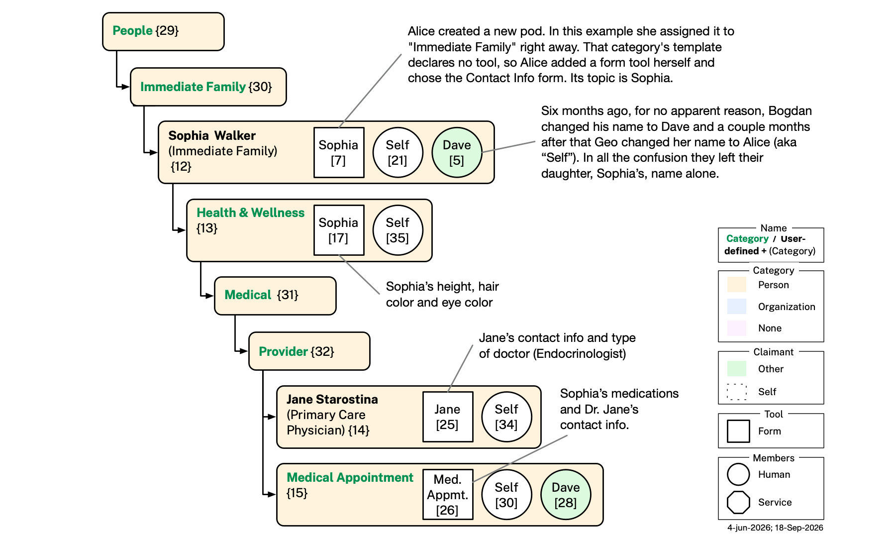

# V4 Ontologies — Illustrative Example

This file continues [README.md](README.md), which describes the Category, Pod, Graph, Persona, and Organization ontologies, and is continued by [app-behavior.md](app-behavior.md), which documents how the app behaves on top of this data. It provides an illustrative example — a hypothetical user, Alice Walker — showing how those ontologies are used together, followed by diagram-generation instructions and the full validation pipeline for the example dataset.

## Illustrative Example: Alice

This section describes the local dataset for a hypothetical user, Alice Walker. Alice's pods live in a tree of pods rooted at `example/Pods/`, where this repo carries each one as a folder — marked as a pod by the `_pod-attachments` folder inside it, and holding a pod DataBook file — all of which is [development scaffolding](pod-databook.md#development-scaffolding) rather than anything a running v4 produces (see [storage.md](storage.md)). Every mention of "Self" in the following is a reference to the user, Alice.

### Bob and Fred

Alice knows two people, Bob and Fred. Under *Others* she has created a two-member pod for each, sharing one with Bob and the other with Fred.

In her shared pod with Bob ([pod 16](<example/Pods/People/Others/Bob Johnson/Bob Johnson(others).databook.md>)) Alice has included some claims about herself ([graph 12](<example/Pods/People/Others/Bob Johnson/Bob Johnson(others).databook.md#graph-12>)) including her given name "Alice", her family name "Walker", etc. She has included ([graph 4](<example/Pods/People/Others/Bob Johnson/Bob Johnson(others).databook.md#graph-04>)) her claim that Bob's favorite drink is an oat milk cappuccino. Bob has claimed some contact information about himself ([graph 2](<example/Pods/People/Others/Bob Johnson/Bob Johnson(others).databook.md#graph-02>)), and he claims that her favorite drink is Pepsi ([graph 8](<example/Pods/People/Others/Bob Johnson/Bob Johnson(others).databook.md#graph-08>)).

<p align="center"></p>

### Taking Care of Sophia

To capture Alice's family-related relationship with her daughter, Sophia Walker, Alice created a pod ([pod 12](<example/Pods/People/Immediate Family/Sophia Walker/Sophia Walker(immediate-family).databook.md>)) named *Sophia Walker*, nested under her *Immediate Family* pod. Its two members are Alice herself ([graph 21](<example/Pods/People/Immediate Family/Sophia Walker/Sophia Walker(immediate-family).databook.md#graph-21>)) and her husband Dave ([graph 5](<example/Pods/People/Immediate Family/Sophia Walker/Sophia Walker(immediate-family).databook.md#graph-05>)). Sophia has no instance of the app, so she cannot join the pod as a member: Alice selected the pod and tapped **Add Tool**, and from the modal dialog that asks which template the new form's information should follow she kept the default, *Contact Info* (`pshapes:ContactInfoShape`) — the dialog offers many other choices alongside it, from *Debit Card* to *Passport* to *Trip Itinerary* (see app-behavior.md's [Adding a Tool](app-behavior.md#adding-a-tool)). That added a graph about her by hand, held by a form tool on the pod ([graph 7](<example/Pods/People/Immediate Family/Sophia Walker/Sophia Walker(immediate-family).databook.md#graph-07>)). That manual step is what gives an ordinary `cat:ImmediateFamily` pod — a category whose template pod declares no tool, and so offers no shape hint either — a form tool all the same, with Sophia as its derived subject (see integrity.md's YAML-4).

Alice spends time taking care of her daughter, so she has assembled some information about Sophia herself, in pods she has not shared. In the *Health & Wellness* pod ([pod 13](<example/Pods/People/Immediate Family/Sophia Walker/Health & Wellness/Health & Wellness.databook.md>)) Alice keeps a record of Sophia's physical characteristics such as height, eye color, and hair color in [graph 17](<example/Pods/People/Immediate Family/Sophia Walker/Health & Wellness/Health & Wellness.databook.md#graph-17>). This is a single-member pod whose subject is Sophia. Its required `member` slot holds a minimal graph about Alice herself ([graph 35](<example/Pods/People/Immediate Family/Sophia Walker/Health & Wellness/Health & Wellness.databook.md#graph-35>)). [Graph 17](<example/Pods/People/Immediate Family/Sophia Walker/Health & Wellness/Health & Wellness.databook.md#graph-17>) is held by the pod's form tool.

Under *Medical* > *Provider* > *Primary Care Physician*, Alice keeps a record of Dr. Jane Starostina, Sophia's primary care physician ([graph 25](<example/Pods/People/Immediate Family/Sophia Walker/Health & Wellness/Medical/Provider/Jane Starostina/Jane Starostina(primary-care-physician).databook.md#graph-25>)). This is a single-member pod whose subject is Jane.

Alice's husband Dave is involved in taking care of their daughter. The two parents need to arrange medical appointments, etc. To do so, they need to share and synchronize medical information about Sophia, including her list of medications, medical history, health insurance policy, contact information and so on. To work on this as a team, Alice creates a two-member *Medical Appointment* pod and shares it with Dave. They both use it to share information about Sophia's upcoming medical appointment ([graph 26](<example/Pods/People/Immediate Family/Sophia Walker/Health & Wellness/Medical/Provider/Medical Appointment/Medical Appointment.databook.md#graph-26>)). This graph includes the name of Sophia's doctor (primary care physician) which the app copies from the Dr. Jane Starostina pod ([graph 25](<example/Pods/People/Immediate Family/Sophia Walker/Health & Wellness/Medical/Provider/Jane Starostina/Jane Starostina(primary-care-physician).databook.md#graph-25>)).

<p align="center"></p>

### Working for Acme

Alice is an employee of Acme, so under her *Work* pod she has created an *Acme* pod to represent her employer. Since Acme is an organization, rather than using `cat:Person` categories she has switched to `cat:Organization` categories (light blue color).

Under *Employees* she has added her own *Alice Walker* pod holding her Contact Info claims ([graph 10](<example/Pods/Work/Acme/Employees/Alice Walker/Alice Walker(employees).databook.md#graph-10>)) — job title at Acme, work telephone number, work email, etc. One of the employees she works with is Paula Walker, so she has a *Paula Walker* pod for her — a two-member pod with Paula herself as the second member ([graph 6](<example/Pods/Work/Acme/Employees/Paula Walker/Paula Walker(employees).databook.md#graph-06>), a bare identifying claim mirroring Alice's own) alongside Alice's own claims about herself ([graph 20](<example/Pods/Work/Acme/Employees/Paula Walker/Paula Walker(employees).databook.md#graph-20>)) — neither of which has been shared with Paula, since Alice has not yet shared the pod with her: both graphs are still her own claims, graph 6 included.

<p align="center"></p>

### Service Providers

Alice has relationships with two companies, Google and AT&T (her cell phone provider). Both are `cat:Companies` pods carrying a form tool: each `pod:member` entry is the usual bare contact-info stub, and each tool graph carries that company's service account itself — service name, username, service URI, and password — typed `sa:ServiceAccount`. Google's username is her Gmail address; AT&T's is her mobile phone number, since AT&T accounts are logged into by phone number rather than a separate handle.

Alice has a third such relationship, with Arca: she holds a **subscription to the Arca pod backup service**. Its pod (pod 50) sits alongside *Google* and *ATT* under *Companies*, and from the outside it looks like them — a `cat:Companies` pod whose form tool's graph carries the account she holds with the provider ([graph 97](<example/Pods/Companies/Arca/Arca(companies).databook.md#graph-97>)), typed `sa:ServiceAccount`.

What the subscription actually buys her, though, is *membership*. By inviting Arca's service into this pod as a `pod:member`, Alice ensures the pod's entire contents are backed up — its note, its attachments, her own private files in it, and the graph claims behind its `pod:member` entries and its tools. The private files are covered because Arca's service acts for Alice herself, and a service's access is its principal's access; a service acting for some other member would not see them. And the arrangement is not specific to this one pod: the same invitation works anywhere, so every other pod Alice invites Arca into as a member is backed up on exactly the same terms. Backup coverage is therefore per-pod and opt-in rather than account-wide — a pod is backed up precisely when Arca is one of its members, which is a fact each pod carries in its own `pod:member` list rather than a setting held somewhere outside the tree. That is the practical reason a backup provider is modeled as a member at all instead of as an external service the app merely talks to: membership is what scopes it, and it travels with the pod.

<p align="center"></p>

### Backing Up Pods

What sets the *Arca* pod apart from *Google* and *ATT* structurally is its second `pod:member` entry. `:Arca_Backup`, the `s:ArcaBackup` service Arca provides, joins the pod as a real member with its own self-claimed graph ([graph 96](<example/Pods/Companies/Arca/Arca(companies).databook.md#graph-96>)), carrying both `s:actsFor :Self` and `s:providedBy :Arca`. Two distinct members — Alice ([graph 95](<example/Pods/Companies/Arca/Arca(companies).databook.md#graph-95>)) and the backup service — make this a two-member pod, where the *Google* and *ATT* pods each have only Alice.

`s:ArcaBackup` sits under `s:AgentService`, so like every agent service it acts for exactly one member — Alice invited it, and it is her own copy of the pod it preserves. That is what separates it from the `s:ServiceProvider` in the *Citibank* and *Boston Hub Society* pods, which acts for the organization behind it instead: no organization claims on Arca Backup's behalf, `:Arca` is named only as its `s:providedBy` value, and the service claims its own member graph directly. Among the three agent-service leaves it is the only one naming a provider at all — `s:ChatGPT` in *Kyoto Trip 2027* carries no `s:providedBy`, because OpenAI is not a party to that pod's relationship, whereas Arca genuinely is a party to this one. Like every service, it can never be a `pod:creator` or a `pod:owner`: Alice alone created and owns this pod.

### Checking Account and Debit Card

Alice has a checking account (and associated debit card) at Citibank. In our example Citibank is compatible with PDN and participates directly, claiming this pod's own tool content — a debit card, a checking account, and Citibank's own record of Alice's online service account — in [graph 76](<example/Pods/Finances/Banking & Payments Firms/Citibank/Citibank(banking-payments).databook.md#graph-76>). It is colored green because the claimant is Citibank, not Alice. Citibank also claims its own member entry, [graph 27](<example/Pods/Finances/Banking & Payments Firms/Citibank/Citibank(banking-payments).databook.md#graph-27>) — the identity the bank presents as one of the pod's two members, carried by `:Citibank_Service`, the `s:ServiceProvider` it provides — and that graph is green for the same reason. Alice separately self-asserts her own username and password for that same online account in [graph 75](<example/Pods/Finances/Banking & Payments Firms/Citibank/Citibank(banking-payments).databook.md#graph-75>). Her own required given-name member entry is [graph 77](<example/Pods/Finances/Banking & Payments Firms/Citibank/Citibank(banking-payments).databook.md#graph-77>), which also carries her own notes about Citibank as an institution.

<p align="center"></p>

### Birth Certificate and Driver's License

Alice was born in Texas, and its vital records department issued her a birth certificate. Alice has manually entered the information from her birth certificate into the *Birth Certificate* pod's tool graph ([graph 78](<example/Pods/Government/State/Birth Certificate/Birth Certificate.databook.md#graph-78>)) and has included a scan of her paper birth certificate as content in that pod's Attachments area (not shown). She recently moved to Paradise, California, and was issued a license by the California DMV. Alice manually entered the information from her plastic license card into the *Drivers License* pod's tool graph ([graph 79](<example/Pods/Government/State/Drivers License/Drivers License.databook.md#graph-79>)) and included a scan of it as content in that pod's Attachments area (not shown). Each pod's required `member` entry ([graph 24](<example/Pods/Government/State/Birth Certificate/Birth Certificate.databook.md#graph-24>), [graph 15](<example/Pods/Government/State/Drivers License/Drivers License.databook.md#graph-15>)) is just her bare given name.

<p align="center"></p>

### Passport and Social Security Number

Alice has a social security number (SSN) issued to her by the Social Security Administration, recorded in the *SSN* pod's tool graph ([graph 80](<example/Pods/Government/Federal/SSN/SSN.databook.md#graph-80>)). Similarly, she has a passport issued to her by the US Department of State, recorded in the *Passport* pod's tool graph ([graph 81](<example/Pods/Government/Federal/Passport/Passport.databook.md#graph-81>)). Each pod's required `member` entry ([graph 23](<example/Pods/Government/Federal/SSN/SSN.databook.md#graph-23>), [graph 19](<example/Pods/Government/Federal/Passport/Passport.databook.md#graph-19>)) is just her bare given name.

<p align="center"></p>

### Current and Previous Homes

Alice used to live in Boston until late 2025, but now lives in Paradise, CA. Both pods are `cat:Home` pods carrying a form tool: each `pod:member` entry ([graph 13](<example/Pods/Home/Previous/Boston/Boston(home).databook.md#graph-13>), [graph 18](<example/Pods/Home/Paradise/Paradise(home).databook.md#graph-18>)) is the usual bare given-name stub, and each tool graph carries the actual `residences:Residence` — Boston's in [graph 82](<example/Pods/Home/Previous/Boston/Boston(home).databook.md#graph-82>), Paradise's in [graph 83](<example/Pods/Home/Paradise/Paradise(home).databook.md#graph-83>).

<p align="center"></p>

### Possessions (Things)

Alice, like everyone, owns (or borrows, or rents) zillions of things. A tiny few of them are described in [graph 22](<example/Pods/Things/Things.databook.md#graph-22>), which concentrates on identity documents: a plastic driver's license card, a health insurance card, and a social security number card. Alice also has a wallet, and keeps some of these cards in it and some separately. She has a vehicle too — see [Vehicles](#vehicles) below. Everything else she owns is out of scope for this example.

Here are a few lines from [graph 22](<example/Pods/Things/Things.databook.md#graph-22>):
```turtle
:Self persona:hasWallet :Alice_Wallet ;
    persona:hasPhysicalCard :Alice_HealthInsuranceCard ;   # carried separately
    persona:hasPhysicalCard :Alice_SSNCard ;               # stored at home
    persona:hasPhysicalCard :Alice_DriversLicense ;        # in wallet
    persona:hasPhysicalCard :Alice_PaymentCard .           # in wallet

:Alice_DriversLicense rdf:type persona:PhysicalDriversLicense ;
    BFO_0000176 :Alice_Wallet .                            # in the wallet

:Alice_PaymentCard rdf:type persona:PhysicalPaymentCard ;
    BFO_0000176 :Alice_Wallet .                            # in the wallet
```

<p align="center"></p>

#### Vehicles

Under her *Things* pod, Alice has created a *Vehicles* pod — a purely organizational category node, like *Pets* — and, nested inside it, a pod for her car, named *RAV4* after the car itself (reusing its parent's own `cat:Vehicles` category, the same "child folder reuses its parent's category" pattern the *Ginger* pod already uses under *Pets*). Thanks to `cat:Vehicles`'s own template pod, the *RAV4* pod identifies the car's vehicle type, make and model (real Wikidata individuals — Toyota and the Toyota RAV4), model year, VIN, color, body type, fuel type, drive wheel configuration, current odometer reading, and engine specification as a real `v:Vehicle` individual rather than a bare label ([graph 63](<example/Pods/Things/Vehicles/RAV4/RAV4(vehicles).databook.md#graph-63>)).

Here is a snippet from [graph 63](<example/Pods/Things/Vehicles/RAV4/RAV4(vehicles).databook.md#graph-63>):

```turtle
:Alice_RAV4 rdf:type owl:NamedIndividual ,
                     vehicles:Vehicle ;
    rdfs:label "Alice Walker's RAV4"@en ;

    vehicles:hasVehicleType vehicles:Car ;
    vehicles:hasMake wd:Q53268 ;   # Toyota
    vehicles:hasModel wd:Q819982 ;  # Toyota RAV4
    vehicles:modelYear "2022"^^xsd:gYear ;
    vehicles:vehicleIdentificationNumber "JT3RWRFV1NU012345" ;
    vehicles:color "Silver" ;
    vehicles:bodyType "SUV" ;
    vehicles:fuelType "Gasoline" ;
    vehicles:driveWheelConfiguration "AWD" ;
    vehicles:hasOdometerReading :Alice_RAV4_Odometer ;
    vehicles:hasEngineSpecification :Alice_RAV4_Engine .
```

### Caring for Ginger

Alice also has a cat, Ginger. Under her *Pets* pod she has created a *Ginger* pod ([pod 41](<example/Pods/Pets/Ginger/Ginger(pets).databook.md>)) for this specific pet — reusing its parent's own `cat:Pets` category, and now, thanks to `cat:Pets`'s own template pod, identifying Ginger's name, species (*Felis catus*, an NCBITaxon class IRI), breed (VBO's own "Mixed Breed (Cat)" class), birth date, and current body weight as a real `pets:Pet` individual rather than a bare label ([graph 37](<example/Pods/Pets/Ginger/Ginger(pets).databook.md#graph-37>)).

<p align="center"></p>

Under [pod 41](<example/Pods/Pets/Ginger/Ginger(pets).databook.md>) is a *Medical* pod ([pod 40](<example/Pods/Pets/Ginger/Medical/Medical.databook.md>)) that Alice created and shared with Paula, who also helps look after Ginger. Its topic is a record of Ginger's medical care (reusing its parent's own `cat:PetsMedical` category) — a completed course of amoxicillin/clavulanate (brand name Clavamox, from Zoetis) and an ongoing daily glucosamine/chondroitin joint supplement ([tool graph 32](<example/Pods/Pets/Ginger/Medical/Medical.databook.md#graph-32>)). The pod contains Alice's claims as a pod `member` in [graph 33](<example/Pods/Pets/Ginger/Medical/Medical.databook.md#graph-33>) and Paula's claims as a pod `member` in [graph 57](<example/Pods/Pets/Ginger/Medical/Medical.databook.md#graph-57>).

Under [pod 41](<example/Pods/Pets/Ginger/Ginger(pets).databook.md>) there is also a *Care & Feeding* pod ([pod 42](<example/Pods/Pets/Ginger/Care & Feeding/Care & Feeding.databook.md>)) (`cat:PetsCareAndFeeding`) that Alice also created and also shared with Paula. Its topic records Alice's day-to-day care instructions for Ginger: her feeding schedule and where she sleeps ([tool graph 60](<example/Pods/Pets/Ginger/Care & Feeding/Care & Feeding.databook.md#graph-60>)). The pod contains Alice's claims as a pod `member` in [graph 58](<example/Pods/Pets/Ginger/Care & Feeding/Care & Feeding.databook.md#graph-58>) and Paula's claims as a pod `member` in [graph 59](<example/Pods/Pets/Ginger/Care & Feeding/Care & Feeding.databook.md#graph-59>).

When Alice shares her Medical pod with Paula, the app must decide where to file it in Paula's own tree — see app-behavior.md's [Auto-Filing on Receipt](app-behavior.md#auto-filing-on-receipt) for how that filing heuristic works, using this very pod as its worked example.

### Boston Hub Society

Alice is a member of the Boston Hub Society, an informal professional networking society. In our example BHS has PDN support in its own server, allowing it to participate directly in this pod alongside Alice and Bob — though an `o:Organization` is never itself a `pod:member` subject, so what actually joins is `:BHS_Service`, the `s:ServiceProvider` the society provides, carrying `s:providedBy :BHS`. Alice maintains her BHS profile in [graph 14](<example/Pods/Groups/Boston Hub Society/Boston Hub Society.databook.md#graph-14>), Bob, another member, keeps his profile updated ([graph 3](<example/Pods/Groups/Boston Hub Society/Boston Hub Society.databook.md#graph-03>)), and BHS itself contributes the identity it presents as one of the pod's three parties — that graph's subject is `:BHS_Service`, but its claimant is `:BHS`, the organization, since the society is the party really making the claim — in [graph 1](<example/Pods/Groups/Boston Hub Society/Boston Hub Society.databook.md#graph-01>). BHS also claims the pod's one tool graph — its own organizational profile, recording that the society currently has 80 members and where its website lives ([graph 92](<example/Pods/Groups/Boston Hub Society/Boston Hub Society.databook.md#graph-92>)). That topic is what makes the pod's derived subject `:BHS` alone, rather than the set of all three member subjects (see integrity.md's YAML-4). `bhscat:BostonHubSociety` declares a form tool, so its template pod names that shape up front — `pod:formShape oshapes:OrganizationShape` — and every pod filed under it is expected to carry that tool of its own; the *Groups* scaffold pod above it satisfies that with a deliberately empty topic, since its real content lives down here in this leaf pod instead.

This pod is also the worked example of a **category extension**. Its `pod:category` is not a concept of `cat:CategoryScheme` at all but `bhscat:BostonHubSociety`, published in `category-ext/boston-hub-society.ttl` — the society's own SKOS scheme, linked to the app's taxonomy by `skos:broadMatch cat:Groups` so that a recipient without the extension installed still knows to file an incoming pod under Groups. The extension's template pod names `bhsshapes:MemberShape` as its `pod:memberShape`, making this the one pod in the example tree whose member graphs are validated against something other than `pshapes:ContactInfoShape`: the society's own two-page member directory form, which asks for schooling, industry, family, and career history alongside the usual contact details. Because the pod's name and its category both compress to `boston-hub-society`, its file is `Boston Hub Society.databook.md` with no parenthetical.

The bundle publishes four things, and `category.ttl` and `cat-templates.ttl` change for none of them:

| Term | What it is |
|---|---|
| `bhscat:BostonHubSocietyScheme` | the society's own `skos:ConceptScheme` |
| `bhscat:BostonHubSociety` | the concept, `skos:broadMatch cat:Groups` — so an app without the extension files the pod under Groups |
| `bhscat:BostonHubSocietyTemplatePod` | the template pod, naming `bhsshapes:MemberShape` as its `pod:memberShape`; its declared tool is unchanged from `ctpl:GroupsTemplatePod`'s |
| `bhsshapes:MemberShape` | the member shape, in `category-ext/shacl/boston-hub-society-shacl.ttl` |

The extension introduces no vocabulary of its own — every field its shape constrains comes from CCO, `persona.ttl`, `persona-ext/directory-profile.ttl`, or `other/education.ttl`. What belongs to the society is the constraints: a FamilyName required exactly once where `pshapes:ContactInfoShape` requires none, `dp:industry` restricted to the form's 19 values, and at most one `education:EducationRecord` per level for its single High School and College rows. For the mechanism itself, see [Category Extensions](README.md#category-extensions).

The pod also carries the completed form itself as an **attachment** — `Personal Page for BHS 2026 Directory (Alice Walker).pdf`, which every member of the pod receives — that being all an attachment is. (In this repo's scaffolding it sits in the pod's own `_pod-attachments` folder.) Its answers are the same ones [graph 14](<example/Pods/Groups/Boston Hub Society/Boston Hub Society.databook.md#graph-14>) carries as RDF, field for field, so the pod holds the paper and the data side by side: the questions and Alice's handwritten answers in its Attachments area, the same answers structured and validated in its member graph.

Beside it, this pod is also the example tree's one worked case of the other half of that rule. Alice keeps `answers-draft.md` in the pod without attaching it — the notes she made while filling the form in: who to ask before naming them as her sponsor, which two of the society's 19 industry options she settled on, and three attempts at the goals question she was not happy with. Because she never attached it, it is private to her: it syncs to her own devices with the rest of her copy of the pod, and neither Bob nor `:BHS_Service` ever receives it, though both are members of this same pod. (In this repo's scaffolding it sits in a `Directory Drafts` subfolder of the pod's own folder, loose rather than in `_pod-attachments`.) The PDF and the draft sit one act apart and on opposite sides of what propagates — see [Pod Contents](app-behavior.md#pod-contents) in app-behavior.md.

<p align="center"></p>

### Chestnut Hill Village Association

The second pod in the same diagram is Alice's neighborhood association — the homeowners on the three streets that make up Chestnut Hill Village. It is filed under the same `cat:Groups` category as the Boston Hub Society, but it is the opposite case in one respect: the association runs no PDN node of its own, so nothing joins the pod on its behalf and Alice self-enters its profile herself. Its tool's topic — the association as an `o:Organization` in its own right, with the number of households it covers and its public website — is therefore claimed by `:Self` ([graph 101](<example/Pods/Groups/Chestnut Hill Village Association/Chestnut Hill Village Association(groups).databook.md#graph-101>)), where BHS claims its own equivalent (graph 92). Alongside Alice's own profile ([graph 9](<example/Pods/Groups/Chestnut Hill Village Association/Chestnut Hill Village Association(groups).databook.md#graph-09>)), two of her neighbors are members who keep their own profiles updated from their own instances of the app: Marcy ([graph 45](<example/Pods/Groups/Chestnut Hill Village Association/Chestnut Hill Village Association(groups).databook.md#graph-45>)) and Henry ([graph 100](<example/Pods/Groups/Chestnut Hill Village Association/Chestnut Hill Village Association(groups).databook.md#graph-100>)). The topic still governs the derived subject, so this pod is about `:CHVA` rather than about its three members (see integrity.md's YAML-4). What the association actually does day to day — its recommended contractors (plumbers, electricians, lawn care and the like), the dates of its annual in-person meeting and its annual spring cleanup event, the name of the current president, and its annual dues — is free text rather than modeled data, and lives in the pod's [folder note](<example/Pods/Groups/Chestnut Hill Village Association/Chestnut Hill Village Association.md>) rather than in any of its graphs — the `X.md`-inside-folder-`X` file the app shows in its Note area (see app-behavior.md's [Note Area](app-behavior.md#note-area)). This is the one folder note the example tree materializes; every other pod here carries its content in graphs alone.

### Planning a Trip with an Agent

Alice is planning a trip with her spouse Dave, and invites her own AI travel agent to help. Under a *Travel* pod (a purely organizational category node, like *Things*) she has created a *Trips* pod (also purely organizational, reusing its parent's own `cat:Travel` category) and, nested inside it, a pod for this specific trip — *Kyoto Trip 2027* (reusing its immediate parent *Trips*'s own `cat:Trips` category, the same "child folder reuses its parent's category" pattern the *Ginger* and *RAV4* pods already use). Alice's travel agent (`s:ChatGPT`) joins this pod as a real member alongside Alice and Dave — not as an invisible tool — giving it its own self-claimed `pod:member` graph (see [graph 67](<example/Pods/Travel/Trips/Kyoto Trip 2027/Kyoto Trip 2027(trips).databook.md#graph-67>)) carrying `s:actsFor :Self`. Three distinct members (Self, Dave, and the agent) make this a three-member pod.

The trip itself is backed by one form tool whose topic is `:Kyoto_Trip_2027`, holding three graphs, one per member, each claimed from a different side: Alice's own basic claim identifying the trip ([graph 69](<example/Pods/Travel/Trips/Kyoto Trip 2027/Kyoto Trip 2027(trips).databook.md#graph-69>)), her agent's own evolving, collaboratively-drafted itinerary ([graph 70](<example/Pods/Travel/Trips/Kyoto Trip 2027/Kyoto Trip 2027(trips).databook.md#graph-70>)), and Dave's own contribution ([graph 91](<example/Pods/Travel/Trips/Kyoto Trip 2027/Kyoto Trip 2027(trips).databook.md#graph-91>)) — reaching `pod:formGraph`'s real upper bound of one graph per member (see README.md's [Tools](README.md#tools) section), and extending the same "one topic, multiple claimants" pattern the Medical Appointment pod's two "Med. Appt mt." squares already illustrate (see [Representative Pods](README.md#representative-pods)). The agent's own graph is revised in place turn by turn as Alice chats back and forth with it, rather than replaced by a new graph each time (see app-behavior.md's [The Iterative Prompt/Response Loop](app-behavior.md#the-iterative-promptresponse-loop)).

<p align="center"></p>

### Travel Providers

Alongside her trips, Alice keeps a pod per travel provider she books with, under a *Provider* pod (`cat:TravelProvider`) nested in the same *Travel* pod. Her [Hilton](<example/Pods/Travel/Provider/Hilton/Hilton(travel-provider).databook.md>) pod is the one worked example: a single form tool ([graph 84](<example/Pods/Travel/Provider/Hilton/Hilton(travel-provider).databook.md#graph-84>)) carrying her Hilton Honors account — username, password, service URI, and `sa:loyaltyProgramID`, her membership number. `cat:TravelProvider` declares a form tool carrying `pod:formShape sashapes:ServiceAccountShape`, so that tool is template-driven: [Lazy Instantiation](app-behavior.md#lazy-instantiation) gives the pod the tool from the start and stamps the graph's `pod:shape` straight from that shape. The parent *Provider* pod is a scaffold, so it carries the same required tool graph ([graph 56](<example/Pods/Travel/Provider/Provider(travel-provider).databook.md#graph-56>)) deliberately empty — its real content lives in the leaf pod instead, exactly as *Trips* does above.

The pod carries no tag at all, and needs none: `sa:loyaltyProgramID` in its own tool graph is what makes it findable. Asking for every pod where Alice holds a loyalty program is a search for that property, which returns this pod without anyone having had to label it — see [Finding Pods by Property](app-behavior.md#finding-pods-by-property) in app-behavior.md, and [Tags](README.md#tags) for the cases a property search cannot reach.

## Pods Mentioned

A summary of every narratively-illustrated pod under `example/Pods/`, grouped by the narrative subsection above it describes.

| Subsection | Name | Pod DataBook | Subject(s) | Pod Category | Graphs |
|---|---|---|---|---|---|
| Bob and Fred | Bob Johnson | [Bob Johnson(others).databook.md](<example/Pods/People/Others/Bob Johnson/Bob Johnson(others).databook.md>) {16} | Self, Bob Johnson | `cat:Others` | 2, 4, 8, 12 |
| Bob and Fred | Fred Flintstone | [Fred Flintstone(others).databook.md](<example/Pods/People/Others/Fred Flintstone/Fred Flintstone(others).databook.md>) {17} | Self, Fred Flintstone | `cat:Others` | 29, 31 |
| Taking Care of Sophia | Sophia Walker | [Sophia Walker(immediate-family).databook.md](<example/Pods/People/Immediate Family/Sophia Walker/Sophia Walker(immediate-family).databook.md>) {12} | Sophia Walker | `cat:ImmediateFamily` | 5, 7, 21 |
| Taking Care of Sophia | Health & Wellness | [Health & Wellness.databook.md](<example/Pods/People/Immediate Family/Sophia Walker/Health & Wellness/Health & Wellness.databook.md>) {13} | Sophia Walker | `cat:HealthWellness` | 17, 35 |
| Taking Care of Sophia | Jane Starostina | [Jane Starostina(primary-care-physician).databook.md](<example/Pods/People/Immediate Family/Sophia Walker/Health & Wellness/Medical/Provider/Jane Starostina/Jane Starostina(primary-care-physician).databook.md>) {14} | Jane Starostina | `cat:PrimaryCarePhysician` | 25, 34 |
| Taking Care of Sophia | Medical Appointment | [Medical Appointment.databook.md](<example/Pods/People/Immediate Family/Sophia Walker/Health & Wellness/Medical/Provider/Medical Appointment/Medical Appointment.databook.md>) {15} | Sophia Walker | `cat:MedicalAppointment` | 26, 28, 30 |
| Working for Acme | Alice Walker | [Alice Walker(employees).databook.md](<example/Pods/Work/Acme/Employees/Alice Walker/Alice Walker(employees).databook.md>) {18} | Self | `cat:Employees` | 10 |
| Working for Acme | Paula Walker | [Paula Walker(employees).databook.md](<example/Pods/Work/Acme/Employees/Paula Walker/Paula Walker(employees).databook.md>) {19} | Self, Paula Walker | `cat:Employees` | 6, 20 |
| Service Providers | Google | [Google(companies).databook.md](<example/Pods/Companies/Google/Google(companies).databook.md>) {3} | Alice's Google Account | `cat:Companies` | 16, 73 |
| Service Providers | ATT | [ATT(companies).databook.md](<example/Pods/Companies/ATT/ATT(companies).databook.md>) {2} | Alice's AT&T Account | `cat:Companies` | 11, 74 |
| Backing Up Pods | Arca | [Arca(companies).databook.md](<example/Pods/Companies/Arca/Arca(companies).databook.md>) {50} | Alice's Arca Account | `cat:Companies` | 95, 96, 97 |
| Checking Account and Debit Card | Citibank | [Citibank(banking-payments).databook.md](<example/Pods/Finances/Banking & Payments Firms/Citibank/Citibank(banking-payments).databook.md>) {4} | Self | `cat:BankingPayments` | 27, 75, 76, 77 |
| Birth Certificate and Driver's License | Birth Certificate | [Birth Certificate.databook.md](<example/Pods/Government/State/Birth Certificate/Birth Certificate.databook.md>) {10} | Self | `cat:BirthCertificate` | 24, 78 |
| Birth Certificate and Driver's License | Drivers License | [Drivers License.databook.md](<example/Pods/Government/State/Drivers License/Drivers License.databook.md>) {9} | Self | `cat:DriversLicense` | 15, 79 |
| Passport and Social Security Number | Passport | [Passport.databook.md](<example/Pods/Government/Federal/Passport/Passport.databook.md>) {5} | Self | `cat:Passport` | 19, 81 |
| Passport and Social Security Number | SSN | [SSN.databook.md](<example/Pods/Government/Federal/SSN/SSN.databook.md>) {6} | Self | `cat:SSN` | 23, 80 |
| Current and Previous Homes | Boston | [Boston(home).databook.md](<example/Pods/Home/Previous/Boston/Boston(home).databook.md>) {7} | Self | `cat:Home` | 13, 82 |
| Current and Previous Homes | Paradise | [Paradise(home).databook.md](<example/Pods/Home/Paradise/Paradise(home).databook.md>) {8} | Self | `cat:Home` | 18, 83 |
| Possessions | Things | [Things.databook.md](<example/Pods/Things/Things.databook.md>) {11} | Self | `cat:Things` | 22 |
| Vehicles | RAV4 | [RAV4(vehicles).databook.md](<example/Pods/Things/Vehicles/RAV4/RAV4(vehicles).databook.md>) {44} | Alice's RAV4 | `cat:Vehicles` | 62, 63 |
| Caring for Ginger | Ginger | [Ginger(pets).databook.md](<example/Pods/Pets/Ginger/Ginger(pets).databook.md>) {41} | Ginger | `cat:Pets` | 36, 37 |
| Caring for Ginger | Medical | [Medical.databook.md](<example/Pods/Pets/Ginger/Medical/Medical.databook.md>) {40} | Ginger | `cat:PetsMedical` | 32, 33, 57 |
| Caring for Ginger | Care & Feeding | [Care & Feeding.databook.md](<example/Pods/Pets/Ginger/Care & Feeding/Care & Feeding.databook.md>) {42} | Ginger | `cat:PetsCareAndFeeding` | 58, 59, 60 |
| Boston Hub Society | Boston Hub Society | [Boston Hub Society.databook.md](<example/Pods/Groups/Boston Hub Society/Boston Hub Society.databook.md>) {1} | BHS | `bhscat:BostonHubSociety` | 1, 3, 14, 92 |
| Chestnut Hill Village Association | Chestnut Hill Village Association | [Chestnut Hill Village Association(groups).databook.md](<example/Pods/Groups/Chestnut Hill Village Association/Chestnut Hill Village Association(groups).databook.md>) {27} | CHVA | `cat:Groups` | 9, 45, 100, 101 |
| Planning a Trip with an Agent | Kyoto Trip 2027 | [Kyoto Trip 2027(trips).databook.md](<example/Pods/Travel/Trips/Kyoto Trip 2027/Kyoto Trip 2027(trips).databook.md>) {47} | Kyoto Trip 2027 | `cat:Trips` | 66, 67, 68, 69, 70, 91 |
| Travel Providers | Provider | [Provider(travel-provider).databook.md](<example/Pods/Travel/Provider/Provider(travel-provider).databook.md>) {51} | Self | `cat:TravelProvider` | 98, 56 |
| Travel Providers | Hilton | [Hilton(travel-provider).databook.md](<example/Pods/Travel/Provider/Hilton/Hilton(travel-provider).databook.md>) {52} | Alice's Hilton Honors Account | `cat:TravelProvider` | 99, 84 |

## Graphs

The graphs in the table below are *about* Alice and claimed *by* Alice. The "Pod DataBook" link jumps straight to each graph's own `### Graph NN` section inside its owning pod-databook file under `example/Pods/`. See [pod-databook.md](pod-databook.md#body) for that body structure.

| #  | Pod DataBook                                                                          | Category | Key data                                                         | Diagram |
|--- |:--------------------------------------------------------------------------------------|:-------------|:-----------------------------------------------------------------|:--------|
| 9  | [Chestnut Hill Village Association(groups).databook.md](<example/Pods/Groups/Chestnut Hill Village Association/Chestnut Hill Village Association(groups).databook.md#graph-09>) {27} | `cat:Groups` | Alice's Chestnut Hill Village Association profile — the name she goes by with her neighbors, the email the association's mailing list reaches her at, and her association social network, whose members are Marcy and Henry | [view](example/graphs/images/graph-09.png) |
| 10 | [Alice Walker(employees).databook.md](<example/Pods/Work/Acme/Employees/Alice Walker/Alice Walker(employees).databook.md#graph-10>) {18} | `cat:Employees`     | Contact info — given name, family name, email, phone, employer  | [view](example/graphs/images/graph-10.png) |
| 11 | [ATT(companies).databook.md](<example/Pods/Companies/ATT/ATT(companies).databook.md#graph-11>) {2}                     | `cat:Companies`    | The ATT pod's required member entry — carries her given name (required by `ContactInfoShape`, `pod:memberShape`, since this template declares a tool), plus an optional organization name and email          | [view](example/graphs/images/graph-11.png) |
| 12 | [Bob Johnson(others).databook.md](<example/Pods/People/Others/Bob Johnson/Bob Johnson(others).databook.md#graph-12>) {16}                     | `cat:Others`       | Alice's 1:1 graph with Bob; social network with Bob as member  | [view](example/graphs/images/graph-12.png)|
| 13 | [Boston(home).databook.md](<example/Pods/Home/Previous/Boston/Boston(home).databook.md#graph-13>) {7}               | `cat:Home` | The Boston pod's required member entry — carries her given name (required by `ContactInfoShape`, `pod:memberShape`, since this template declares a tool)          | [view](example/graphs/images/graph-13.png) |
| 14  | [Boston Hub Society.databook.md](<example/Pods/Groups/Boston Hub Society/Boston Hub Society.databook.md#graph-14>) {1}                     | `bhscat:BostonHubSociety` | BHS directory profile: name, employer, addresses, phones, emails, plus her directory answers, schooling and hobbies                    | [view](example/graphs/images/graph-14.png)|
| 15 | [Drivers License.databook.md](<example/Pods/Government/State/Drivers License/Drivers License.databook.md#graph-15>) {9} | `cat:DriversLicense`      | The Drivers License pod's required member entry — carries her given name (required by `ContactInfoShape`, `pod:memberShape`, since this template declares a tool) | [view](example/graphs/images/graph-15.png) |
| 95 | [Arca(companies).databook.md](<example/Pods/Companies/Arca/Arca(companies).databook.md#graph-95>) {50}               | `cat:Companies`    | The Arca pod's own `:Self` member entry — carries her given name (required by `ContactInfoShape`, `pod:memberShape`, since this template declares a tool)          | [view](example/graphs/images/graph-95.png) |
| 16 | [Google(companies).databook.md](<example/Pods/Companies/Google/Google(companies).databook.md#graph-16>) {3}               | `cat:Companies`    | The Google pod's required member entry — carries her given name (required by `ContactInfoShape`, `pod:memberShape`, since this template declares a tool), plus an optional organization name and email          | [view](example/graphs/images/graph-16.png) |
| 18 | [Paradise(home).databook.md](<example/Pods/Home/Paradise/Paradise(home).databook.md#graph-18>) {8}           | `cat:Home` | The Paradise pod's required member entry — carries her given name (required by `ContactInfoShape`, `pod:memberShape`, since this template declares a tool) | [view](example/graphs/images/graph-18.png) |
| 19 | [Passport.databook.md](<example/Pods/Government/Federal/Passport/Passport.databook.md#graph-19>) {5}             | `cat:Passport`    | The Passport pod's required member entry — carries her given name (required by `ContactInfoShape`, `pod:memberShape`, since this template declares a tool) | [view](example/graphs/images/graph-19.png) |
| 20 | [Paula Walker(employees).databook.md](<example/Pods/Work/Acme/Employees/Paula Walker/Paula Walker(employees).databook.md#graph-20>) {19}                   | `cat:Employees`     | Acme employee graph; company email; works with Paula           | [view](example/graphs/images/graph-20.png)|
| 21 | [Sophia Walker(immediate-family).databook.md](<example/Pods/People/Immediate Family/Sophia Walker/Sophia Walker(immediate-family).databook.md#graph-21>) {12}   | `cat:ImmediateFamily`       | Alice as a family member; family social network with Sophia and Dave                       | [view](example/graphs/images/graph-21.png) |
| 22 | [Things.databook.md](<example/Pods/Things/Things.databook.md#graph-22>) {11}     | `cat:Things`  | Wallet (driver's license + payment card); health ins., SSN card  | [view](example/graphs/images/graph-22.png) |
| 23 | [SSN.databook.md](<example/Pods/Government/Federal/SSN/SSN.databook.md#graph-23>) {6}                     | `cat:SSN`      | The SSN pod's required member entry — carries her given name (required by `ContactInfoShape`, `pod:memberShape`, since this template declares a tool) | [view](example/graphs/images/graph-23.png) |
| 24 | [Birth Certificate.databook.md](<example/Pods/Government/State/Birth Certificate/Birth Certificate.databook.md#graph-24>) {10} | `cat:BirthCertificate`        | The Birth Certificate pod's required member entry — carries her given name (required by `ContactInfoShape`, `pod:memberShape`, since this template declares a tool) | [view](example/graphs/images/graph-24.png) |
| 78 | [Birth Certificate.databook.md](<example/Pods/Government/State/Birth Certificate/Birth Certificate.databook.md#graph-78>) {10} | `cat:BirthCertificate` | Alice's Texas birth certificate — legal names, maiden name; typed `idoc:BirthCertificate` | [view](example/graphs/images/graph-78.png) |
| 79 | [Drivers License.databook.md](<example/Pods/Government/State/Drivers License/Drivers License.databook.md#graph-79>) {9} | `cat:DriversLicense` | California driver's license — legal name, DOB, DL#, expiry, photo; typed `idoc:DriversLicense` | [view](example/graphs/images/graph-79.png) |
| 80 | [SSN.databook.md](<example/Pods/Government/Federal/SSN/SSN.databook.md#graph-80>) {6} | `cat:SSN` | Social security number (SSN) | [view](example/graphs/images/graph-80.png) |
| 81 | [Passport.databook.md](<example/Pods/Government/Federal/Passport/Passport.databook.md#graph-81>) {5} | `cat:Passport` | US passport — legal name, DOB, passport#, issue/expiry, place of birth, gender marker, photo; typed `idoc:Passport` | [view](example/graphs/images/graph-81.png) |
| 82 | [Boston(home).databook.md](<example/Pods/Home/Previous/Boston/Boston(home).databook.md#graph-82>) {7} | `cat:Home` | Previous address — Boston, MA (2020–2025) with temporal interval; typed `residences:Residence` | [view](example/graphs/images/graph-82.png) |
| 83 | [Paradise(home).databook.md](<example/Pods/Home/Paradise/Paradise(home).databook.md#graph-83>) {8} | `cat:Home` | Current address — Paradise, CA (2025–present); typed `residences:Residence` | [view](example/graphs/images/graph-83.png) |
| 29 | [Fred Flintstone(others).databook.md](<example/Pods/People/Others/Fred Flintstone/Fred Flintstone(others).databook.md#graph-29>) {17}                     | `cat:Others`       | Alice's 1:1 graph with Fred; social network with Fred as member  | [view](example/graphs/images/graph-29.png) |
| 33 | [Medical.databook.md](<example/Pods/Pets/Ginger/Medical/Medical.databook.md#graph-33>) {40} | `cat:PetsMedical`     | The Ginger-Medical pod's required member entry — carries her given name (required by `ContactInfoShape`, `pod:memberShape`, since this template declares a tool), plus an optional organization name and email          | [view](example/graphs/images/graph-33.png) |
| 34 | [Jane Starostina(primary-care-physician).databook.md](<example/Pods/People/Immediate Family/Sophia Walker/Health & Wellness/Medical/Provider/Jane Starostina/Jane Starostina(primary-care-physician).databook.md#graph-34>) {14} | `cat:PrimaryCarePhysician`     | Alice's bare given-name claim — the Jane-Starostina pod's required member entry (required by `ContactInfoShape`, `pod:memberShape`, since this template declares a tool)          | [view](example/graphs/images/graph-34.png) |
| 35 | [Health & Wellness.databook.md](<example/Pods/People/Immediate Family/Sophia Walker/Health & Wellness/Health & Wellness.databook.md#graph-35>) {13} | `cat:HealthWellness`     | Alice's bare given-name claim — the Health & Wellness pod's required member entry (required by `ContactInfoShape`, `pod:memberShape`, since this template declares a tool)          | [view](example/graphs/images/graph-35.png) |
| 36 | [Ginger(pets).databook.md](<example/Pods/Pets/Ginger/Ginger(pets).databook.md#graph-36>) {41} | `cat:Pets`     | The Ginger pod's required member entry — carries her given name (required by `ContactInfoShape`, `pod:memberShape`, since this template declares a tool), plus an optional organization name and email          | [view](example/graphs/images/graph-36.png) |
| 58 | [Care & Feeding.databook.md](<example/Pods/Pets/Ginger/Care & Feeding/Care & Feeding.databook.md#graph-58>) {42} | `cat:PetsCareAndFeeding`     | Alice's bare given-name claim — the Ginger-Care & Feeding pod's required member entry (required by `ContactInfoShape`, `pod:memberShape`, since this template declares a tool)          | [view](example/graphs/images/graph-58.png) |
| 62 | [RAV4(vehicles).databook.md](<example/Pods/Things/Vehicles/RAV4/RAV4(vehicles).databook.md#graph-62>) {44} | `cat:Vehicles`     | The RAV4 pod's required member entry — carries her given name (required by `ContactInfoShape`, `pod:memberShape`, since this template declares a tool), plus an optional organization name and email          | [view](example/graphs/images/graph-62.png) |
| 66 | [Kyoto Trip 2027(trips).databook.md](<example/Pods/Travel/Trips/Kyoto Trip 2027/Kyoto Trip 2027(trips).databook.md#graph-66>) {47} | `cat:Trips` | Alice's bare given-name claim, extended with her social network link to Dave — one of the Kyoto Trip pod's three required member entries | [view](example/graphs/images/graph-66.png) |
| 75 | [Citibank(banking-payments).databook.md](<example/Pods/Finances/Banking & Payments Firms/Citibank/Citibank(banking-payments).databook.md#graph-75>) {4} | `cat:BankingPayments` | Alice's own self-asserted claim about her Citibank online service account — username and password as she herself knows them, distinct from Citibank's own record (graph 76) | [view](example/graphs/images/graph-75.png) |
| 77 | [Citibank(banking-payments).databook.md](<example/Pods/Finances/Banking & Payments Firms/Citibank/Citibank(banking-payments).databook.md#graph-77>) {4} | `cat:BankingPayments` | The Citibank pod's second required member entry, claimed by and about Alice — a minimal given-name stub, so `:Self` is a genuine member of the pod alongside `:Citibank_Service` (graph 27), plus her own notes about Citibank as an institution, asserted on `:Citibank` | [view](example/graphs/images/graph-77.png) |

The following table lists graphs that are *about* Alice but claimed by others.

| #  | Pod DataBook                                                                         | Category | Key data                             | Diagram |
|--- |:-------------------------------------------------------------------------------------|:-------------|:-------------------------------------|:--------|
| 8  | [Bob Johnson(others).databook.md](<example/Pods/People/Others/Bob Johnson/Bob Johnson(others).databook.md#graph-08>) {16}                         | `cat:Others`            | Alice as seen by Bob                 | [view](example/graphs/images/graph-08.png)|
| 76 | [Citibank(banking-payments).databook.md](<example/Pods/Finances/Banking & Payments Firms/Citibank/Citibank(banking-payments).databook.md#graph-76>) {4} | `cat:BankingPayments` | Citibank's own claimed record about Alice, transmitted from its PDN node — VISA debit card, linked checking account, and online service account; claimed by `:Citibank`, the organization, not by the `s:ServiceProvider` that carries its membership | [view](example/graphs/images/graph-76.png) |

The following table lists graphs about other people (Sophia, Dave, Paula and Bob), organizations (Boston Hub Society), or services (Arca's backup service) in Alice's own tree. As above, each "Pod DataBook" link jumps to that graph's section inside its owning pod-databook file.

| #  | Pod DataBook                                                                                     | Category | Key data                                                         | Diagram |
|--- |:-------------------------------------------------------------------------------------------------|:-------------|:-----------------------------------------------------------------|:--------|
| 1  | [Boston Hub Society.databook.md](<example/Pods/Groups/Boston Hub Society/Boston Hub Society.databook.md#graph-01>) {1}             | `bhscat:BostonHubSociety` | BHS's member identity in this pod — `:BHS_Service`, the `s:ServiceProvider` that joins as the member, plus the society's own name and self-description on `:BHS`; claimed by BHS, the organization | [view](example/graphs/images/graph-01.png) |
| 2  | [Bob Johnson(others).databook.md](<example/Pods/People/Others/Bob Johnson/Bob Johnson(others).databook.md#graph-02>) {16}                     | `cat:Others`       | Bob's self-claimed Bob persona                                 | [view](example/graphs/images/graph-02.png)|
| 3  | [Boston Hub Society.databook.md](<example/Pods/Groups/Boston Hub Society/Boston Hub Society.databook.md#graph-03>) {1}                     | `bhscat:BostonHubSociety` | Bob's BHS member persona (name, email, and the four directory questions he answered)          | [view](example/graphs/images/graph-03.png) |
| 92 | [Boston Hub Society.databook.md](<example/Pods/Groups/Boston Hub Society/Boston Hub Society.databook.md#graph-92>) {1} | `bhscat:BostonHubSociety` | BHS's own organizational profile — its current member count (`o:numMembers` 80) and public website (`o:hasWebsite`) — the pod's manually-added tool graph, claimed by BHS | [view](example/graphs/images/graph-92.png) |
| 45 | [Chestnut Hill Village Association(groups).databook.md](<example/Pods/Groups/Chestnut Hill Village Association/Chestnut Hill Village Association(groups).databook.md#graph-45>) {27} | `cat:Groups` | Marcy's association member profile — her given name and email, claimed by Marcy from her own instance | [view](example/graphs/images/graph-45.png) |
| 100 | [Chestnut Hill Village Association(groups).databook.md](<example/Pods/Groups/Chestnut Hill Village Association/Chestnut Hill Village Association(groups).databook.md#graph-100>) {27} | `cat:Groups` | Henry's association member profile — his given name and email, claimed by Henry from his own instance | [view](example/graphs/images/graph-100.png) |
| 101 | [Chestnut Hill Village Association(groups).databook.md](<example/Pods/Groups/Chestnut Hill Village Association/Chestnut Hill Village Association(groups).databook.md#graph-101>) {27} | `cat:Groups` | The association's own organizational profile — the number of households it covers (`o:numMembers` 64) and its public website (`o:hasWebsite`) — the pod's tool graph, self-entered by Alice since the association runs no PDN node of its own | [view](example/graphs/images/graph-101.png) |
| 96 | [Arca(companies).databook.md](<example/Pods/Companies/Arca/Arca(companies).databook.md#graph-96>) {50} | `cat:Companies` | Arca's backup service as a real pod member — `:Arca_Backup`, typed `s:ArcaBackup`, carrying `s:actsFor :Self` and `s:providedBy :Arca`; claimed by the service itself, since no organization claims on a backup service's behalf | [view](example/graphs/images/graph-96.png) |
| 94 | [Acme(organization).databook.md](<example/Pods/Work/Acme/Acme(organization).databook.md#graph-94>) {35} | `cat:Organization` | Acme's own `o:Organization` profile — employee count (`o:numMembers` 2400) and website (`o:hasWebsite`); the pod's tool graph, self-entered by Alice since Acme is not a PDN node | [view](example/graphs/images/graph-94.png)|
| 4  | [Bob Johnson(others).databook.md](<example/Pods/People/Others/Bob Johnson/Bob Johnson(others).databook.md#graph-04>) {16}                 | `cat:Others`       | Alice's notes about Bob; fav drink: oat milk cappuccino         | [view](example/graphs/images/graph-04.png) |
| 5  | [Sophia Walker(immediate-family).databook.md](<example/Pods/People/Immediate Family/Sophia Walker/Sophia Walker(immediate-family).databook.md#graph-05>) {12} | `cat:ImmediateFamily`       | Dave's own self-claimed family persona — the pod's second `member` entry, alongside Alice's own (graph 21)       | [view](example/graphs/images/graph-05.png)|
| 6  | [Paula Walker(employees).databook.md](<example/Pods/Work/Acme/Employees/Paula Walker/Paula Walker(employees).databook.md#graph-06>) {19}           | `cat:Employees`     | Paula as Alice's Acme colleague (Alice-claimed)                | [view](example/graphs/images/graph-06.png)|
| 7  | [Sophia Walker(immediate-family).databook.md](<example/Pods/People/Immediate Family/Sophia Walker/Sophia Walker(immediate-family).databook.md#graph-07>) {12} | `cat:ImmediateFamily`       | Sophia as Alice's daughter (Alice-claimed) — the pod's manually-added tool graph, using the Contact Info template           | [view](example/graphs/images/graph-07.png)|
| 17 | [Health & Wellness.databook.md](<example/Pods/People/Immediate Family/Sophia Walker/Health & Wellness/Health & Wellness.databook.md#graph-17>) {13} | `cat:HealthWellness`     | Sophia's physical body — height (52 in.), blue eyes, brown hair — as recorded by Alice; held by the pod's form tool (Sophia is the pod's subject, not its member)            | [view](example/graphs/images/graph-17.png) |
| 25 | [Jane Starostina(primary-care-physician).databook.md](<example/Pods/People/Immediate Family/Sophia Walker/Health & Wellness/Medical/Provider/Jane Starostina/Jane Starostina(primary-care-physician).databook.md#graph-25>) {14} | `cat:PrimaryCarePhysician`       | Alice's record of Dr. Jane Starostina, Sophia Walker's primary care physician, including her medical specialty (Endocrinology)           | [view](example/graphs/images/graph-25.png)|
| 26 | [Medical Appointment.databook.md](<example/Pods/People/Immediate Family/Sophia Walker/Health & Wellness/Medical/Provider/Medical Appointment/Medical Appointment.databook.md#graph-26>) {15} | `cat:MedicalAppointment`       | Alice and Dave's shared claims for Sophia's medical appointment — medications, allergies, insurance, PCP reference           | [view](example/graphs/images/graph-26.png)|
| 28 | [Medical Appointment.databook.md](<example/Pods/People/Immediate Family/Sophia Walker/Health & Wellness/Medical/Provider/Medical Appointment/Medical Appointment.databook.md#graph-28>) {15} | `cat:MedicalAppointment`       | Dave's own self-claimed persona and contact info — one of this pod's two members, alongside Alice (graph 30)           | [view](example/graphs/images/graph-28.png) |
| 30 | [Medical Appointment.databook.md](<example/Pods/People/Immediate Family/Sophia Walker/Health & Wellness/Medical/Provider/Medical Appointment/Medical Appointment.databook.md#graph-30>) {15} | `cat:MedicalAppointment`       | Alice's own self-claimed contact info — the other of this pod's two members, alongside Dave (graph 28)           | [view](example/graphs/images/graph-30.png) |
| 27 | [Citibank(banking-payments).databook.md](<example/Pods/Finances/Banking & Payments Firms/Citibank/Citibank(banking-payments).databook.md#graph-27>) {4} | `cat:BankingPayments` | The Citibank pod's other required `member` entry — the identity Citibank presents as a member, carried by `:Citibank_Service`, the `s:ServiceProvider` the bank provides, plus the bank's own name, website, and institutional self-description on `:Citibank`; claimed by Citibank, alongside its own claimed record about Alice (graph 76) | [view](example/graphs/images/graph-27.png) |
| 31 | [Fred Flintstone(others).databook.md](<example/Pods/People/Others/Fred Flintstone/Fred Flintstone(others).databook.md#graph-31>) {17}                     | `cat:Others`       | Fred's self-claimed Fred persona                                 | [view](example/graphs/images/graph-31.png) |
| 32 | [Medical.databook.md](<example/Pods/Pets/Ginger/Medical/Medical.databook.md#graph-32>) {40} | `cat:PetsMedical`       | Alice's record of her cat Ginger's medications — amoxicillin/clavulanate course, ongoing glucosamine/chondroitin supplement           | [view](example/graphs/images/graph-32.png)|
| 37 | [Ginger(pets).databook.md](<example/Pods/Pets/Ginger/Ginger(pets).databook.md#graph-37>) {41} | `cat:Pets`       | Alice's basic claim identifying Ginger — name, species (Felis catus, NCBITaxon), breed (Mixed Breed (Cat), VBO), birth date, and current body weight — backs the Ginger pod's `subject: ":Ginger"` with a real graph, typed `pets:Pet`           | [view](example/graphs/images/graph-37.png)|
| 57 | [Medical.databook.md](<example/Pods/Pets/Ginger/Medical/Medical.databook.md#graph-57>) {40} | `cat:PetsMedical`       | Paula's own self-claimed given-name claim (required by `ContactInfoShape`) — the pod's second `member` entry after Alice shared it with her, making it a two-member pod — plus an optional organization name and phone           | [view](example/graphs/images/graph-57.png)|
| 59 | [Care & Feeding.databook.md](<example/Pods/Pets/Ginger/Care & Feeding/Care & Feeding.databook.md#graph-59>) {42} | `cat:PetsCareAndFeeding`       | Paula's own self-claimed given-name claim (required by `ContactInfoShape`) — the pod's second `member` entry after Alice shared it with her, making it a two-member pod           | [view](example/graphs/images/graph-59.png)|
| 60 | [Care & Feeding.databook.md](<example/Pods/Pets/Ginger/Care & Feeding/Care & Feeding.databook.md#graph-60>) {42} | `cat:PetsCareAndFeeding`       | Alice's day-to-day care and feeding instructions for Ginger — feeding schedule, food, and where she sleeps           | [view](example/graphs/images/graph-60.png)|
| 63 | [RAV4(vehicles).databook.md](<example/Pods/Things/Vehicles/RAV4/RAV4(vehicles).databook.md#graph-63>) {44} | `cat:Vehicles`       | Alice's basic claim identifying her car — vehicle type (Car), make and model (Toyota RAV4, real Wikidata individuals), model year, VIN, color, body type, fuel type, drive wheel configuration, odometer reading, and engine specification — backs the RAV4 pod's `subject: ":Alice_RAV4"` with a real graph, typed `v:Vehicle`           | [view](example/graphs/images/graph-63.png)|
| 67 | [Kyoto Trip 2027(trips).databook.md](<example/Pods/Travel/Trips/Kyoto Trip 2027/Kyoto Trip 2027(trips).databook.md#graph-67>) {47} | `cat:Trips` | Alice's travel agent's own self-claimed member graph — typed `s:ChatGPT`, carrying `s:actsFor :Self` | [view](example/graphs/images/graph-67.png)|
| 68 | [Kyoto Trip 2027(trips).databook.md](<example/Pods/Travel/Trips/Kyoto Trip 2027/Kyoto Trip 2027(trips).databook.md#graph-68>) {47} | `cat:Trips` | Dave's own self-claimed bare given-name persona — the Kyoto Trip pod's third required member entry, making it a three-member pod | [view](example/graphs/images/graph-68.png)|
| 69 | [Kyoto Trip 2027(trips).databook.md](<example/Pods/Travel/Trips/Kyoto Trip 2027/Kyoto Trip 2027(trips).databook.md#graph-69>) {47} | `cat:Trips` | Alice's basic claim identifying the trip itself — backs the Kyoto Trip pod's derived subject `:Kyoto_Trip_2027` with a real graph, distinct from her agent's own contribution (graph 70) | [view](example/graphs/images/graph-69.png)|
| 70 | [Kyoto Trip 2027(trips).databook.md](<example/Pods/Travel/Trips/Kyoto Trip 2027/Kyoto Trip 2027(trips).databook.md#graph-70>) {47} | `cat:Trips` | Alice's travel agent's own evolving, collaboratively-drafted itinerary for the trip — a single graph revised in place turn by turn, not replaced each time | [view](example/graphs/images/graph-70.png)|
| 91 | [Kyoto Trip 2027(trips).databook.md](<example/Pods/Travel/Trips/Kyoto Trip 2027/Kyoto Trip 2027(trips).databook.md#graph-91>) {47} | `cat:Trips` | Dave's own contribution to the itinerary — a day trip to Fushimi Inari Taisha and a kaiseki dinner reservation in Gion; the third tool graph, reaching the pod's one-per-member cap | [view](example/graphs/images/graph-91.png) |
| 99 | [Hilton(travel-provider).databook.md](<example/Pods/Travel/Provider/Hilton/Hilton(travel-provider).databook.md#graph-99>) {52} | `cat:TravelProvider` | The Hilton pod's required `member` entry, claimed by and about Alice — her given name, satisfying `ContactInfoShape` | [view](example/graphs/images/graph-99.png) |
| 84 | [Hilton(travel-provider).databook.md](<example/Pods/Travel/Provider/Hilton/Hilton(travel-provider).databook.md#graph-84>) {52} | `cat:TravelProvider` | Alice's Hilton Honors account — service name, username, service URI, password, and `sa:loyaltyProgramID` (her Hilton Honors membership number, the one example graph exercising that property); the pod's sole tool graph, template-driven since `cat:TravelProvider` declares a form tool carrying `pod:formShape sashapes:ServiceAccountShape`, so its own `subject: ":Alice_Hilton_Account"` is what the pod's derived subject resolves to | [view](example/graphs/images/graph-84.png) |
| 73 | [Google(companies).databook.md](<example/Pods/Companies/Google/Google(companies).databook.md#graph-73>) {3} | `cat:Companies` | Alice's basic claim about her Google account itself — service name, username (her Gmail address), and password — backs the Google pod's derived subject `:Alice_Google_Account` with a real graph, typed `sa:ServiceAccount` | [view](example/graphs/images/graph-73.png)|
| 74 | [ATT(companies).databook.md](<example/Pods/Companies/ATT/ATT(companies).databook.md#graph-74>) {2} | `cat:Companies` | Alice's basic claim about her AT&T account itself — service name, username (her mobile phone number), service URI, and password — backs the ATT pod's derived subject `:Alice_ATT_Account` with a real graph, typed `sa:ServiceAccount` | [view](example/graphs/images/graph-74.png)|
| 97 | [Arca(companies).databook.md](<example/Pods/Companies/Arca/Arca(companies).databook.md#graph-97>) {50} | `cat:Companies` | Alice's basic claim about her Arca account itself — service name, username, service URI, and password — backs the Arca pod's derived subject `:Alice_Arca_Account` with a real graph, typed `sa:ServiceAccount` | [view](example/graphs/images/graph-97.png)|

The tree's purely organizational **scaffold pods** — the branch nodes whose real content lives in their own leaf pods — carry graphs too, and they are listed here rather than mixed in above. Each carries the `:Self` stub `member` entry YAML-6 requires of every pod, and most carry a deliberately-empty tool graph as well. These are the graphs the 12 diagrams deliberately do **not** draw: a scaffold pod's box shows no graph shapes at all, a visual simplification that keeps the diagrams uncluttered (integrity.md's PNG-1g), which is a decision about the drawing only and never about whether the graph exists or is documented.

| #  | Pod DataBook | Category | Key data | Diagram |
|--- |:--------------|:-------------|:-----------------------------------------------------------------|:--------|
| 38 | [Pods(person).databook.md](<example/Pods/Pods(person).databook.md#graph-38>) {20} | `cat:Person` | The root **Pods** scaffold pod's required `member` entry — Alice's given-name stub; the tree root has no relationship or subject of its own beyond her membership | [view](example/graphs/images/graph-38.png) |
| 47 | [People.databook.md](<example/Pods/People/People.databook.md#graph-47>) {29} | `cat:People` | The **People** scaffold pod's required `member` entry — Alice's given name, plus a minimal organization name and email | [view](example/graphs/images/graph-47.png) |
| 48 | [Immediate Family.databook.md](<example/Pods/People/Immediate Family/Immediate Family.databook.md#graph-48>) {30} | `cat:ImmediateFamily` | The **Immediate Family** scaffold pod's required `member` entry — Alice's given name, plus an optional organization name and email | [view](example/graphs/images/graph-48.png) |
| 51 | [Others.databook.md](<example/Pods/People/Others/Others.databook.md#graph-51>) {33} | `cat:Others` | The **Others** scaffold pod's required `member` entry — Alice's given name, plus an optional organization name and email | [view](example/graphs/images/graph-51.png) |
| 39 | [Groups.databook.md](<example/Pods/Groups/Groups.databook.md#graph-39>) {21} | `cat:Groups` | The **Groups** scaffold pod's required `member` entry — Alice's given-name stub | [view](example/graphs/images/graph-39.png) |
| 40 | [Companies.databook.md](<example/Pods/Companies/Companies.databook.md#graph-40>) {22} | `cat:Companies` | The **Companies** scaffold pod's required `member` entry — Alice's given-name stub | [view](example/graphs/images/graph-40.png) |
| 41 | [Finances.databook.md](<example/Pods/Finances/Finances.databook.md#graph-41>) {23} | `cat:Finances` | The **Finances** scaffold pod's required `member` entry — Alice's given-name stub | [view](example/graphs/images/graph-41.png) |
| 42 | [Banking & Payments Firms(banking-payments).databook.md](<example/Pods/Finances/Banking & Payments Firms/Banking & Payments Firms(banking-payments).databook.md#graph-42>) {24} | `cat:BankingPayments` | The **Banking & Payments Firms** scaffold pod's required `member` entry — Alice's given-name stub | [view](example/graphs/images/graph-42.png) |
| 43 | [Government.databook.md](<example/Pods/Government/Government.databook.md#graph-43>) {25} | `cat:Government` | The **Government** scaffold pod's required `member` entry — Alice's given-name stub | [view](example/graphs/images/graph-43.png) |
| 44 | [Federal.databook.md](<example/Pods/Government/Federal/Federal.databook.md#graph-44>) {26} | `cat:Federal` | The **Federal** scaffold pod's required `member` entry — Alice's given-name stub | [view](example/graphs/images/graph-44.png) |
| 46 | [State.databook.md](<example/Pods/Government/State/State.databook.md#graph-46>) {28} | `cat:State` | The **State** scaffold pod's required `member` entry — Alice's given-name stub | [view](example/graphs/images/graph-46.png) |
| 49 | [Medical.databook.md](<example/Pods/People/Immediate Family/Sophia Walker/Health & Wellness/Medical/Medical.databook.md#graph-49>) {31} | `cat:Medical` | The **Medical** scaffold pod's required `member` entry (under Sophia's Health & Wellness) — Alice's given-name stub | [view](example/graphs/images/graph-49.png) |
| 50 | [Provider(medical-provider).databook.md](<example/Pods/People/Immediate Family/Sophia Walker/Health & Wellness/Medical/Provider/Provider(medical-provider).databook.md#graph-50>) {32} | `cat:MedicalProvider` | The **Provider** scaffold pod's required `member` entry (Sophia's medical providers) — Alice's given-name stub | [view](example/graphs/images/graph-50.png) |
| 52 | [Work.databook.md](<example/Pods/Work/Work.databook.md#graph-52>) {34} | `cat:Work` | The **Work** scaffold pod's required `member` entry — Alice's given-name stub | [view](example/graphs/images/graph-52.png) |
| 53 | [Acme(organization).databook.md](<example/Pods/Work/Acme/Acme(organization).databook.md#graph-53>) {35} | `cat:Organization` | The **Acme** pod's required `member` entry — Alice's given-name stub; unlike the others here, this pod does have a subject of its own, Alice's employer, carried by its tool graph (graph 94) rather than by this stub | [view](example/graphs/images/graph-53.png) |
| 54 | [Employees.databook.md](<example/Pods/Work/Acme/Employees/Employees.databook.md#graph-54>) {36} | `cat:Employees` | The **Employees** scaffold pod's required `member` entry — Alice's given-name stub | [view](example/graphs/images/graph-54.png) |
| 55 | [Pets.databook.md](<example/Pods/Pets/Pets.databook.md#graph-55>) {37} | `cat:Pets` | The **Pets** scaffold pod's required `member` entry — Alice's given-name stub | [view](example/graphs/images/graph-55.png) |
| 61 | [Vehicles.databook.md](<example/Pods/Things/Vehicles/Vehicles.databook.md#graph-61>) {43} | `cat:Vehicles` | The **Vehicles** scaffold pod's required `member` entry — Alice's given-name stub | [view](example/graphs/images/graph-61.png) |
| 64 | [Travel.databook.md](<example/Pods/Travel/Travel.databook.md#graph-64>) {45} | `cat:Travel` | The **Travel** scaffold pod's required `member` entry — Alice's given-name stub | [view](example/graphs/images/graph-64.png) |
| 65 | [Trips.databook.md](<example/Pods/Travel/Trips/Trips.databook.md#graph-65>) {46} | `cat:Trips` | The **Trips** scaffold pod's required `member` entry — Alice's given-name stub | [view](example/graphs/images/graph-65.png) |
| 71 | [Home.databook.md](<example/Pods/Home/Home.databook.md#graph-71>) {48} | `cat:Home` | The **Home** scaffold pod's required `member` entry — Alice's given-name stub | [view](example/graphs/images/graph-71.png) |
| 72 | [Previous.databook.md](<example/Pods/Home/Previous/Previous.databook.md#graph-72>) {49} | `cat:Previous` | The **Previous** scaffold pod's required `member` entry — Alice's given-name stub | [view](example/graphs/images/graph-72.png) |
| 98 | [Provider(travel-provider).databook.md](<example/Pods/Travel/Provider/Provider(travel-provider).databook.md#graph-98>) {51} | `cat:TravelProvider` | The **Provider** scaffold pod's required `member` entry (Alice's travel providers) — Alice's given-name stub | [view](example/graphs/images/graph-98.png) |
| 93 | [Groups.databook.md](<example/Pods/Groups/Groups.databook.md#graph-93>) {21} | `cat:Groups` | The Groups scaffold pod's required tool graph — deliberately empty, since its real content lives in its own leaf pods (Boston Hub Society, Chestnut Hill Village Association) instead | [view](example/graphs/images/graph-93.png)|
| 85 | [Companies.databook.md](<example/Pods/Companies/Companies.databook.md#graph-85>) {22} | `cat:Companies` | The Companies scaffold pod's required tool graph — deliberately empty, since its real content lives in its own leaf pods (Google, ATT) instead | [view](example/graphs/images/graph-85.png)|
| 86 | [Banking & Payments Firms(banking-payments).databook.md](<example/Pods/Finances/Banking & Payments Firms/Banking & Payments Firms(banking-payments).databook.md#graph-86>) {24} | `cat:BankingPayments` | The Banking & Payments Firms scaffold pod's required tool graph — deliberately empty, since its real content lives in its own leaf pod (Citibank) instead | [view](example/graphs/images/graph-86.png)|
| 88 | [Pets.databook.md](<example/Pods/Pets/Pets.databook.md#graph-88>) {37} | `cat:Pets` | The Pets scaffold pod's required tool graph — deliberately empty, since its real content lives in its own leaf pod (Ginger) instead | [view](example/graphs/images/graph-88.png)|
| 87 | [Home.databook.md](<example/Pods/Home/Home.databook.md#graph-87>) {48} | `cat:Home` | The Home scaffold pod's required tool graph — deliberately empty, since its real content lives in its own leaf pods (Paradise, Boston) instead | [view](example/graphs/images/graph-87.png)|
| 89 | [Vehicles.databook.md](<example/Pods/Things/Vehicles/Vehicles.databook.md#graph-89>) {43} | `cat:Vehicles` | The Vehicles scaffold pod's required tool graph — deliberately empty, since its real content lives in its own leaf pod (RAV4) instead | [view](example/graphs/images/graph-89.png)|
| 90 | [Trips.databook.md](<example/Pods/Travel/Trips/Trips.databook.md#graph-90>) {46} | `cat:Trips` | The Trips scaffold pod's required tool graph — deliberately empty, since its real content lives in its own leaf pod (Kyoto Trip 2027) instead | [view](example/graphs/images/graph-90.png)|
| 56 | [Provider(travel-provider).databook.md](<example/Pods/Travel/Provider/Provider(travel-provider).databook.md#graph-56>) {51} | `cat:TravelProvider` | The Provider scaffold pod's required tool graph — deliberately empty, since its real content lives in its own leaf pod (Hilton) instead | [view](example/graphs/images/graph-56.png) |

## Diagrams

`helpers/draw.py` generates a Mermaid (`.mmd`) and PNG diagram for a single embedded graph, given its owning pod DataBook file and its id (or id local-name):

```bash
python3 helpers/draw.py "example/Pods/Finances/Banking & Payments Firms/Citibank/Citibank(banking-payments).databook.md" "graph-76"
python3 helpers/draw.py "example/Pods/Home/Paradise/Paradise(home).databook.md" "graph-18"
```

Both output files are always written to `example/graphs/images/` (must be run from the repo root), keyed by the graph's own id local-name.

**Dependencies** (one-time setup):
```bash
pip install rdflib pyyaml
npm install -g @mermaid-js/mermaid-cli
```

Each diagram shows the `p:Person` individual (yellow), supporting named individuals (white boxes), class labels (plain text), blank-node designator chains, and literal values (green).

## Validation

Validation requires [Apache Jena](https://jena.apache.org/) (`riot`, `shacl`), plus `pyyaml` and `rdflib` for the `helpers/` scripts (`pip install pyyaml rdflib`). All Turtle extraction happens in-repo, through one fence parser (`databook_graphs.iter_graph_blocks()`): `helpers/validate.py` uses it directly, `helpers/extract-graph.py` isolates a single embedded graph, and `helpers/extract-all.py` concatenates every graph in the tree. The [DataBook CLI](https://github.com/kurtcagle/databook) (`databook`; install: `git clone https://github.com/kurtcagle/databook.git && cd databook && npm install && npm install -g .`) is optional — needed only for the Quick check below, never by validation. SHACL shapes remain plain Turtle (`.ttl`).

### Quick check — DataBook syntax (optional, requires the DataBook CLI)

Verify that every DataBook file has valid YAML frontmatter and well-formed block annotations:

```bash
find example -name "*.databook.md" -not -path "*/under-development/*" -print0 | sort -z |
while IFS= read -r -d '' f; do
  databook head "$f" -q > /dev/null || echo "FAIL: $f"
done
```

A file that fails here is likely to yield no Turtle when `helpers/validate.py` extracts it either, causing downstream `riot` or SHACL errors that are harder to trace. (Uses `-print0`/`read -d ''` rather than `for f in $(find ...)` — pod DataBook paths under `example/Pods/` routinely contain spaces, e.g. `Banking & Payments Firms`, which word-splitting would otherwise silently break.)

### Running it

Everything is one script, run from the repo root:

```bash
python3 helpers/validate.py
```

It walks every pod-databook under `example/Pods/` (skipping `under-development/`) and validates
**each pod in isolation from every other pod** — no two pods' data ever reach the same
`shacl validate` call. That isolation is the whole point: every graph re-asserts shared individuals
such as `:Self` under the self-containment convention, so merging all pods into one graph would
union facts that were never meant to co-exist and manufacture violations no real query would ever
see. (README's [Named Graph Scoping](README.md#named-graph-scoping-and-graph-specific-membership) makes the same point about
queries.) The shared foundation and application ontologies it merges in are schema, not another
pod's instance data, so merging those in doesn't break the isolation.

Each pod gets two passes.

**1 — the pod pass.** The pod's whole content at once: every one of its embedded graphs' Turtle,
plus the `pod:` triples synthesized from its own `v4.*` frontmatter
(`databook_graphs.process_pod_databook()`). This is validated against the four general shapes
files — `shacl/pod-shacl.ttl` (the pod model itself: `pod:category` cardinality, the
`pod:TemplatePod`/`pod:InstancePod` split, `pod:creator`/`pod:owner`/`pod:member`/`pod:tool`, and
`pod:CGraph`'s `pod:claimant` and `pod:MemberGraph`'s `pod:subject`), plus `shacl/persona-shacl.ttl`,
`shacl/organization-shacl.ttl` and `shacl/service-shacl.ttl` — merged into one shapes graph with
`owl:imports` stripped. The graph Turtle has to be in this data, not just the frontmatter triples:
`:InstancePodShape` and `:CGraphShape` constrain `pod:creator`/`pod:owner`/`pod:claimant` with
`sh:or ( [sh:class p:Person] [sh:class o:Organization] … )`, and those individuals are typed only
in the graph Turtle.

**2 — the template pass.** Each graph carrying a `template:` value, checked on its own against the
shape that value names. Driven entirely by data already in each pod-databook's own
`v4.member[]`/`v4.tool[].graph[]` entries — there is no hand-maintained per-graph command list to keep in
sync. Since `pod:shape`'s range is `sh:NodeShape` (`pod.ttl`), the value already *names the shape
itself* (e.g. `idocshapes:PassportShape`), with no label-to-shape resolution; the only work left is
locating which physical `*-shacl.ttl` file defines a shape of that name — `pshapes:` shapes are
split across `shacl/persona-shacl.ttl` and `shacl/contactinfo-shacl.ttl` — done via the
`SHAPE_TO_FILE` table in the script. A graph with no `template:` value needs no per-template
validation and is skipped outright.

Every resolved template shape is additionally scoped at runtime so it can't fire on an individual
outside the one graph being checked: every *other* shape co-located in the same physical shapes file
is deactivated for that call, and — for the one class broad enough to risk an incidental same-type
individual within a single isolated graph, `p:Person` (targeted by `ContactInfoShape`) — the
shape is re-targeted (`sh:targetNode`) at only the *substantive* `p:Person` individual(s) actually
present in the graph (one carrying real content, not just the bare `rdf:type` triple the
self-containment convention re-asserts on every referenced individual). Every other template's shape
already targets a narrow, specific document/account class with no such risk, so it keeps its own
original targeting.

The two passes use **different base merges**. `cat-templates.ttl` is in the template pass's base but
deliberately out of the pod pass's, so `pod-shacl`'s `:PodShape` can't fire on the 102
`ctpl:*TemplatePod` individuals — generic class-level content bound to no real person, and not what
a pod-databook's own validation is about. Both bases are built once per run, not once per pod.

Sample output (abridged):

```
OK       example/Pods/Companies/Google/Google(companies).databook.md [pod]
OK       example/Pods/Companies/Google/Google(companies).databook.md graph-16 [pshapes:ContactInfoShape]
OK       example/Pods/Companies/Google/Google(companies).databook.md graph-73 [sashapes:ServiceAccountShape]
OK       example/Pods/Government/Federal/Passport/Passport.databook.md [pod]
OK       example/Pods/Government/Federal/Passport/Passport.databook.md graph-81 [idocshapes:PassportShape]
...

Pods: 46   Checked: 81   Skipped (no template): 9   Violations: 0   Unresolved: 0
```

The script exits non-zero if any pod or checked graph reports a violation (or a `template:` value's
shape has no entry in the `SHAPE_TO_FILE` table), so it doubles as a CI-style gate.

### Merged whole-tree dump

Validation never merges the whole tree, but a few things legitimately need the union — notably
integrity.md's TTL-1 ("no orphan Persons"), whose reachability question only makes sense across every
pod at once, and loading the example into a triplestore for ad-hoc SPARQL. To produce it:

```bash
python3 helpers/extract-all.py example > /tmp/v4-data.ttl   # every embedded graph's turtle
python3 helpers/yaml-to-rdf.py . > /tmp/v4-yaml.ttl         # the c: triples from every pod's frontmatter
riot --output=turtle /tmp/v4-data.ttl /tmp/v4-yaml.ttl > /tmp/v4-merged.ttl
```

Do **not** run the general SHACL shapes against this merged file — that is exactly the global-merge
mistake described above.
